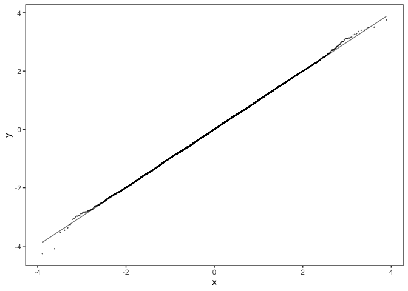
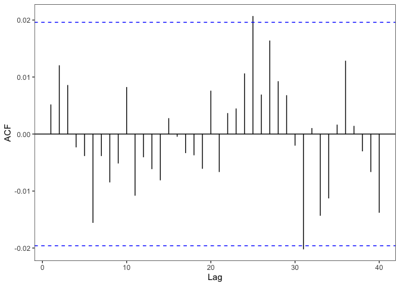

<!-- README.md is generated from README.Rmd. Please edit that file -->

# lizardHMM

<!-- badges: start -->

<!-- badges: end -->

The goal of lizardHMM is to fit lizard movement data with Hidden Markov
Models.

## Installation

You can install the released version of lizardHMM from
[CRAN](https://CRAN.R-project.org) with:

``` r
install.packages("lizardHMM")
```

And the development version from [GitHub](https://github.com/) with:

``` r
# install.packages("devtools")
devtools::install_github("simonecollier/lizardHMM")
```

## Example

Set up a basic HMM with data distributed according to normal state
dependent distributions. This HMM will have 3 states, 2 variables, 1
subject, and no covariates (included in the computation of the
transition probability matrix). We also define the design matrix which
indicates the values of the covariates at each point in time. Then we go
about generating data from this HMM.

``` r
library(lizardHMM)

hmm1 <- list(num_states = 3,
             num_variables = 1,
             num_subjects = 1,
             num_covariates = 0,
             mu = list(matrix(c(12, 18, 22), ncol = 3, nrow = 1, byrow = TRUE)),
             sigma = list(matrix(c(3, 1, 1.5), ncol = 3, nrow = 1, byrow = TRUE)),
             beta  = matrix(c(-4.931936,
                              -4.316150,
                              -5.080883,
                              -3.541777,
                              -3.793888,
                              -3.551066), nrow = 6, byrow = TRUE),
             delta = list(c(0.3, 0.2, 0.5)))

num_sample <- 10000

design           <- list(matrix(0, nrow = 1000, ncol = 3))
design[[1]][, 1] <- 1 # First column is the intercept

sample <- norm_generate_sample(num_sample, hmm1, design)
x      <- sample$observ
```

We can plot the timeseries of the observations for each subect and
variable along with the corresponding states.

``` r
timeseries_plot(x, sample$state, hmm1$num_subjects, hmm1$num_variables)
#> [[1]]
```


The histogram of the data for each subject and variable can be gnerated,
overlayed with the state dependent normal
distributions.

``` r
norm_hist(sample, hmm1$num_states, hmm1$num_variables, hmm1$num_subjects,
          hmm1, width = 0.05, x_step = 0.1)
#> [[1]]
```


Now we can try fitting the data we generated with a basic HMM with
reasonable guesses for the initial parameters.

``` r
num_states = 3
num_variables = 1
num_subjects = 1
num_covariates = 0
mu0 <- list(matrix(c(11, 19, 23), ncol = 3, nrow = 1, byrow = TRUE))
sigma0 <- list(matrix(c(3, 3, 3), ncol = 3, nrow = 1, byrow = TRUE))
beta0 <- matrix(c(-2,
                  -2,
                  -2,
                  -2,
                  -2,
                  -2), nrow = 6, byrow = TRUE)
delta0 <- list(c(1/3, 1/3, 1/3))

hmm_fit <- norm_fit_hmm(x, design, num_states, num_variables, num_subjects,
                        num_covariates, mu0, sigma0, beta0, delta0,
                        iterlim = 200, hessian = TRUE)
```

We can find the confidence intervals for our parameter estimates.

``` r
conf_intervals <- norm_ci(hmm_fit, state_dep_dist_pooled = FALSE, 
                          n = 100, level= 0.975) 
conf_intervals
#> $mu
#> $mu$estimate
#> $mu$estimate$`1`
#>          [,1]     [,2]     [,3]
#> [1,] 11.96189 17.97288 22.00477
#> 
#> 
#> $mu$upper
#> $mu$upper$`1`
#>          [,1]     [,2]     [,3]
#> [1,] 12.05534 18.01298 22.05621
#> 
#> 
#> $mu$lower
#> $mu$lower$`1`
#>          [,1]     [,2]     [,3]
#> [1,] 11.89528 17.93744 21.93764
#> 
#> 
#> 
#> $sigma
#> $sigma$estimate
#> $sigma$estimate$`1`
#>          [,1]     [,2]     [,3]
#> [1,] 2.990271 0.991765 1.521619
#> 
#> 
#> $sigma$upper
#> $sigma$upper$`1`
#>          [,1]    [,2]     [,3]
#> [1,] 3.050674 1.02359 1.565832
#> 
#> 
#> $sigma$lower
#> $sigma$lower$`1`
#>         [,1]      [,2]     [,3]
#> [1,] 2.91302 0.9700301 1.481842
#> 
#> 
#> 
#> $beta
#> $beta$estimate
#>           [,1]
#> [1,] -5.029704
#> [2,] -4.467052
#> [3,] -5.163355
#> [4,] -3.488589
#> [5,] -3.787573
#> [6,] -3.418988
#> 
#> $beta$upper
#>           [,1]
#> [1,] -4.658879
#> [2,] -4.196056
#> [3,] -4.589238
#> [4,] -3.272916
#> [5,] -3.524610
#> [6,] -3.173953
#> 
#> $beta$lower
#>           [,1]
#> [1,] -5.370534
#> [2,] -4.765351
#> [3,] -5.778031
#> [4,] -3.703569
#> [5,] -4.073880
#> [6,] -3.658818
```

Using the viterbi algorithm we can decode the hidden states according to
our fitted HMM and plot the resulting time series.

``` r
viterbi <- norm_viterbi(x, hmm_fit)
timeseries_plot(x, viterbi, num_subjects, num_variables)
#> [[1]]
```


We can compute the confidence intervals of the state dependent normal
distributions and compare them to the histogram of
data.

``` r
norm_hist_ci(x, viterbi, num_states, num_subjects, num_variables, hmm_fit, 
             state_dep_dist_pooled = FALSE,
             width = 0.05, n = 100, level = 0.975, x_step = 0.1)
#> [[1]]
```


The normal pseudo-residuals can be computed and the plots displayed
below.

``` r
pseudo_residuals <- norm_forecast_psr(x, hmm_fit)
psr_plot(pseudo_residuals, num_subjects)
#> [[1]]
```


``` r
psr_hist(pseudo_residuals, num_subjects)
#> [[1]]
```


``` r
psr_qq(pseudo_residuals, num_subjects)
#> [[1]]
```



``` r
psr_acf(pseudo_residuals, num_subjects)
#> [[1]]
```


