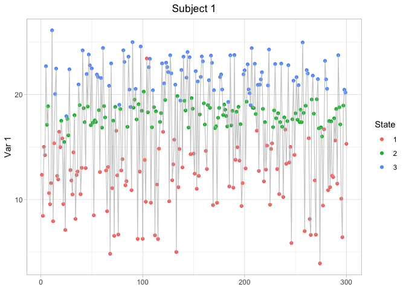
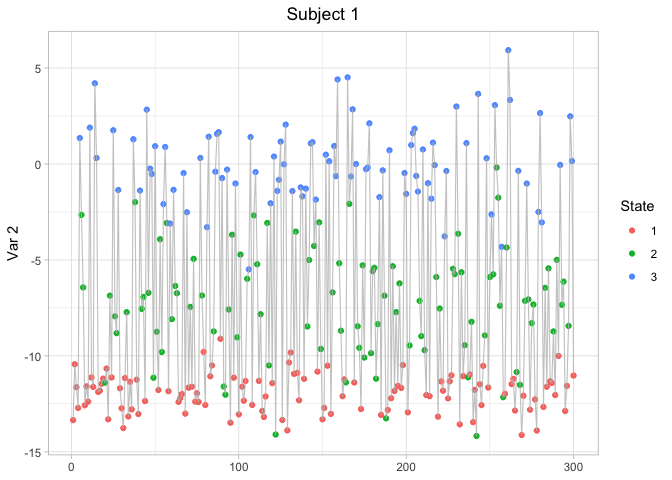
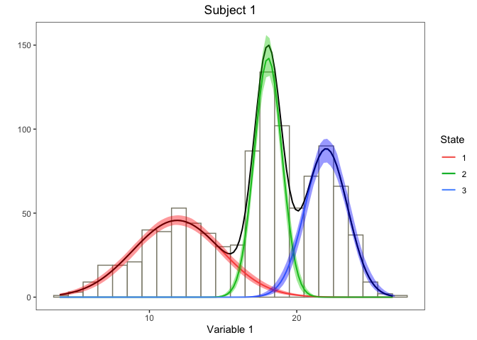
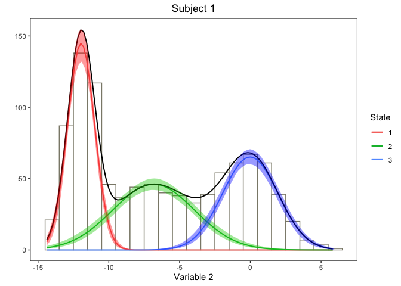

<!-- README.md is generated from README.Rmd. Please edit that file -->

# lizardHMM

<!-- badges: start -->

<!-- badges: end -->

The goal of lizardHMM is to fit lizard movement data with Hidden Markov
Models.

## Installation

You can install the released version of lizardHMM from
[CRAN](https://CRAN.R-project.org) with:

``` r
install.packages("lizardHMM")
```

And the development version from [GitHub](https://github.com/) with:

``` r
# install.packages("devtools")
devtools::install_github("simonecollier/lizardHMM")
```

## Example

Set up a basic HMM with data distributed according to normal state
dependent distributions. This HMM will have 3 states, 2 variables, 1
subject, and 2 covariates (included in the computation of the transition
probability matrix). We also define the design matrix which indicates
the values of the covariates at each point in time. Then we go about
generating data from this HMM.

``` r
library(lizardHMM)

hmm1 <- list(num_states = 3,
             num_variables = 2,
             num_subjects = 1,
             mu = list(matrix(c(12, 18, 22), ncol = 3, nrow = 1, byrow = TRUE), 
                       matrix(c(-12, -7, 0), ncol = 3, nrow = 1, byrow = TRUE)),
             sigma = list(matrix(c(3, 1, 1.5), ncol = 3, nrow = 1, byrow = TRUE), 
                          matrix(c(1, 3, 2), ncol = 3, nrow = 1, byrow = TRUE)),
             beta  = matrix(c(0.01, 0.02, 0.001,
                              0.01, 0.03, 0.004,
                              0.01, 0.01, 0.003,
                              0.01, 0.04, 0.002,
                              0.01, 0.01, 0.004,
                              0.01, 0.03, 0.001), ncol = 3, nrow = 6, byrow = TRUE),
             delta = list(c(0.3, 0.02, 0.5)))

num_sample <- 1000

design           <- list(matrix(0, nrow = 1000, ncol = 3))
design[[1]][, 1] <- 1 # First column is the intercept
design[[1]][, 2] <- sample(c(0, 1), size = 1000, 
                           prob = c(0.3, 0.7), replace = TRUE)
design[[1]][, 3] <- rnorm(1000, mean = 5, sd = 1)

sample <- norm_generate_sample(num_sample, hmm1, design)
x      <- sample$observ

timeseries_plot(x, sample$state, hmm1$num_subjects, hmm1$num_variables)
#> [[1]]
```


    #> 
    #> [[2]]


Now we can try fitting the data we generated with a basic HMM with
reasonable guesses for the initial parameters.

``` r
num_states = 3
num_variables = 2
num_subjects = 1
num_covariates = 2
mu0 <- list(matrix(c(11, 19, 23), ncol = 3, nrow = 1, byrow = TRUE),
            matrix(c(-10, -5, 1), ncol = 3, nrow = 1, byrow = TRUE))
sigma0 <- list(matrix(c(3, 3, 3), ncol = 3, nrow = 1, byrow = TRUE),
               matrix(c(3, 3, 3), ncol = 3, nrow = 1, byrow = TRUE))
beta0 <- matrix(c(-2, 0, 0,
                  -2, 0, 0,
                  -2, 0, 0,
                  -2, 0, 0,
                  -2, 0, 0,
                  -2, 0, 0), ncol = 3, nrow = 6, byrow = TRUE)
delta0 <- list(c(1/3, 1/3, 1/3))

hmm_fit <- norm_fit_hmm(x, design, num_states, num_variables, num_subjects,
                        num_covariates, mu0, sigma0, beta0, delta0,
                        iterlim = 200, hessian = TRUE)
hmm_fit
#> $num_states
#> [1] 3
#> 
#> $num_variables
#> [1] 2
#> 
#> $num_subjects
#> [1] 1
#> 
#> $num_covariates
#> [1] 2
#> 
#> $mu
#> $mu$`1`
#>          [,1]     [,2]    [,3]
#> [1,] 11.88742 18.05472 22.0055
#> 
#> $mu$`2`
#>           [,1]     [,2]        [,3]
#> [1,] -11.95643 -6.83629 -0.01102827
#> 
#> 
#> $sigma
#> $sigma$`1`
#>         [,1]      [,2]    [,3]
#> [1,] 3.02159 0.9361979 1.44672
#> 
#> $sigma$`2`
#>          [,1]     [,2]     [,3]
#> [1,] 0.953434 2.893816 1.958345
#> 
#> 
#> $beta
#>             [,1]          [,2]        [,3]
#> [1,]  0.04281937  0.2111527040 -0.05407640
#> [2,]  0.70961983 -0.0036813113 -0.16322313
#> [3,]  0.02705720 -0.1819927396  0.06248263
#> [4,]  0.89667353  0.0050002290 -0.14563320
#> [5,]  0.42754698 -0.0548077742 -0.05690551
#> [6,] -0.16661715 -0.0004446433  0.07636718
#> 
#> $delta
#> $delta[[1]]
#> [1] 9.999999e-01 5.277794e-08 5.284476e-08
#> 
#> 
#> $gamma
#> $gamma[[1]]
#> $gamma[[1]][[1]]
#>           [,1]      [,2]      [,3]
#> [1,] 0.3626896 0.2938843 0.3434261
#> [2,] 0.3806650 0.2765315 0.3428035
#> [3,] 0.3470482 0.3575480 0.2954037
#> 
#> $gamma[[1]][[2]]
#>           [,1]      [,2]      [,3]
#> [1,] 0.3951158 0.3490632 0.2558210
#> [2,] 0.4121460 0.3109620 0.2768920
#> [3,] 0.2853477 0.4221018 0.2925505
#> 
#> $gamma[[1]][[3]]
#>           [,1]      [,2]      [,3]
#> [1,] 0.3899282 0.3485344 0.2615374
#> [2,] 0.4052624 0.3099301 0.2848075
#> [3,] 0.2898631 0.4165936 0.2935434
#> 
#> $gamma[[1]][[4]]
#>           [,1]      [,2]      [,3]
#> [1,] 0.3555048 0.2923869 0.3521083
#> [2,] 0.3713678 0.2744625 0.3541697
#> [3,] 0.3532254 0.3507906 0.2959840
#> 
#> $gamma[[1]][[5]]
#>           [,1]      [,2]      [,3]
#> [1,] 0.3562382 0.3434676 0.3002942
#> [2,] 0.3603324 0.3007648 0.3389029
#> [3,] 0.3197255 0.3812877 0.2989868
#> 
#> $gamma[[1]][[6]]
#>           [,1]      [,2]      [,3]
#> [1,] 0.3355701 0.3389388 0.3254911
#> [2,] 0.3327145 0.2930401 0.3742454
#> [3,] 0.3385337 0.3600079 0.3014584
#> 
#> $gamma[[1]][[7]]
#>           [,1]      [,2]      [,3]
#> [1,] 0.3604984 0.3442658 0.2952358
#> [2,] 0.3660268 0.3021592 0.3318140
#> [3,] 0.3158962 0.3857089 0.2983949
#> 
#> $gamma[[1]][[8]]
#>           [,1]      [,2]      [,3]
#> [1,] 0.3712451 0.3460758 0.2826791
#> [2,] 0.3803810 0.3053744 0.3142445
#> [3,] 0.3063061 0.3969165 0.2967774
#> 
#> $gamma[[1]][[9]]
#>           [,1]      [,2]      [,3]
#> [1,] 0.3164577 0.3337676 0.3497746
#> [2,] 0.3072644 0.2844979 0.4082377
#> [3,] 0.3562876 0.3405659 0.3031466
#> 
#> $gamma[[1]][[10]]
#>           [,1]      [,2]      [,3]
#> [1,] 0.3584278 0.3438836 0.2976886
#> [2,] 0.3632593 0.3014899 0.3352508
#> [3,] 0.3177554 0.3835585 0.2986861
#> 
#> $gamma[[1]][[11]]
#>           [,1]      [,2]      [,3]
#> [1,] 0.3324146 0.2868749 0.3807106
#> [2,] 0.3414072 0.2667476 0.3918452
#> [3,] 0.3733284 0.3292900 0.2973815
#> 
#> $gamma[[1]][[12]]
#>           [,1]      [,2]      [,3]
#> [1,] 0.3284639 0.3371276 0.3344085
#> [2,] 0.3232363 0.2900196 0.3867442
#> [3,] 0.3450926 0.3527536 0.3021538
#> 
#> $gamma[[1]][[13]]
#>           [,1]      [,2]      [,3]
#> [1,] 0.3460607 0.3413742 0.3125651
#> [2,] 0.3467276 0.2971592 0.3561132
#> [3,] 0.3289384 0.3707746 0.3002870
#> 
#> $gamma[[1]][[14]]
#>           [,1]      [,2]      [,3]
#> [1,] 0.3583959 0.3438776 0.2977265
#> [2,] 0.3632166 0.3014795 0.3353038
#> [3,] 0.3177841 0.3835255 0.2986905
#> 
#> $gamma[[1]][[15]]
#>           [,1]      [,2]      [,3]
#> [1,] 0.3216283 0.3352611 0.3431106
#> [2,] 0.3141352 0.2869400 0.3989248
#> [3,] 0.3514485 0.3458043 0.3027472
#> 
#> $gamma[[1]][[16]]
#>           [,1]      [,2]      [,3]
#> [1,] 0.3250629 0.3362142 0.3387229
#> [2,] 0.3187058 0.2885086 0.3927856
#> [3,] 0.3482491 0.3492926 0.3024583
#> 
#> $gamma[[1]][[17]]
#>           [,1]      [,2]      [,3]
#> [1,] 0.3417747 0.2892387 0.3689866
#> [2,] 0.3535628 0.2700708 0.3763664
#> [3,] 0.3651310 0.3379676 0.2969014
#> 
#> $gamma[[1]][[18]]
#>           [,1]      [,2]      [,3]
#> [1,] 0.3463946 0.3414471 0.3121583
#> [2,] 0.3471739 0.2972836 0.3555425
#> [3,] 0.3286347 0.3711184 0.3002469
#> 
#> $gamma[[1]][[19]]
#>           [,1]      [,2]      [,3]
#> [1,] 0.3515260 0.3425312 0.3059428
#> [2,] 0.3540331 0.2991434 0.3468235
#> [3,] 0.3239795 0.3764117 0.2996088
#> 
#> $gamma[[1]][[20]]
#>           [,1]      [,2]      [,3]
#> [1,] 0.3624239 0.3446115 0.2929646
#> [2,] 0.3685999 0.3027671 0.3286329
#> [3,] 0.3141707 0.3877112 0.2981181
#> 
#> $gamma[[1]][[21]]
#>           [,1]      [,2]      [,3]
#> [1,] 0.3467133 0.2904146 0.3628721
#> [2,] 0.3599717 0.2717166 0.3683117
#> [3,] 0.3608329 0.3425666 0.2966005
#> 
#> $gamma[[1]][[22]]
#>           [,1]      [,2]      [,3]
#> [1,] 0.3743057 0.3465382 0.2791561
#> [2,] 0.3844647 0.3062107 0.3093246
#> [3,] 0.3035927 0.4001230 0.2962843
#> 
#> $gamma[[1]][[23]]
#>           [,1]      [,2]      [,3]
#> [1,] 0.3603502 0.2934080 0.3462418
#> [2,] 0.3776396 0.2758751 0.3464852
#> [3,] 0.3490557 0.3553441 0.2956002
#> 
#> $gamma[[1]][[24]]
#>           [,1]      [,2]      [,3]
#> [1,] 0.3391530 0.3398024 0.3210445
#> [2,] 0.3374983 0.2944927 0.3680090
#> [3,] 0.3352450 0.3636772 0.3010777
#> 
#> $gamma[[1]][[25]]
#>           [,1]      [,2]      [,3]
#> [1,] 0.3228685 0.3356088 0.3415227
#> [2,] 0.3157850 0.2875113 0.3967037
#> [3,] 0.3502919 0.3470630 0.3026451
#> 
#> $gamma[[1]][[26]]
#>           [,1]      [,2]      [,3]
#> [1,] 0.3145375 0.3331950 0.3522675
#> [2,] 0.3047162 0.2835665 0.4117173
#> [3,] 0.3580917 0.3386243 0.3032840
#> 
#> $gamma[[1]][[27]]
#>           [,1]      [,2]      [,3]
#> [1,] 0.3422053 0.3405121 0.3172826
#> [2,] 0.3415756 0.2956927 0.3627317
#> [3,] 0.3324529 0.3668096 0.3007375
#> 
#> $gamma[[1]][[28]]
#>           [,1]      [,2]      [,3]
#> [1,] 0.3568515 0.3435853 0.2995632
#> [2,] 0.3611522 0.3009697 0.3378781
#> [3,] 0.3191733 0.3819234 0.2989033
#> 
#> $gamma[[1]][[29]]
#>           [,1]      [,2]      [,3]
#> [1,] 0.3264333 0.3365859 0.3369808
#> [2,] 0.3205309 0.2891225 0.3903466
#> [3,] 0.3469758 0.3506864 0.3023378
#> 
#> $gamma[[1]][[30]]
#>           [,1]      [,2]      [,3]
#> [1,] 0.2950292 0.3268181 0.3781527
#> [2,] 0.2789607 0.2733604 0.4476789
#> [3,] 0.3766468 0.3190136 0.3043397
#> 
#> $gamma[[1]][[31]]
#>           [,1]      [,2]      [,3]
#> [1,] 0.3740785 0.2960481 0.3298734
#> [2,] 0.3953629 0.2794883 0.3251487
#> [3,] 0.3373268 0.3683296 0.2943436
#> 
#> $gamma[[1]][[32]]
#>           [,1]      [,2]      [,3]
#> [1,] 0.3259971 0.3364681 0.3375347
#> [2,] 0.3199499 0.2889278 0.3911223
#> [3,] 0.3473809 0.3502426 0.3023765
#> 
#> $gamma[[1]][[33]]
#>           [,1]      [,2]      [,3]
#> [1,] 0.3974635 0.2996901 0.3028464
#> [2,] 0.4253382 0.2843214 0.2903404
#> [3,] 0.3176165 0.3907543 0.2916292
#> 
#> $gamma[[1]][[34]]
#>           [,1]      [,2]      [,3]
#> [1,] 0.3449448 0.3411286 0.3139267
#> [2,] 0.3452361 0.2967404 0.3580235
#> [3,] 0.3299543 0.3696259 0.3004198
#> 
#> $gamma[[1]][[35]]
#>           [,1]      [,2]      [,3]
#> [1,] 0.3616279 0.2936695 0.3447026
#> [2,] 0.3792922 0.2762357 0.3444721
#> [3,] 0.3479588 0.3565474 0.2954938
#> 
#> $gamma[[1]][[36]]
#>           [,1]      [,2]      [,3]
#> [1,] 0.3495950 0.3421311 0.3082739
#> [2,] 0.3514517 0.2984550 0.3500932
#> [3,] 0.3257285 0.3744178 0.2998537
#> 
#> $gamma[[1]][[37]]
#>           [,1]      [,2]      [,3]
#> [1,] 0.3573210 0.3436748 0.2990041
#> [2,] 0.3617799 0.3011256 0.3370945
#> [3,] 0.3187507 0.3824103 0.2988390
#> 
#> $gamma[[1]][[38]]
#>           [,1]      [,2]      [,3]
#> [1,] 0.3479798 0.3417891 0.3102311
#> [2,] 0.3492926 0.2978686 0.3528388
#> [3,] 0.3271941 0.3727518 0.3000542
#> 
#> $gamma[[1]][[39]]
#>           [,1]      [,2]      [,3]
#> [1,] 0.3458388 0.2902100 0.3639512
#> [2,] 0.3588371 0.2714306 0.3697323
#> [3,] 0.3615927 0.3417512 0.2966562
#> 
#> $gamma[[1]][[40]]
#>           [,1]      [,2]      [,3]
#> [1,] 0.3699580 0.2952948 0.3347471
#> [2,] 0.3900515 0.2784642 0.3314843
#> [3,] 0.3408343 0.3644187 0.2947470
#> 
#> $gamma[[1]][[41]]
#>           [,1]      [,2]      [,3]
#> [1,] 0.3511112 0.3424460 0.3064428
#> [2,] 0.3534785 0.2989967 0.3475248
#> [3,] 0.3243550 0.3759831 0.2996619
#> 
#> $gamma[[1]][[42]]
#>           [,1]      [,2]      [,3]
#> [1,] 0.3583558 0.3438701 0.2977741
#> [2,] 0.3631631 0.3014664 0.3353705
#> [3,] 0.3178201 0.3834839 0.2986961
#> 
#> $gamma[[1]][[43]]
#>           [,1]      [,2]      [,3]
#> [1,] 0.3237828 0.3358626 0.3403546
#> [2,] 0.3170017 0.2879290 0.3950693
#> [3,] 0.3494402 0.3479916 0.3025682
#> 
#> $gamma[[1]][[44]]
#>           [,1]      [,2]      [,3]
#> [1,] 0.3742577 0.3465311 0.2792112
#> [2,] 0.3844006 0.3061978 0.3094015
#> [3,] 0.3036353 0.4000726 0.2962921
#> 
#> $gamma[[1]][[45]]
#>           [,1]      [,2]      [,3]
#> [1,] 0.3702811 0.3459253 0.2837936
#> [2,] 0.3790943 0.3051037 0.3158020
#> [3,] 0.3071623 0.3959079 0.2969297
#> 
#> $gamma[[1]][[46]]
#>           [,1]      [,2]      [,3]
#> [1,] 0.3550670 0.2922924 0.3526407
#> [2,] 0.3708007 0.2743314 0.3548679
#> [3,] 0.3536029 0.3503799 0.2960172
#> 
#> $gamma[[1]][[47]]
#>           [,1]      [,2]      [,3]
#> [1,] 0.3570852 0.3436300 0.2992849
#> [2,] 0.3614646 0.3010474 0.3374880
#> [3,] 0.3189629 0.3821658 0.2988713
#> 
#> $gamma[[1]][[48]]
#>           [,1]      [,2]      [,3]
#> [1,] 0.3218871 0.3353340 0.3427789
#> [2,] 0.3144794 0.2870596 0.3984609
#> [3,] 0.3512070 0.3460669 0.3027261
#> 
#> $gamma[[1]][[49]]
#>           [,1]      [,2]      [,3]
#> [1,] 0.3700079 0.2953042 0.3346879
#> [2,] 0.3901158 0.2784769 0.3314072
#> [3,] 0.3407918 0.3644660 0.2947422
#> 
#> $gamma[[1]][[50]]
#>           [,1]      [,2]      [,3]
#> [1,] 0.3448022 0.3410969 0.3141009
#> [2,] 0.3450456 0.2966865 0.3582679
#> [3,] 0.3300842 0.3694792 0.3004366
#> 
#> $gamma[[1]][[51]]
#>           [,1]      [,2]      [,3]
#> [1,] 0.3750598 0.3466485 0.2782916
#> [2,] 0.3854706 0.3064113 0.3081181
#> [3,] 0.3029254 0.4009141 0.2961606
#> 
#> $gamma[[1]][[52]]
#>           [,1]      [,2]      [,3]
#> [1,] 0.3283330 0.3370930 0.3345740
#> [2,] 0.3230618 0.2899622 0.3869760
#> [3,] 0.3452139 0.3526202 0.3021659
#> 
#> $gamma[[1]][[53]]
#>           [,1]      [,2]      [,3]
#> [1,] 0.3931352 0.3488692 0.2579956
#> [2,] 0.4095195 0.3105800 0.2799005
#> [3,] 0.2870691 0.4199965 0.2929345
#> 
#> $gamma[[1]][[54]]
#>           [,1]      [,2]      [,3]
#> [1,] 0.3669333 0.3453845 0.2876823
#> [2,] 0.3746241 0.3041365 0.3212394
#> [3,] 0.3101421 0.3924102 0.2974477
#> 
#> $gamma[[1]][[55]]
#>           [,1]      [,2]      [,3]
#> [1,] 0.3750723 0.3466504 0.2782773
#> [2,] 0.3854872 0.3064146 0.3080981
#> [3,] 0.3029143 0.4009272 0.2961585
#> 
#> $gamma[[1]][[56]]
#>           [,1]      [,2]      [,3]
#> [1,] 0.3305327 0.3376684 0.3317988
#> [2,] 0.3259941 0.2909181 0.3830878
#> [3,] 0.3431781 0.3548624 0.3019596
#> 
#> $gamma[[1]][[57]]
#>           [,1]      [,2]      [,3]
#> [1,] 0.3229388 0.3356284 0.3414328
#> [2,] 0.3158785 0.2875435 0.3965779
#> [3,] 0.3502264 0.3471344 0.3026392
#> 
#> $gamma[[1]][[58]]
#>           [,1]      [,2]      [,3]
#> [1,] 0.3493573 0.3420812 0.3085616
#> [2,] 0.3511339 0.2983693 0.3504968
#> [3,] 0.3259441 0.3741724 0.2998835
#> 
#> $gamma[[1]][[59]]
#>           [,1]      [,2]      [,3]
#> [1,] 0.3630707 0.3447255 0.2922038
#> [2,] 0.3694642 0.3029682 0.3275676
#> [3,] 0.3135918 0.3883843 0.2980239
#> 
#> $gamma[[1]][[60]]
#>           [,1]      [,2]      [,3]
#> [1,] 0.3130036 0.3327306 0.3542659
#> [2,] 0.3026821 0.2828129 0.4145050
#> [3,] 0.3595357 0.3370749 0.3033894
#> 
#> $gamma[[1]][[61]]
#>           [,1]      [,2]      [,3]
#> [1,] 0.3441207 0.3409451 0.3149341
#> [2,] 0.3441349 0.2964282 0.3594369
#> [3,] 0.3307051 0.3687782 0.3005166
#> 
#> $gamma[[1]][[62]]
#>           [,1]      [,2]      [,3]
#> [1,] 0.4313782 0.3030702 0.2655516
#> [2,] 0.4681394 0.2883961 0.2434645
#> [3,] 0.2895708 0.4240256 0.2864036
#> 
#> $gamma[[1]][[63]]
#>           [,1]      [,2]      [,3]
#> [1,] 0.3098064 0.3317424 0.3584513
#> [2,] 0.2984466 0.2812152 0.4203382
#> [3,] 0.3625534 0.3338495 0.3035971
#> 
#> $gamma[[1]][[64]]
#>           [,1]      [,2]      [,3]
#> [1,] 0.3496437 0.3421413 0.3082150
#> [2,] 0.3515168 0.2984726 0.3500106
#> [3,] 0.3256844 0.3744680 0.2998476
#> 
#> $gamma[[1]][[65]]
#>           [,1]      [,2]      [,3]
#> [1,] 0.4386163 0.3035005 0.2578831
#> [2,] 0.4771478 0.2888213 0.2340308
#> [3,] 0.2836614 0.4312499 0.2850888
#> 
#> $gamma[[1]][[66]]
#>           [,1]      [,2]      [,3]
#> [1,] 0.3247385 0.3361255 0.3391360
#> [2,] 0.3182739 0.2883623 0.3933638
#> [3,] 0.3485508 0.3489628 0.3024864
#> 
#> $gamma[[1]][[67]]
#>           [,1]      [,2]      [,3]
#> [1,] 0.3395620 0.3398989 0.3205391
#> [2,] 0.3380445 0.2946555 0.3673000
#> [3,] 0.3348704 0.3640966 0.3010330
#> 
#> $gamma[[1]][[68]]
#>           [,1]      [,2]      [,3]
#> [1,] 0.3733825 0.2959232 0.3306944
#> [2,] 0.3944662 0.2793190 0.3262148
#> [3,] 0.3379186 0.3676681 0.2944133
#> 
#> $gamma[[1]][[69]]
#>           [,1]      [,2]      [,3]
#> [1,] 0.3473060 0.3416445 0.3110495
#> [2,] 0.3483919 0.2976211 0.3539870
#> [3,] 0.3278062 0.3720573 0.3001366
#> 
#> $gamma[[1]][[70]]
#>           [,1]      [,2]      [,3]
#> [1,] 0.3908430 0.2987679 0.3103891
#> [2,] 0.4168843 0.2831217 0.2999940
#> [3,] 0.3231640 0.3843649 0.2924710
#> 
#> $gamma[[1]][[71]]
#>           [,1]      [,2]      [,3]
#> [1,] 0.3504146 0.3423020 0.3072834
#> [2,] 0.3525473 0.2987489 0.3487038
#> [3,] 0.3249858 0.3752637 0.2997505
#> 
#> $gamma[[1]][[72]]
#>           [,1]      [,2]      [,3]
#> [1,] 0.3052099 0.3302738 0.3645164
#> [2,] 0.2923687 0.2788544 0.4287769
#> [3,] 0.3669112 0.3292224 0.3038665
#> 
#> $gamma[[1]][[73]]
#>           [,1]      [,2]      [,3]
#> [1,] 0.3686304 0.2950450 0.3363245
#> [2,] 0.3883386 0.2781233 0.3335381
#> [3,] 0.3419667 0.3631611 0.2948722
#> 
#> $gamma[[1]][[74]]
#>           [,1]      [,2]      [,3]
#> [1,] 0.3827644 0.2975262 0.3197094
#> [2,] 0.4065325 0.2814776 0.3119899
#> [3,] 0.3299677 0.3766125 0.2934198
#> 
#> $gamma[[1]][[75]]
#>           [,1]      [,2]      [,3]
#> [1,] 0.3440724 0.2897919 0.3661357
#> [2,] 0.3565451 0.2708457 0.3726092
#> [3,] 0.3631291 0.3401055 0.2967655
#> 
#> $gamma[[1]][[76]]
#>           [,1]      [,2]      [,3]
#> [1,] 0.3244815 0.3360551 0.3394634
#> [2,] 0.3179318 0.2882461 0.3938221
#> [3,] 0.3487898 0.3487016 0.3025085
#> 
#> $gamma[[1]][[77]]
#>           [,1]      [,2]      [,3]
#> [1,] 0.3357834 0.3389912 0.3252254
#> [2,] 0.3329992 0.2931279 0.3738729
#> [3,] 0.3383376 0.3602261 0.3014363
#> 
#> $gamma[[1]][[78]]
#>           [,1]      [,2]      [,3]
#> [1,] 0.3308430 0.3377486 0.3314084
#> [2,] 0.3264078 0.2910514 0.3825407
#> [3,] 0.3428913 0.3551788 0.3019299
#> 
#> $gamma[[1]][[79]]
#>           [,1]      [,2]      [,3]
#> [1,] 0.3509718 0.3424173 0.3066108
#> [2,] 0.3532922 0.2989473 0.3477605
#> [3,] 0.3244812 0.3758392 0.2996797
#> 
#> $gamma[[1]][[80]]
#>           [,1]      [,2]      [,3]
#> [1,] 0.3262604 0.3365393 0.3372004
#> [2,] 0.3203005 0.2890454 0.3906541
#> [3,] 0.3471364 0.3505104 0.3023532
#> 
#> $gamma[[1]][[81]]
#>           [,1]      [,2]      [,3]
#> [1,] 0.3611072 0.3443761 0.2945167
#> [2,] 0.3668403 0.3023529 0.3308068
#> [3,] 0.3153503 0.3863417 0.2983080
#> 
#> $gamma[[1]][[82]]
#>           [,1]      [,2]      [,3]
#> [1,] 0.3898144 0.3485221 0.2616635
#> [2,] 0.4051113 0.3099064 0.2849823
#> [3,] 0.2899623 0.4164730 0.2935647
#> 
#> $gamma[[1]][[83]]
#>           [,1]      [,2]      [,3]
#> [1,] 0.3883067 0.3483554 0.2633379
#> [2,] 0.4031082 0.3095868 0.2873050
#> [3,] 0.2912788 0.4148760 0.2938452
#> 
#> $gamma[[1]][[84]]
#>           [,1]      [,2]      [,3]
#> [1,] 0.3246514 0.3361016 0.3392470
#> [2,] 0.3181579 0.2883229 0.3935192
#> [3,] 0.3486318 0.3488743 0.3024939
#> 
#> $gamma[[1]][[85]]
#>           [,1]      [,2]      [,3]
#> [1,] 0.3493917 0.3420884 0.3085198
#> [2,] 0.3511800 0.2983818 0.3504383
#> [3,] 0.3259129 0.3742080 0.2998792
#> 
#> $gamma[[1]][[86]]
#>           [,1]      [,2]      [,3]
#> [1,] 0.3547869 0.3431852 0.3020279
#> [2,] 0.3583923 0.3002742 0.3413335
#> [3,] 0.3210336 0.3797844 0.2991820
#> 
#> $gamma[[1]][[87]]
#>           [,1]      [,2]      [,3]
#> [1,] 0.3595256 0.2932375 0.3472369
#> [2,] 0.3765728 0.2756398 0.3477874
#> [3,] 0.3497641 0.3545681 0.2956677
#> 
#> $gamma[[1]][[88]]
#>           [,1]      [,2]      [,3]
#> [1,] 0.3177425 0.2828104 0.3994471
#> [2,] 0.3223494 0.2610035 0.4166471
#> [3,] 0.3863206 0.3157854 0.2978940
#> 
#> $gamma[[1]][[89]]
#>           [,1]      [,2]      [,3]
#> [1,] 0.3645201 0.2942494 0.3412305
#> [2,] 0.3830309 0.2770334 0.3399357
#> [3,] 0.3454800 0.3592751 0.2952449
#> 
#> $gamma[[1]][[90]]
#>           [,1]      [,2]      [,3]
#> [1,] 0.2919815 0.3257287 0.3822898
#> [2,] 0.2749632 0.2716454 0.4533914
#> [3,] 0.3795844 0.3159677 0.3044479
#> 
#> $gamma[[1]][[91]]
#>           [,1]      [,2]      [,3]
#> [1,] 0.3935105 0.2991498 0.3073397
#> [2,] 0.4202939 0.2836211 0.2960850
#> [3,] 0.3209258 0.3869353 0.2921388
#> 
#> $gamma[[1]][[92]]
#>           [,1]      [,2]      [,3]
#> [1,] 0.3612732 0.3444060 0.2943208
#> [2,] 0.3670622 0.3024055 0.3305323
#> [3,] 0.3152015 0.3865143 0.2982842
#> 
#> $gamma[[1]][[93]]
#>           [,1]      [,2]      [,3]
#> [1,] 0.3618508 0.2937148 0.3444344
#> [2,] 0.3795804 0.2762981 0.3441215
#> [3,] 0.3477676 0.3567574 0.2954750
#> 
#> $gamma[[1]][[94]]
#>           [,1]      [,2]      [,3]
#> [1,] 0.3765845 0.3468673 0.2765482
#> [2,] 0.3875036 0.3068105 0.3056859
#> [3,] 0.3015776 0.4025147 0.2959078
#> 
#> $gamma[[1]][[95]]
#>           [,1]      [,2]      [,3]
#> [1,] 0.3151612 0.3333821 0.3514567
#> [2,] 0.3055437 0.2838705 0.4105858
#> [3,] 0.3575052 0.3392548 0.3032400
#> 
#> $gamma[[1]][[96]]
#>           [,1]      [,2]      [,3]
#> [1,] 0.3627077 0.3446616 0.2926306
#> [2,] 0.3689792 0.3028556 0.3281652
#> [3,] 0.3139166 0.3880065 0.2980769
#> 
#> $gamma[[1]][[97]]
#>           [,1]      [,2]      [,3]
#> [1,] 0.3946109 0.3490147 0.2563745
#> [2,] 0.4114766 0.3108660 0.2776574
#> [3,] 0.2857862 0.4215648 0.2926490
#> 
#> $gamma[[1]][[98]]
#>           [,1]      [,2]      [,3]
#> [1,] 0.3587227 0.3439387 0.2973386
#> [2,] 0.3636535 0.3015862 0.3347603
#> [3,] 0.3174904 0.3838647 0.2986450
#> 
#> $gamma[[1]][[99]]
#>           [,1]      [,2]      [,3]
#> [1,] 0.3835201 0.2976478 0.3188321
#> [2,] 0.4075023 0.2816398 0.3108579
#> [3,] 0.3293297 0.3773356 0.2933347
#> 
#> $gamma[[1]][[100]]
#>           [,1]      [,2]      [,3]
#> [1,] 0.3199439 0.3347823 0.3452738
#> [2,] 0.3118956 0.2861550 0.4019494
#> [3,] 0.3530219 0.3440961 0.3028820
#> 
#> $gamma[[1]][[101]]
#>           [,1]      [,2]      [,3]
#> [1,] 0.3874726 0.3482608 0.2642665
#> [2,] 0.4019997 0.3094064 0.2885940
#> [3,] 0.2920079 0.4139931 0.2939989
#> 
#> $gamma[[1]][[102]]
#>           [,1]      [,2]      [,3]
#> [1,] 0.3451699 0.3411784 0.3136517
#> [2,] 0.3455371 0.2968253 0.3576377
#> [3,] 0.3297492 0.3698576 0.3003932
#> 
#> $gamma[[1]][[103]]
#>           [,1]      [,2]      [,3]
#> [1,] 0.3323040 0.3381226 0.3295734
#> [2,] 0.3283563 0.2916748 0.3799688
#> [3,] 0.3415422 0.3566698 0.3017879
#> 
#> $gamma[[1]][[104]]
#>           [,1]      [,2]      [,3]
#> [1,] 0.3212021 0.3351406 0.3436573
#> [2,] 0.3135683 0.2867423 0.3996893
#> [3,] 0.3518463 0.3453719 0.3027818
#> 
#> $gamma[[1]][[105]]
#>           [,1]      [,2]      [,3]
#> [1,] 0.3248951 0.2848469 0.3902580
#> [2,] 0.3316390 0.2638852 0.4044759
#> [3,] 0.3799643 0.3223546 0.2976811
#> 
#> $gamma[[1]][[106]]
#>           [,1]      [,2]      [,3]
#> [1,] 0.3243163 0.2846860 0.3909977
#> [2,] 0.3308871 0.2636577 0.4054552
#> [3,] 0.3804771 0.3218220 0.2977009
#> 
#> $gamma[[1]][[107]]
#>           [,1]      [,2]      [,3]
#> [1,] 0.3558626 0.3433950 0.3007423
#> [2,] 0.3598304 0.3006386 0.3395311
#> [3,] 0.3200638 0.3808986 0.2990376
#> 
#> $gamma[[1]][[108]]
#>           [,1]      [,2]      [,3]
#> [1,] 0.3937851 0.2991883 0.3070265
#> [2,] 0.4206447 0.2836713 0.2956840
#> [3,] 0.3206956 0.3872003 0.2921041
#> 
#> $gamma[[1]][[109]]
#>           [,1]      [,2]      [,3]
#> [1,] 0.3540121 0.3430322 0.3029557
#> [2,] 0.3573565 0.3000091 0.3426344
#> [3,] 0.3217327 0.3789823 0.2992849
#> 
#> $gamma[[1]][[110]]
#>           [,1]      [,2]      [,3]
#> [1,] 0.3216239 0.2839286 0.3944475
#> [2,] 0.3273899 0.2625864 0.4100237
#> [3,] 0.3828659 0.3193469 0.2977872
#> 
#> $gamma[[1]][[111]]
#>           [,1]      [,2]      [,3]
#> [1,] 0.3583397 0.3438671 0.2977932
#> [2,] 0.3631415 0.3014611 0.3353974
#> [3,] 0.3178346 0.3834671 0.2986983
#> 
#> $gamma[[1]][[112]]
#>           [,1]      [,2]      [,3]
#> [1,] 0.3345061 0.3386760 0.3268179
#> [2,] 0.3312945 0.2925997 0.3761059
#> [3,] 0.3395127 0.3589197 0.3015676
#> 
#> $gamma[[1]][[113]]
#>           [,1]      [,2]      [,3]
#> [1,] 0.3506233 0.3423453 0.3070314
#> [2,] 0.3528262 0.2988233 0.3483505
#> [3,] 0.3247968 0.3754792 0.2997240
#> 
#> $gamma[[1]][[114]]
#>           [,1]      [,2]      [,3]
#> [1,] 0.3446189 0.3410562 0.3143249
#> [2,] 0.3448006 0.2966172 0.3585822
#> [3,] 0.3302512 0.3692906 0.3004582
#> 
#> $gamma[[1]][[115]]
#>           [,1]      [,2]      [,3]
#> [1,] 0.3727564 0.3463071 0.2809366
#> [2,] 0.3823978 0.3057918 0.3118104
#> [3,] 0.3049653 0.3984990 0.2965357
#> 
#> $gamma[[1]][[116]]
#>           [,1]      [,2]      [,3]
#> [1,] 0.3625917 0.3446412 0.2927672
#> [2,] 0.3688241 0.3028195 0.3283564
#> [3,] 0.3140205 0.3878858 0.2980938
#> 
#> $gamma[[1]][[117]]
#>           [,1]      [,2]      [,3]
#> [1,] 0.3547019 0.2922132 0.3530849
#> [2,] 0.3703278 0.2742215 0.3554506
#> [3,] 0.3539179 0.3500375 0.2960446
#> 
#> $gamma[[1]][[118]]
#>           [,1]      [,2]      [,3]
#> [1,] 0.3432382 0.2895923 0.3671696
#> [2,] 0.3554624 0.2705662 0.3739714
#> [3,] 0.3638555 0.3393289 0.2968156
#> 
#> $gamma[[1]][[119]]
#>           [,1]      [,2]      [,3]
#> [1,] 0.3138679 0.3329931 0.3531390
#> [2,] 0.3038281 0.2832386 0.4129333
#> [3,] 0.3587217 0.3379478 0.3033305
#> 
#> $gamma[[1]][[120]]
#>           [,1]      [,2]      [,3]
#> [1,] 0.3242018 0.3359782 0.3398200
#> [2,] 0.3175594 0.2881193 0.3943212
#> [3,] 0.3490501 0.3484174 0.3025325
#> 
#> $gamma[[1]][[121]]
#>           [,1]      [,2]      [,3]
#> [1,] 0.3286186 0.3371684 0.3342130
#> [2,] 0.3234424 0.2900873 0.3864703
#> [3,] 0.3449493 0.3529112 0.3021395
#> 
#> $gamma[[1]][[122]]
#>           [,1]      [,2]      [,3]
#> [1,] 0.3088303 0.3314353 0.3597344
#> [2,] 0.2971549 0.2807202 0.4221250
#> [3,] 0.3634768 0.3328660 0.3036572
#> 
#> $gamma[[1]][[123]]
#>           [,1]      [,2]      [,3]
#> [1,] 0.3355107 0.3389242 0.3255651
#> [2,] 0.3326352 0.2930156 0.3743491
#> [3,] 0.3385883 0.3599471 0.3014646
#> 
#> $gamma[[1]][[124]]
#>           [,1]      [,2]      [,3]
#> [1,] 0.3809038 0.3474554 0.2716408
#> [2,] 0.3932593 0.3078937 0.2988471
#> [3,] 0.2977697 0.4070580 0.2951723
#> 
#> $gamma[[1]][[125]]
#>           [,1]      [,2]      [,3]
#> [1,] 0.3543550 0.3431001 0.3025449
#> [2,] 0.3578149 0.3001267 0.3420583
#> [3,] 0.3214232 0.3793373 0.2992395
#> 
#> $gamma[[1]][[126]]
#>           [,1]      [,2]      [,3]
#> [1,] 0.3621092 0.2937672 0.3441236
#> [2,] 0.3799146 0.2763702 0.3437151
#> [3,] 0.3475459 0.3570010 0.2954531
#> 
#> $gamma[[1]][[127]]
#>           [,1]      [,2]      [,3]
#> [1,] 0.3555668 0.3433376 0.3010955
#> [2,] 0.3594349 0.3005388 0.3400262
#> [3,] 0.3203304 0.3805921 0.2990775
#> 
#> $gamma[[1]][[128]]
#>           [,1]      [,2]      [,3]
#> [1,] 0.3621963 0.3445711 0.2932326
#> [2,] 0.3682958 0.3026960 0.3290082
#> [3,] 0.3143745 0.3874744 0.2981511
#> 
#> $gamma[[1]][[129]]
#>           [,1]      [,2]      [,3]
#> [1,] 0.3221395 0.3354049 0.3424556
#> [2,] 0.3148152 0.2871761 0.3980087
#> [3,] 0.3509715 0.3463230 0.3027054
#> 
#> $gamma[[1]][[130]]
#>           [,1]      [,2]      [,3]
#> [1,] 0.3693912 0.3457843 0.2848246
#> [2,] 0.3779062 0.3048507 0.3172431
#> [3,] 0.3079535 0.3949774 0.2970691
#> 
#> $gamma[[1]][[131]]
#>           [,1]      [,2]      [,3]
#> [1,] 0.3216322 0.3352622 0.3431057
#> [2,] 0.3141403 0.2869417 0.3989179
#> [3,] 0.3514449 0.3458082 0.3027469
#> 
#> $gamma[[1]][[132]]
#>           [,1]      [,2]      [,3]
#> [1,] 0.3716639 0.2956107 0.3327254
#> [2,] 0.3922513 0.2788945 0.3288542
#> [3,] 0.3393809 0.3660364 0.2945827
#> 
#> $gamma[[1]][[133]]
#>           [,1]      [,2]      [,3]
#> [1,] 0.3293168 0.3373519 0.3333313
#> [2,] 0.3243730 0.2903919 0.3852351
#> [3,] 0.3443028 0.3536226 0.3020745
#> 
#> $gamma[[1]][[134]]
#>           [,1]      [,2]      [,3]
#> [1,] 0.3260850 0.3364919 0.3374231
#> [2,] 0.3200669 0.2889671 0.3909660
#> [3,] 0.3472993 0.3503320 0.3023687
#> 
#> $gamma[[1]][[135]]
#>           [,1]      [,2]      [,3]
#> [1,] 0.3619567 0.3445284 0.2935149
#> [2,] 0.3679756 0.3026209 0.3294036
#> [3,] 0.3145891 0.3872251 0.2981858
#> 
#> $gamma[[1]][[136]]
#>           [,1]      [,2]      [,3]
#> [1,] 0.3831928 0.3477483 0.2690589
#> [2,] 0.3963069 0.3084392 0.2952539
#> [3,] 0.2957579 0.4094711 0.2947709
#> 
#> $gamma[[1]][[137]]
#>           [,1]      [,2]      [,3]
#> [1,] 0.3652651 0.3451045 0.2896304
#> [2,] 0.3723960 0.3036388 0.3239652
#> [3,] 0.3116304 0.3906703 0.2976994
#> 
#> $gamma[[1]][[138]]
#>           [,1]      [,2]      [,3]
#> [1,] 0.3510275 0.3424288 0.3065437
#> [2,] 0.3533667 0.2989670 0.3476663
#> [3,] 0.3244308 0.3758967 0.2996726
#> 
#> $gamma[[1]][[139]]
#>           [,1]      [,2]      [,3]
#> [1,] 0.3150828 0.3333586 0.3515585
#> [2,] 0.3054397 0.2838323 0.4107280
#> [3,] 0.3575789 0.3391755 0.3032456
#> 
#> $gamma[[1]][[140]]
#>           [,1]      [,2]      [,3]
#> [1,] 0.3367802 0.3392342 0.3239856
#> [2,] 0.3343299 0.2935360 0.3721341
#> [3,] 0.3374216 0.3612463 0.3013321
#> 
#> $gamma[[1]][[141]]
#>           [,1]      [,2]      [,3]
#> [1,] 0.3337539 0.3384884 0.3277578
#> [2,] 0.3302907 0.2922858 0.3774236
#> [3,] 0.3402054 0.3581508 0.3016437
#> 
#> $gamma[[1]][[142]]
#>           [,1]      [,2]      [,3]
#> [1,] 0.3815542 0.3475400 0.2709058
#> [2,] 0.3941255 0.3080507 0.2978238
#> [3,] 0.2971976 0.4077433 0.2950590
#> 
#> $gamma[[1]][[143]]
#>           [,1]      [,2]      [,3]
#> [1,] 0.3499432 0.3422039 0.3078529
#> [2,] 0.3519171 0.2985802 0.3495027
#> [3,] 0.3254129 0.3747771 0.2998100
#> 
#> $gamma[[1]][[144]]
#>           [,1]      [,2]      [,3]
#> [1,] 0.3894757 0.3484851 0.2620391
#> [2,] 0.4046615 0.3098353 0.2855032
#> [3,] 0.2902579 0.4161142 0.2936280
#> 
#> $gamma[[1]][[145]]
#>           [,1]      [,2]      [,3]
#> [1,] 0.3476600 0.3417206 0.3106193
#> [2,] 0.3488652 0.2977513 0.3533835
#> [3,] 0.3274845 0.3724221 0.3000934
#> 
#> $gamma[[1]][[146]]
#>           [,1]      [,2]      [,3]
#> [1,] 0.4023273 0.3003129 0.2973598
#> [2,] 0.4315304 0.2851182 0.2833513
#> [3,] 0.3135567 0.3954695 0.2909738
#> 
#> $gamma[[1]][[147]]
#>           [,1]      [,2]      [,3]
#> [1,] 0.3523248 0.3426939 0.3049813
#> [2,] 0.3551010 0.2994241 0.3454750
#> [3,] 0.3232570 0.3772373 0.2995057
#> 
#> $gamma[[1]][[148]]
#>           [,1]      [,2]      [,3]
#> [1,] 0.3473278 0.3416492 0.3110230
#> [2,] 0.3484211 0.2976291 0.3539498
#> [3,] 0.3277863 0.3720798 0.3001339
#> 
#> $gamma[[1]][[149]]
#>           [,1]      [,2]      [,3]
#> [1,] 0.3376139 0.3394355 0.3229506
#> [2,] 0.3354430 0.2938745 0.3706825
#> [3,] 0.3366563 0.3621000 0.3012437
#> 
#> $gamma[[1]][[150]]
#>           [,1]      [,2]      [,3]
#> [1,] 0.3604309 0.2934246 0.3461445
#> [2,] 0.3777441 0.2758981 0.3463579
#> [3,] 0.3489864 0.3554201 0.2955935
#> 
#> $gamma[[1]][[151]]
#>           [,1]      [,2]      [,3]
#> [1,] 0.3475272 0.2906037 0.3618690
#> [2,] 0.3610275 0.2719808 0.3669917
#> [3,] 0.3601262 0.3433260 0.2965478
#> 
#> $gamma[[1]][[152]]
#>           [,1]      [,2]      [,3]
#> [1,] 0.3359675 0.3390362 0.3249963
#> [2,] 0.3332449 0.2932036 0.3735515
#> [3,] 0.3381684 0.3604144 0.3014172
#> 
#> $gamma[[1]][[153]]
#>           [,1]      [,2]      [,3]
#> [1,] 0.3529225 0.3428146 0.3042630
#> [2,] 0.3558999 0.2996325 0.3444676
#> [3,] 0.3227168 0.3778551 0.2994280
#> 
#> $gamma[[1]][[154]]
#>           [,1]      [,2]      [,3]
#> [1,] 0.3814633 0.2973143 0.3212224
#> [2,] 0.4048618 0.2811943 0.3139439
#> [3,] 0.3310671 0.3753684 0.2935645
#> 
#> $gamma[[1]][[155]]
#>           [,1]      [,2]      [,3]
#> [1,] 0.3459571 0.3413515 0.3126913
#> [2,] 0.3465891 0.2971205 0.3562904
#> [3,] 0.3290326 0.3706679 0.3002994
#> 
#> $gamma[[1]][[156]]
#>           [,1]      [,2]      [,3]
#> [1,] 0.3394067 0.2886574 0.3719359
#> [2,] 0.3504884 0.2692552 0.3802564
#> [3,] 0.3671985 0.3357675 0.2970341
#> 
#> $gamma[[1]][[157]]
#>           [,1]      [,2]      [,3]
#> [1,] 0.3639389 0.3448769 0.2911842
#> [2,] 0.3706243 0.3032357 0.3261400
#> [3,] 0.3128152 0.3892884 0.2978964
#> 
#> $gamma[[1]][[158]]
#>           [,1]      [,2]      [,3]
#> [1,] 0.3905936 0.2987315 0.3106749
#> [2,] 0.4165653 0.2830739 0.3003608
#> [3,] 0.3233735 0.3841249 0.2925016
#> 
#> $gamma[[1]][[159]]
#>           [,1]      [,2]      [,3]
#> [1,] 0.3405887 0.2889490 0.3704623
#> [2,] 0.3520231 0.2696644 0.3783125
#> [3,] 0.3661660 0.3368652 0.2969688
#> 
#> $gamma[[1]][[160]]
#>           [,1]      [,2]      [,3]
#> [1,] 0.3488462 0.2909073 0.3602465
#> [2,] 0.3627381 0.2724045 0.3648574
#> [3,] 0.3589822 0.3445574 0.2964604
#> 
#> $gamma[[1]][[161]]
#>           [,1]      [,2]      [,3]
#> [1,] 0.3258445 0.3364268 0.3377287
#> [2,] 0.3197466 0.2888596 0.3913938
#> [3,] 0.3475227 0.3500874 0.3023900
#> 
#> $gamma[[1]][[162]]
#>           [,1]      [,2]      [,3]
#> [1,] 0.3774024 0.3469822 0.2756154
#> [2,] 0.3885940 0.3070210 0.3043850
#> [3,] 0.3008553 0.4033740 0.2957707
#> 
#> $gamma[[1]][[163]]
#>           [,1]      [,2]      [,3]
#> [1,] 0.3749120 0.2961964 0.3288916
#> [2,] 0.3964363 0.2796892 0.3238745
#> [3,] 0.3366186 0.3691221 0.2942593
#> 
#> $gamma[[1]][[164]]
#>           [,1]      [,2]      [,3]
#> [1,] 0.3743726 0.3465481 0.2790793
#> [2,] 0.3845540 0.3062286 0.3092174
#> [3,] 0.3035335 0.4001932 0.2962733
#> 
#> $gamma[[1]][[165]]
#>           [,1]      [,2]      [,3]
#> [1,] 0.3357731 0.3389886 0.3252382
#> [2,] 0.3329855 0.2931237 0.3738908
#> [3,] 0.3383470 0.3602156 0.3014374
#> 
#> $gamma[[1]][[166]]
#>           [,1]      [,2]      [,3]
#> [1,] 0.3609431 0.2935298 0.3455271
#> [2,] 0.3784066 0.2760431 0.3455503
#> [3,] 0.3485465 0.3559024 0.2955511
#> 
#> $gamma[[1]][[167]]
#>           [,1]      [,2]      [,3]
#> [1,] 0.3556812 0.3433599 0.3009589
#> [2,] 0.3595878 0.3005774 0.3398347
#> [3,] 0.3202273 0.3807106 0.2990621
#> 
#> $gamma[[1]][[168]]
#>           [,1]      [,2]      [,3]
#> [1,] 0.3508545 0.3423931 0.3067525
#> [2,] 0.3531353 0.2989056 0.3479591
#> [3,] 0.3245874 0.3757179 0.2996946
#> 
#> $gamma[[1]][[169]]
#>           [,1]      [,2]      [,3]
#> [1,] 0.3268311 0.3366929 0.3364761
#> [2,] 0.3210607 0.2892994 0.3896399
#> [3,] 0.3466066 0.3510911 0.3023023
#> 
#> $gamma[[1]][[170]]
#>           [,1]      [,2]      [,3]
#> [1,] 0.3447773 0.2899595 0.3652632
#> [2,] 0.3574598 0.2710803 0.3714599
#> [3,] 0.3625157 0.3407620 0.2967224
#> 
#> $gamma[[1]][[171]]
#>           [,1]      [,2]      [,3]
#> [1,] 0.3650143 0.3450618 0.2899239
#> [2,] 0.3720609 0.3035631 0.3243760
#> [3,] 0.3118543 0.3904088 0.2977368
#> 
#> $gamma[[1]][[172]]
#>           [,1]      [,2]      [,3]
#> [1,] 0.3795430 0.3472752 0.2731818
#> [2,] 0.3914467 0.3075600 0.3009933
#> [3,] 0.2989677 0.4056252 0.2954071
#> 
#> $gamma[[1]][[173]]
#>           [,1]      [,2]      [,3]
#> [1,] 0.3802159 0.2971079 0.3226762
#> [2,] 0.4032592 0.2809177 0.3158231
#> [3,] 0.3321222 0.3741767 0.2937012
#> 
#> $gamma[[1]][[174]]
#>           [,1]      [,2]      [,3]
#> [1,] 0.3218502 0.3353236 0.3428262
#> [2,] 0.3144304 0.2870426 0.3985270
#> [3,] 0.3512414 0.3460295 0.3027291
#> 
#> $gamma[[1]][[175]]
#>           [,1]      [,2]      [,3]
#> [1,] 0.3926367 0.3488188 0.2585444
#> [2,] 0.4088581 0.3104815 0.2806603
#> [3,] 0.2875028 0.4194671 0.2930301
#> 
#> $gamma[[1]][[176]]
#>           [,1]      [,2]      [,3]
#> [1,] 0.3770599 0.2965722 0.3263679
#> [2,] 0.3992011 0.2801970 0.3206018
#> [3,] 0.3347956 0.3711667 0.2940377
#> 
#> $gamma[[1]][[177]]
#>           [,1]      [,2]      [,3]
#> [1,] 0.3340816 0.3385703 0.3273481
#> [2,] 0.3307280 0.2924228 0.3768493
#> [3,] 0.3399035 0.3584858 0.3016107
#> 
#> $gamma[[1]][[178]]
#>           [,1]      [,2]      [,3]
#> [1,] 0.3836375 0.3478036 0.2685589
#> [2,] 0.3968987 0.3085429 0.2945584
#> [3,] 0.2953676 0.4099404 0.2946920
#> 
#> $gamma[[1]][[179]]
#>           [,1]      [,2]      [,3]
#> [1,] 0.3234644 0.3357745 0.3407612
#> [2,] 0.3165780 0.2877838 0.3956382
#> [3,] 0.3497367 0.3476682 0.3025951
#> 
#> $gamma[[1]][[180]]
#>           [,1]      [,2]      [,3]
#> [1,] 0.3130605 0.3327479 0.3541916
#> [2,] 0.3027576 0.2828410 0.4144014
#> [3,] 0.3594820 0.3371324 0.3033856
#> 
#> $gamma[[1]][[181]]
#>           [,1]      [,2]      [,3]
#> [1,] 0.3956997 0.2994528 0.3048475
#> [2,] 0.4230887 0.2840148 0.2928965
#> [3,] 0.3190920 0.3890488 0.2918592
#> 
#> $gamma[[1]][[182]]
#>           [,1]      [,2]      [,3]
#> [1,] 0.3791340 0.3472201 0.2736459
#> [2,] 0.3909017 0.3074583 0.3016399
#> [3,] 0.2993281 0.4051948 0.2954771
#> 
#> $gamma[[1]][[183]]
#>           [,1]      [,2]      [,3]
#> [1,] 0.3721313 0.3462121 0.2816566
#> [2,] 0.3815637 0.3056202 0.3128161
#> [3,] 0.3055196 0.3978443 0.2966361
#> 
#> $gamma[[1]][[184]]
#>           [,1]      [,2]      [,3]
#> [1,] 0.3422763 0.3405283 0.3171955
#> [2,] 0.3416704 0.2957202 0.3626094
#> [3,] 0.3323881 0.3668825 0.3007295
#> 
#> $gamma[[1]][[185]]
#>           [,1]      [,2]      [,3]
#> [1,] 0.3544691 0.3431226 0.3024083
#> [2,] 0.3579674 0.3001658 0.3418668
#> [3,] 0.3213203 0.3794554 0.2992243
#> 
#> $gamma[[1]][[186]]
#>           [,1]      [,2]      [,3]
#> [1,] 0.3003532 0.3286603 0.3709864
#> [2,] 0.2859626 0.2762788 0.4377585
#> [3,] 0.3715408 0.3243456 0.3041136
#> 
#> $gamma[[1]][[187]]
#>           [,1]      [,2]      [,3]
#> [1,] 0.3482759 0.2907765 0.3609477
#> [2,] 0.3619985 0.2722219 0.3657796
#> [3,] 0.3594767 0.3440248 0.2964985
#> 
#> $gamma[[1]][[188]]
#>           [,1]      [,2]      [,3]
#> [1,] 0.3645812 0.2942615 0.3411574
#> [2,] 0.3831098 0.2770500 0.3398402
#> [3,] 0.3454277 0.3593327 0.2952396
#> 
#> $gamma[[1]][[189]]
#>           [,1]      [,2]      [,3]
#> [1,] 0.3631059 0.3447317 0.2921624
#> [2,] 0.3695112 0.3029791 0.3275096
#> [3,] 0.3135603 0.3884210 0.2980188
#> 
#> $gamma[[1]][[190]]
#>           [,1]      [,2]      [,3]
#> [1,] 0.3615866 0.2936611 0.3447523
#> [2,] 0.3792388 0.2762241 0.3445371
#> [3,] 0.3479943 0.3565085 0.2954973
#> 
#> $gamma[[1]][[191]]
#>           [,1]      [,2]      [,3]
#> [1,] 0.3458028 0.2902015 0.3639957
#> [2,] 0.3587904 0.2714188 0.3697908
#> [3,] 0.3616240 0.3417176 0.2966584
#> 
#> $gamma[[1]][[192]]
#>           [,1]      [,2]      [,3]
#> [1,] 0.3420989 0.2893174 0.3685837
#> [2,] 0.3539836 0.2701811 0.3758354
#> [3,] 0.3648484 0.3382690 0.2968827
#> 
#> $gamma[[1]][[193]]
#>           [,1]      [,2]      [,3]
#> [1,] 0.3263189 0.2852398 0.3884413
#> [2,] 0.3334886 0.2644403 0.4020711
#> [3,] 0.3787042 0.3236655 0.2976303
#> 
#> $gamma[[1]][[194]]
#>           [,1]      [,2]      [,3]
#> [1,] 0.3599944 0.3441738 0.2958318
#> [2,] 0.3653532 0.3019978 0.3326490
#> [3,] 0.3163484 0.3851853 0.2984663
#> 
#> $gamma[[1]][[195]]
#>           [,1]      [,2]      [,3]
#> [1,] 0.3634396 0.2940347 0.3425258
#> [2,] 0.3816344 0.2767384 0.3416272
#> [3,] 0.3464055 0.3582553 0.2953392
#> 
#> $gamma[[1]][[196]]
#>           [,1]      [,2]      [,3]
#> [1,] 0.2848353 0.3230741 0.3920906
#> [2,] 0.2656231 0.2674987 0.4668781
#> [3,] 0.3865160 0.3088436 0.3046404
#> 
#> $gamma[[1]][[197]]
#>           [,1]      [,2]      [,3]
#> [1,] 0.3339039 0.3385259 0.3275702
#> [2,] 0.3304909 0.2923485 0.3771606
#> [3,] 0.3400672 0.3583042 0.3016286
#> 
#> $gamma[[1]][[198]]
#>           [,1]      [,2]      [,3]
#> [1,] 0.3749593 0.3466339 0.2784068
#> [2,] 0.3853365 0.3063847 0.3082788
#> [3,] 0.3030143 0.4008086 0.2961771
#> 
#> $gamma[[1]][[199]]
#>           [,1]      [,2]      [,3]
#> [1,] 0.3211800 0.2838023 0.3950177
#> [2,] 0.3268134 0.2624077 0.4107788
#> [3,] 0.3832603 0.3189393 0.2978005
#> 
#> $gamma[[1]][[200]]
#>           [,1]      [,2]      [,3]
#> [1,] 0.3730350 0.3463491 0.2806160
#> [2,] 0.3827695 0.3058678 0.3113627
#> [3,] 0.3047183 0.3987909 0.2964908
#> 
#> $gamma[[1]][[201]]
#>           [,1]      [,2]      [,3]
#> [1,] 0.3485316 0.3419067 0.3095617
#> [2,] 0.3500302 0.2980700 0.3518998
#> [3,] 0.3266932 0.3733207 0.2999861
#> 
#> $gamma[[1]][[202]]
#>           [,1]      [,2]      [,3]
#> [1,] 0.3619966 0.3445356 0.2934678
#> [2,] 0.3680290 0.3026334 0.3293376
#> [3,] 0.3145533 0.3872666 0.2981800
#> 
#> $gamma[[1]][[203]]
#>           [,1]      [,2]      [,3]
#> [1,] 0.3398146 0.2887583 0.3714271
#> [2,] 0.3510180 0.2693969 0.3795851
#> [3,] 0.3668421 0.3361462 0.2970117
#> 
#> $gamma[[1]][[204]]
#>           [,1]      [,2]      [,3]
#> [1,] 0.3482558 0.3418480 0.3098961
#> [2,] 0.3496616 0.2979695 0.3523689
#> [3,] 0.3269435 0.3730363 0.3000202
#> 
#> $gamma[[1]][[205]]
#>           [,1]      [,2]      [,3]
#> [1,] 0.3493282 0.3420751 0.3085967
#> [2,] 0.3510951 0.2983588 0.3505461
#> [3,] 0.3259704 0.3741424 0.2998871
#> 
#> $gamma[[1]][[206]]
#>           [,1]      [,2]      [,3]
#> [1,] 0.3470813 0.3415960 0.3113227
#> [2,] 0.3480916 0.2975381 0.3543703
#> [3,] 0.3280104 0.3718257 0.3001639
#> 
#> $gamma[[1]][[207]]
#>           [,1]      [,2]      [,3]
#> [1,] 0.3247374 0.3361252 0.3391374
#> [2,] 0.3182724 0.2883617 0.3933659
#> [3,] 0.3485519 0.3489616 0.3024865
#> 
#> $gamma[[1]][[208]]
#>           [,1]      [,2]      [,3]
#> [1,] 0.3408142 0.2890043 0.3701815
#> [2,] 0.3523159 0.2697420 0.3779421
#> [3,] 0.3659691 0.3370748 0.2969561
#> 
#> $gamma[[1]][[209]]
#>           [,1]      [,2]      [,3]
#> [1,] 0.4383511 0.3034866 0.2581623
#> [2,] 0.4768186 0.2888085 0.2343729
#> [3,] 0.2838774 0.4309844 0.2851382
#> 
#> $gamma[[1]][[210]]
#>           [,1]      [,2]      [,3]
#> [1,] 0.3466181 0.2903924 0.3629895
#> [2,] 0.3598482 0.2716856 0.3684662
#> [3,] 0.3609156 0.3424778 0.2966066
#> 
#> $gamma[[1]][[211]]
#>           [,1]      [,2]      [,3]
#> [1,] 0.3679030 0.3455440 0.2865529
#> [2,] 0.3759192 0.3044210 0.3196598
#> [3,] 0.3092780 0.3934226 0.2972995
#> 
#> $gamma[[1]][[212]]
#>           [,1]      [,2]      [,3]
#> [1,] 0.3236663 0.3358304 0.3405033
#> [2,] 0.3168467 0.2878759 0.3952774
#> [3,] 0.3495486 0.3478733 0.3025781
#> 
#> $gamma[[1]][[213]]
#>           [,1]      [,2]      [,3]
#> [1,] 0.3315459 0.3379292 0.3305248
#> [2,] 0.3273452 0.2913524 0.3813024
#> [3,] 0.3422420 0.3558960 0.3018620
#> 
#> $gamma[[1]][[214]]
#>           [,1]      [,2]      [,3]
#> [1,] 0.3278469 0.3369641 0.3351890
#> [2,] 0.3224141 0.2897486 0.3878373
#> [3,] 0.3456644 0.3521252 0.3022104
#> 
#> $gamma[[1]][[215]]
#>           [,1]      [,2]      [,3]
#> [1,] 0.3241710 0.3359697 0.3398594
#> [2,] 0.3175184 0.2881053 0.3943763
#> [3,] 0.3490788 0.3483860 0.3025352
#> 
#> $gamma[[1]][[216]]
#>           [,1]      [,2]      [,3]
#> [1,] 0.3445243 0.3410352 0.3144405
#> [2,] 0.3446742 0.2965814 0.3587444
#> [3,] 0.3303373 0.3691933 0.3004693
#> 
#> $gamma[[1]][[217]]
#>           [,1]      [,2]      [,3]
#> [1,] 0.3592126 0.2931725 0.3476149
#> [2,] 0.3761679 0.2755499 0.3482822
#> [3,] 0.3500332 0.3542737 0.2956931
#> 
#> $gamma[[1]][[218]]
#>           [,1]      [,2]      [,3]
#> [1,] 0.3836429 0.3478043 0.2685527
#> [2,] 0.3969060 0.3085442 0.2945498
#> [3,] 0.2953628 0.4099462 0.2946910
#> 
#> $gamma[[1]][[219]]
#>           [,1]      [,2]      [,3]
#> [1,] 0.3900897 0.2986576 0.3112527
#> [2,] 0.4159207 0.2829768 0.3011025
#> [3,] 0.3237968 0.3836401 0.2925631
#> 
#> $gamma[[1]][[220]]
#>           [,1]      [,2]      [,3]
#> [1,] 0.3457744 0.2901948 0.3640308
#> [2,] 0.3587535 0.2714094 0.3698371
#> [3,] 0.3616487 0.3416911 0.2966602
#> 
#> $gamma[[1]][[221]]
#>           [,1]      [,2]      [,3]
#> [1,] 0.2947725 0.3267274 0.3785001
#> [2,] 0.2786238 0.2732172 0.4481590
#> [3,] 0.3768937 0.3187569 0.3043494
#> 
#> $gamma[[1]][[222]]
#>           [,1]      [,2]      [,3]
#> [1,] 0.3772268 0.2966010 0.3261722
#> [2,] 0.3994158 0.2802359 0.3203483
#> [3,] 0.3346541 0.3713257 0.2940203
#> 
#> $gamma[[1]][[223]]
#>           [,1]      [,2]      [,3]
#> [1,] 0.3879437 0.2983370 0.3137192
#> [2,] 0.4131736 0.2825545 0.3042719
#> [3,] 0.3256013 0.3815773 0.2928214
#> 
#> $gamma[[1]][[224]]
#>           [,1]      [,2]      [,3]
#> [1,] 0.3668477 0.3453703 0.2877820
#> [2,] 0.3745098 0.3041112 0.3213790
#> [3,] 0.3102184 0.3923209 0.2974607
#> 
#> $gamma[[1]][[225]]
#>           [,1]      [,2]      [,3]
#> [1,] 0.3666853 0.2946727 0.3386420
#> [2,] 0.3858277 0.2776139 0.3365584
#> [3,] 0.3436279 0.3613207 0.2950514
#> 
#> $gamma[[1]][[226]]
#>           [,1]      [,2]      [,3]
#> [1,] 0.3736258 0.3464375 0.2799367
#> [2,] 0.3835578 0.3060280 0.3104143
#> [3,] 0.3041948 0.3994101 0.2963951
#> 
#> $gamma[[1]][[227]]
#>           [,1]      [,2]      [,3]
#> [1,] 0.4182966 0.3020327 0.2796707
#> [2,] 0.4517394 0.2872329 0.2610277
#> [3,] 0.3003173 0.4110817 0.2886010
#> 
#> $gamma[[1]][[228]]
#>           [,1]      [,2]      [,3]
#> [1,] 0.3933883 0.2991326 0.3074791
#> [2,] 0.4201378 0.2835987 0.2962635
#> [3,] 0.3210282 0.3868175 0.2921542
#> 
#> $gamma[[1]][[229]]
#>           [,1]      [,2]      [,3]
#> [1,] 0.3338651 0.3385162 0.3276187
#> [2,] 0.3304391 0.2923323 0.3772286
#> [3,] 0.3401030 0.3582645 0.3016325
#> 
#> $gamma[[1]][[230]]
#>           [,1]      [,2]      [,3]
#> [1,] 0.3511450 0.3424530 0.3064020
#> [2,] 0.3535238 0.2990087 0.3474676
#> [3,] 0.3243244 0.3760181 0.2996576
#> 
#> $gamma[[1]][[231]]
#>           [,1]      [,2]      [,3]
#> [1,] 0.4313654 0.3030693 0.2655653
#> [2,] 0.4681233 0.2883952 0.2434814
#> [3,] 0.2895813 0.4240128 0.2864059
#> 
#> $gamma[[1]][[232]]
#>           [,1]      [,2]      [,3]
#> [1,] 0.3486823 0.3419387 0.3093791
#> [2,] 0.3502316 0.2981248 0.3516436
#> [3,] 0.3265564 0.3734761 0.2999675
#> 
#> $gamma[[1]][[233]]
#>           [,1]      [,2]      [,3]
#> [1,] 0.3322333 0.3381047 0.3296621
#> [2,] 0.3282620 0.2916449 0.3800931
#> [3,] 0.3416075 0.3565977 0.3017949
#> 
#> $gamma[[1]][[234]]
#>           [,1]      [,2]      [,3]
#> [1,] 0.3410418 0.3402444 0.3187138
#> [2,] 0.3400211 0.2952393 0.3647395
#> [3,] 0.3335162 0.3656148 0.3008689
#> 
#> $gamma[[1]][[235]]
#>           [,1]      [,2]      [,3]
#> [1,] 0.3336855 0.3384713 0.3278432
#> [2,] 0.3301995 0.2922571 0.3775434
#> [3,] 0.3402684 0.3580810 0.3016506
#> 
#> $gamma[[1]][[236]]
#>           [,1]      [,2]      [,3]
#> [1,] 0.3303038 0.3376091 0.3320870
#> [2,] 0.3256889 0.2908194 0.3834916
#> [3,] 0.3433897 0.3546289 0.3019814
#> 
#> $gamma[[1]][[237]]
#>           [,1]      [,2]      [,3]
#> [1,] 0.3729479 0.2958447 0.3312073
#> [2,] 0.3939063 0.2792125 0.3268812
#> [3,] 0.3382881 0.3672554 0.2944565
#> 
#> $gamma[[1]][[238]]
#>           [,1]      [,2]      [,3]
#> [1,] 0.3501234 0.2911980 0.3586786
#> [2,] 0.3643942 0.2728097 0.3627960
#> [3,] 0.3578755 0.3457509 0.2963736
#> 
#> $gamma[[1]][[239]]
#>           [,1]      [,2]      [,3]
#> [1,] 0.3412956 0.3403031 0.3184013
#> [2,] 0.3403602 0.2953387 0.3643011
#> [3,] 0.3332841 0.3658754 0.3008405
#> 
#> $gamma[[1]][[240]]
#>           [,1]      [,2]      [,3]
#> [1,] 0.3192671 0.2832533 0.3974796
#> [2,] 0.3243291 0.2616307 0.4140402
#> [3,] 0.3849620 0.3171835 0.2978545
#> 
#> $gamma[[1]][[241]]
#>           [,1]      [,2]      [,3]
#> [1,] 0.3666032 0.2946568 0.3387401
#> [2,] 0.3857216 0.2775922 0.3366862
#> [3,] 0.3436982 0.3612430 0.2950588
#> 
#> $gamma[[1]][[242]]
#>           [,1]      [,2]      [,3]
#> [1,] 0.3203098 0.3348869 0.3448033
#> [2,] 0.3123819 0.2863264 0.4012917
#> [3,] 0.3526799 0.3444670 0.3028531
#> 
#> $gamma[[1]][[243]]
#>           [,1]      [,2]      [,3]
#> [1,] 0.3423222 0.2893715 0.3683063
#> [2,] 0.3542735 0.2702569 0.3754696
#> [3,] 0.3646536 0.3384767 0.2968697
#> 
#> $gamma[[1]][[244]]
#>           [,1]      [,2]      [,3]
#> [1,] 0.3228826 0.2842846 0.3928328
#> [2,] 0.3290248 0.2630900 0.4078852
#> [3,] 0.3817483 0.3205035 0.2977481
#> 
#> $gamma[[1]][[245]]
#>           [,1]      [,2]      [,3]
#> [1,] 0.3573842 0.3436868 0.2989290
#> [2,] 0.3618643 0.3011465 0.3369892
#> [3,] 0.3186939 0.3824758 0.2988303
#> 
#> $gamma[[1]][[246]]
#>           [,1]      [,2]      [,3]
#> [1,] 0.3777580 0.2966924 0.3255497
#> [2,] 0.4000991 0.2803591 0.3195418
#> [3,] 0.3342037 0.3718318 0.2939644
#> 
#> $gamma[[1]][[247]]
#>           [,1]      [,2]      [,3]
#> [1,] 0.3854272 0.2979497 0.3166232
#> [2,] 0.4099487 0.2820414 0.3080099
#> [3,] 0.3277209 0.3791625 0.2931166
#> 
#> $gamma[[1]][[248]]
#>           [,1]      [,2]      [,3]
#> [1,] 0.3606086 0.2934612 0.3459302
#> [2,] 0.3779739 0.2759485 0.3460776
#> [3,] 0.3488338 0.3555874 0.2955789
#> 
#> $gamma[[1]][[249]]
#>           [,1]      [,2]      [,3]
#> [1,] 0.3277065 0.3369268 0.3353667
#> [2,] 0.3222269 0.2896867 0.3880863
#> [3,] 0.3457946 0.3519822 0.3022232
#> 
#> $gamma[[1]][[250]]
#>           [,1]      [,2]      [,3]
#> [1,] 0.3264042 0.3365781 0.3370177
#> [2,] 0.3204921 0.2891095 0.3903984
#> [3,] 0.3470028 0.3506567 0.3023404
#> 
#> $gamma[[1]][[251]]
#>           [,1]      [,2]      [,3]
#> [1,] 0.3001961 0.3286070 0.3711969
#> [2,] 0.2857556 0.2761941 0.4380503
#> [3,] 0.3716911 0.3241880 0.3041209
#> 
#> $gamma[[1]][[252]]
#>           [,1]      [,2]      [,3]
#> [1,] 0.3830887 0.3477352 0.2691761
#> [2,] 0.3961683 0.3084148 0.2954168
#> [3,] 0.2958494 0.4093613 0.2947893
#> 
#> $gamma[[1]][[253]]
#>           [,1]      [,2]      [,3]
#> [1,] 0.3513959 0.3425045 0.3060996
#> [2,] 0.3538591 0.2990974 0.3470435
#> [3,] 0.3240973 0.3762772 0.2996255
#> 
#> $gamma[[1]][[254]]
#>           [,1]      [,2]      [,3]
#> [1,] 0.3488382 0.3419717 0.3091901
#> [2,] 0.3504401 0.2981815 0.3513784
#> [3,] 0.3264149 0.3736370 0.2999481
#> 
#> $gamma[[1]][[255]]
#>           [,1]      [,2]      [,3]
#> [1,] 0.4033234 0.3004348 0.2962418
#> [2,] 0.4327966 0.2852726 0.2819308
#> [3,] 0.3127268 0.3964375 0.2908357
#> 
#> $gamma[[1]][[256]]
#>           [,1]      [,2]      [,3]
#> [1,] 0.3406470 0.3401528 0.3192003
#> [2,] 0.3394938 0.2950844 0.3654219
#> [3,] 0.3338773 0.3652096 0.3009130
#> 
#> $gamma[[1]][[257]]
#>           [,1]      [,2]      [,3]
#> [1,] 0.3799207 0.2970586 0.3230207
#> [2,] 0.4028798 0.2808516 0.3162686
#> [3,] 0.3323720 0.3738948 0.2937332
#> 
#> $gamma[[1]][[258]]
#>           [,1]      [,2]      [,3]
#> [1,] 0.3486020 0.3419216 0.3094763
#> [2,] 0.3501243 0.2980956 0.3517800
#> [3,] 0.3266292 0.3733933 0.2999774
#> 
#> $gamma[[1]][[259]]
#>           [,1]      [,2]      [,3]
#> [1,] 0.3328847 0.3382698 0.3288455
#> [2,] 0.3291310 0.2919205 0.3789485
#> [3,] 0.3410066 0.3572629 0.3017306
#> 
#> $gamma[[1]][[260]]
#>           [,1]      [,2]      [,3]
#> [1,] 0.3530792 0.2918582 0.3550626
#> [2,] 0.3682256 0.2737285 0.3580459
#> [3,] 0.3553188 0.3485168 0.2961644
#> 
#> $gamma[[1]][[261]]
#>           [,1]      [,2]      [,3]
#> [1,] 0.3129491 0.3327140 0.3543369
#> [2,] 0.3026098 0.2827860 0.4146042
#> [3,] 0.3595870 0.3370199 0.3033931
#> 
#> $gamma[[1]][[262]]
#>           [,1]      [,2]      [,3]
#> [1,] 0.3874318 0.3482562 0.2643120
#> [2,] 0.4019454 0.3093975 0.2886571
#> [3,] 0.2920436 0.4139499 0.2940064
#> 
#> $gamma[[1]][[263]]
#>           [,1]      [,2]      [,3]
#> [1,] 0.3445438 0.3410395 0.3144167
#> [2,] 0.3447003 0.2965888 0.3587109
#> [3,] 0.3303195 0.3692134 0.3004671
#> 
#> $gamma[[1]][[264]]
#>           [,1]      [,2]      [,3]
#> [1,] 0.3318916 0.3380176 0.3300908
#> [2,] 0.3278063 0.2914997 0.3806940
#> [3,] 0.3419228 0.3562489 0.3018283
#> 
#> $gamma[[1]][[265]]
#>           [,1]      [,2]      [,3]
#> [1,] 0.3467732 0.3415293 0.3116975
#> [2,] 0.3476798 0.2974241 0.3548961
#> [3,] 0.3282905 0.3715083 0.3002013
#> 
#> $gamma[[1]][[266]]
#>           [,1]      [,2]      [,3]
#> [1,] 0.3710404 0.2954960 0.3334636
#> [2,] 0.3914475 0.2787383 0.3298143
#> [3,] 0.3399119 0.3654449 0.2946432
#> 
#> $gamma[[1]][[267]]
#>           [,1]      [,2]      [,3]
#> [1,] 0.3707115 0.3459928 0.2832957
#> [2,] 0.3796688 0.3052250 0.3151062
#> [3,] 0.3067800 0.3963581 0.2968619
#> 
#> $gamma[[1]][[268]]
#>           [,1]      [,2]      [,3]
#> [1,] 0.3573391 0.3436783 0.2989826
#> [2,] 0.3618041 0.3011316 0.3370643
#> [3,] 0.3187344 0.3824291 0.2988365
#> 
#> $gamma[[1]][[269]]
#>           [,1]      [,2]      [,3]
#> [1,] 0.3659472 0.3452198 0.2888330
#> [2,] 0.3733071 0.3038436 0.3228494
#> [3,] 0.3110215 0.3913815 0.2975970
#> 
#> $gamma[[1]][[270]]
#>           [,1]      [,2]      [,3]
#> [1,] 0.3436937 0.3408494 0.3154570
#> [2,] 0.3435642 0.2962654 0.3601704
#> [3,] 0.3310945 0.3683391 0.3005664
#> 
#> $gamma[[1]][[271]]
#>           [,1]      [,2]      [,3]
#> [1,] 0.3346853 0.3387204 0.3265943
#> [2,] 0.3315335 0.2926741 0.3757923
#> [3,] 0.3393477 0.3591029 0.3015494
#> 
#> $gamma[[1]][[272]]
#>           [,1]      [,2]      [,3]
#> [1,] 0.3193897 0.3346231 0.3459872
#> [2,] 0.3111589 0.2858945 0.4029466
#> [3,] 0.3535402 0.3435344 0.3029254
#> 
#> $gamma[[1]][[273]]
#>           [,1]      [,2]      [,3]
#> [1,] 0.3416540 0.3403856 0.3179604
#> [2,] 0.3408390 0.2954785 0.3636825
#> [3,] 0.3329566 0.3662433 0.3008001
#> 
#> $gamma[[1]][[274]]
#>           [,1]      [,2]      [,3]
#> [1,] 0.3202014 0.3348560 0.3449426
#> [2,] 0.3122378 0.2862757 0.4014865
#> [3,] 0.3527812 0.3443571 0.3028617
#> 
#> $gamma[[1]][[275]]
#>           [,1]      [,2]      [,3]
#> [1,] 0.3074441 0.3309947 0.3615611
#> [2,] 0.2953213 0.2800113 0.4246674
#> [3,] 0.3647901 0.3314701 0.3037398
#> 
#> $gamma[[1]][[276]]
#>           [,1]      [,2]      [,3]
#> [1,] 0.3455272 0.2901367 0.3643361
#> [2,] 0.3584329 0.2713281 0.3702390
#> [3,] 0.3618635 0.3414607 0.2966757
#> 
#> $gamma[[1]][[277]]
#>           [,1]      [,2]      [,3]
#> [1,] 0.3484999 0.2908279 0.3606722
#> [2,] 0.3622890 0.2722937 0.3654172
#> [3,] 0.3592824 0.3442340 0.2964836
#> 
#> $gamma[[1]][[278]]
#>           [,1]      [,2]      [,3]
#> [1,] 0.3381408 0.3395618 0.3222973
#> [2,] 0.3361466 0.2940871 0.3697663
#> [3,] 0.3361729 0.3626398 0.3011873
#> 
#> $gamma[[1]][[279]]
#>           [,1]      [,2]      [,3]
#> [1,] 0.3611058 0.2935630 0.3453312
#> [2,] 0.3786170 0.2760890 0.3452941
#> [3,] 0.3484069 0.3560555 0.2955375
#> 
#> $gamma[[1]][[280]]
#>           [,1]      [,2]      [,3]
#> [1,] 0.3796456 0.2970126 0.3233419
#> [2,] 0.4025262 0.2807898 0.3166840
#> [3,] 0.3326048 0.3736322 0.2937630
#> 
#> $gamma[[1]][[281]]
#>           [,1]      [,2]      [,3]
#> [1,] 0.3481627 0.3418282 0.3100091
#> [2,] 0.3495371 0.2979355 0.3525274
#> [3,] 0.3270280 0.3729403 0.3000317
#> 
#> $gamma[[1]][[282]]
#>           [,1]      [,2]      [,3]
#> [1,] 0.3150359 0.3333446 0.3516195
#> [2,] 0.3053774 0.2838095 0.4108131
#> [3,] 0.3576231 0.3391281 0.3032489
#> 
#> $gamma[[1]][[283]]
#>           [,1]      [,2]      [,3]
#> [1,] 0.3593819 0.3440610 0.2965571
#> [2,] 0.3645345 0.3018003 0.3336652
#> [3,] 0.3168983 0.3845490 0.2985527
#> 
#> $gamma[[1]][[284]]
#>           [,1]      [,2]      [,3]
#> [1,] 0.3386799 0.2884767 0.3728433
#> [2,] 0.3495447 0.2690015 0.3814538
#> [3,] 0.3678339 0.3350929 0.2970733
#> 
#> $gamma[[1]][[285]]
#>           [,1]      [,2]      [,3]
#> [1,] 0.3084834 0.3313255 0.3601911
#> [2,] 0.2966958 0.2805434 0.4227608
#> [3,] 0.3638053 0.3325166 0.3036781
#> 
#> $gamma[[1]][[286]]
#>           [,1]      [,2]      [,3]
#> [1,] 0.3343894 0.3386470 0.3269636
#> [2,] 0.3311388 0.2925511 0.3763101
#> [3,] 0.3396201 0.3588004 0.3015795
#> 
#> $gamma[[1]][[287]]
#>           [,1]      [,2]      [,3]
#> [1,] 0.3589206 0.3439755 0.2971038
#> [2,] 0.3639180 0.3016507 0.3344313
#> [3,] 0.3173125 0.3840701 0.2986173
#> 
#> $gamma[[1]][[288]]
#>           [,1]      [,2]      [,3]
#> [1,] 0.3706785 0.3459876 0.2833339
#> [2,] 0.3796247 0.3052157 0.3151596
#> [3,] 0.3068093 0.3963236 0.2968671
#> 
#> $gamma[[1]][[289]]
#>           [,1]      [,2]      [,3]
#> [1,] 0.3376625 0.3394472 0.3228903
#> [2,] 0.3355079 0.2938942 0.3705979
#> [3,] 0.3366117 0.3621498 0.3012386
#> 
#> $gamma[[1]][[290]]
#>           [,1]      [,2]      [,3]
#> [1,] 0.3503055 0.3422794 0.3074151
#> [2,] 0.3524015 0.2987099 0.3488885
#> [3,] 0.3250846 0.3751511 0.2997643
#> 
#> $gamma[[1]][[291]]
#>           [,1]      [,2]      [,3]
#> [1,] 0.3419489 0.3404534 0.3175978
#> [2,] 0.3412330 0.2955932 0.3631738
#> [3,] 0.3326872 0.3665462 0.3007667
#> 
#> $gamma[[1]][[292]]
#>           [,1]      [,2]      [,3]
#> [1,] 0.3514555 0.3425167 0.3060278
#> [2,] 0.3539388 0.2991185 0.3469427
#> [3,] 0.3240434 0.3763388 0.2996178
#> 
#> $gamma[[1]][[293]]
#>           [,1]      [,2]      [,3]
#> [1,] 0.3483485 0.3418678 0.3097837
#> [2,] 0.3497855 0.2980033 0.3522112
#> [3,] 0.3268593 0.3731319 0.3000088
#> 
#> $gamma[[1]][[294]]
#>           [,1]      [,2]      [,3]
#> [1,] 0.3780270 0.3470689 0.2749041
#> [2,] 0.3894266 0.3071800 0.3033934
#> [3,] 0.3003041 0.4040306 0.2956653
#> 
#> $gamma[[1]][[295]]
#>           [,1]      [,2]      [,3]
#> [1,] 0.3897924 0.3485197 0.2616879
#> [2,] 0.4050821 0.3099018 0.2850162
#> [3,] 0.2899815 0.4164497 0.2935688
#> 
#> $gamma[[1]][[296]]
#>           [,1]      [,2]      [,3]
#> [1,] 0.3205853 0.3349655 0.3444492
#> [2,] 0.3127482 0.2864551 0.4007966
#> [3,] 0.3524224 0.3447464 0.3028312
#> 
#> $gamma[[1]][[297]]
#>           [,1]      [,2]      [,3]
#> [1,] 0.3731951 0.2958894 0.3309155
#> [2,] 0.3942249 0.2792731 0.3265020
#> [3,] 0.3380779 0.3674902 0.2944320
#> 
#> $gamma[[1]][[298]]
#>           [,1]      [,2]      [,3]
#> [1,] 0.3495300 0.3421175 0.3083525
#> [2,] 0.3513649 0.2984316 0.3502035
#> [3,] 0.3257875 0.3743507 0.2998619
#> 
#> $gamma[[1]][[299]]
#>           [,1]      [,2]      [,3]
#> [1,] 0.3379229 0.3395097 0.3225674
#> [2,] 0.3358556 0.2939993 0.3701451
#> [3,] 0.3363728 0.3624165 0.3012107
#> 
#> $gamma[[1]][[300]]
#>           [,1]      [,2]      [,3]
#> [1,] 0.3638898 0.3448684 0.2912419
#> [2,] 0.3705586 0.3032206 0.3262208
#> [3,] 0.3128592 0.3892372 0.2979036
#> 
#> $gamma[[1]][[301]]
#>           [,1]      [,2]      [,3]
#> [1,] 0.3472046 0.3416226 0.3111728
#> [2,] 0.3482564 0.2975837 0.3541599
#> [3,] 0.3278983 0.3719527 0.3001489
#> 
#> $gamma[[1]][[302]]
#>           [,1]      [,2]      [,3]
#> [1,] 0.3824386 0.2974735 0.3200880
#> [2,] 0.4061142 0.2814071 0.3124787
#> [3,] 0.3302430 0.3763008 0.2934562
#> 
#> $gamma[[1]][[303]]
#>           [,1]      [,2]      [,3]
#> [1,] 0.3572981 0.2927703 0.3499317
#> [2,] 0.3736898 0.2749937 0.3513165
#> [3,] 0.3516803 0.3524741 0.2958456
#> 
#> $gamma[[1]][[304]]
#>           [,1]      [,2]      [,3]
#> [1,] 0.3915782 0.3487098 0.2597120
#> [2,] 0.4074533 0.3102693 0.2822774
#> [3,] 0.2884245 0.4183435 0.2932320
#> 
#> $gamma[[1]][[305]]
#>           [,1]      [,2]      [,3]
#> [1,] 0.3556680 0.3433573 0.3009747
#> [2,] 0.3595701 0.3005730 0.3398569
#> [3,] 0.3202392 0.3806969 0.2990639
#> 
#> $gamma[[1]][[306]]
#>           [,1]      [,2]      [,3]
#> [1,] 0.3739010 0.2960163 0.3300827
#> [2,] 0.3951342 0.2794453 0.3254205
#> [3,] 0.3374777 0.3681608 0.2943615
#> 
#> $gamma[[1]][[307]]
#>           [,1]      [,2]      [,3]
#> [1,] 0.3510448 0.3424323 0.3065229
#> [2,] 0.3533897 0.2989731 0.3476371
#> [3,] 0.3244151 0.3759145 0.2996704
#> 
#> $gamma[[1]][[308]]
#>           [,1]      [,2]      [,3]
#> [1,] 0.3430319 0.3407001 0.3162680
#> [2,] 0.3426800 0.2960118 0.3613082
#> [3,] 0.3316982 0.3676589 0.3006429
#> 
#> $gamma[[1]][[309]]
#>           [,1]      [,2]      [,3]
#> [1,] 0.3960537 0.2995009 0.3044453
#> [2,] 0.4235404 0.2840771 0.2923825
#> [3,] 0.3187957 0.3893910 0.2918133
#> 
#> $gamma[[1]][[310]]
#>           [,1]      [,2]      [,3]
#> [1,] 0.3104002 0.3319280 0.3576718
#> [2,] 0.2992329 0.2815147 0.4192524
#> [3,] 0.3619920 0.3344482 0.3035598
#> 
#> $gamma[[1]][[311]]
#>           [,1]      [,2]      [,3]
#> [1,] 0.3375811 0.2882016 0.3742174
#> [2,] 0.3481177 0.2686148 0.3832674
#> [3,] 0.3687953 0.3340735 0.2971312
#> 
#> $gamma[[1]][[312]]
#>           [,1]      [,2]      [,3]
#> [1,] 0.3304502 0.2863562 0.3831936
#> [2,] 0.3388555 0.2660164 0.3951282
#> [3,] 0.3750575 0.3274753 0.2974672
#> 
#> $gamma[[1]][[313]]
#>           [,1]      [,2]      [,3]
#> [1,] 0.3465800 0.3414874 0.3119326
#> [2,] 0.3474216 0.2973525 0.3552259
#> [3,] 0.3284661 0.3713093 0.3002246
#> 
#> $gamma[[1]][[314]]
#>           [,1]      [,2]      [,3]
#> [1,] 0.3423911 0.3405545 0.3170544
#> [2,] 0.3418238 0.2957647 0.3624115
#> [3,] 0.3322832 0.3670004 0.3007164
#> 
#> $gamma[[1]][[315]]
#>           [,1]      [,2]      [,3]
#> [1,] 0.3770223 0.2965657 0.3264120
#> [2,] 0.3991527 0.2801883 0.3206590
#> [3,] 0.3348275 0.3711308 0.2940417
#> 
#> $gamma[[1]][[316]]
#>           [,1]      [,2]      [,3]
#> [1,] 0.3234477 0.3357698 0.3407825
#> [2,] 0.3165557 0.2877762 0.3956681
#> [3,] 0.3497523 0.3476512 0.3025965
#> 
#> $gamma[[1]][[317]]
#>           [,1]      [,2]      [,3]
#> [1,] 0.3347367 0.2874779 0.3777854
#> [2,] 0.3444236 0.2675969 0.3879795
#> [3,] 0.3712884 0.3314382 0.2972735
#> 
#> $gamma[[1]][[318]]
#>           [,1]      [,2]      [,3]
#> [1,] 0.3762863 0.3468250 0.2768887
#> [2,] 0.3871061 0.3067331 0.3061608
#> [3,] 0.3018410 0.4022015 0.2959575
#> 
#> $gamma[[1]][[319]]
#>           [,1]      [,2]      [,3]
#> [1,] 0.3879639 0.2983401 0.3136960
#> [2,] 0.4131994 0.2825585 0.3042421
#> [3,] 0.3255844 0.3815966 0.2928190
#> 
#> $gamma[[1]][[320]]
#>           [,1]      [,2]      [,3]
#> [1,] 0.3868968 0.2981774 0.3149258
#> [2,] 0.4118325 0.2823434 0.3058241
#> [3,] 0.3264826 0.3805721 0.2929452
#> 
#> $gamma[[1]][[321]]
#>           [,1]      [,2]      [,3]
#> [1,] 0.3558576 0.3433941 0.3007484
#> [2,] 0.3598236 0.3006369 0.3395395
#> [3,] 0.3200684 0.3808933 0.2990383
#> 
#> $gamma[[1]][[322]]
#>           [,1]      [,2]      [,3]
#> [1,] 0.3533123 0.3428928 0.3037950
#> [2,] 0.3564210 0.2997678 0.3438113
#> [3,] 0.3223646 0.3782583 0.2993770
#> 
#> $gamma[[1]][[323]]
#>           [,1]      [,2]      [,3]
#> [1,] 0.3661425 0.3452526 0.2886049
#> [2,] 0.3735679 0.3039019 0.3225302
#> [3,] 0.3108473 0.3915851 0.2975676
#> 
#> $gamma[[1]][[324]]
#>           [,1]      [,2]      [,3]
#> [1,] 0.3697109 0.2952486 0.3350405
#> [2,] 0.3897327 0.2784012 0.3318661
#> [3,] 0.3410450 0.3641845 0.2947705
#> 
#> $gamma[[1]][[325]]
#>           [,1]      [,2]      [,3]
#> [1,] 0.3606821 0.3442992 0.2950187
#> [2,] 0.3662723 0.3022178 0.3315099
#> [3,] 0.3157315 0.3858998 0.2983687
#> 
#> $gamma[[1]][[326]]
#>           [,1]      [,2]      [,3]
#> [1,] 0.3660126 0.3452308 0.2887566
#> [2,] 0.3733945 0.3038631 0.3227424
#> [3,] 0.3109632 0.3914497 0.2975871
#> 
#> $gamma[[1]][[327]]
#>           [,1]      [,2]      [,3]
#> [1,] 0.3407632 0.3401798 0.3190571
#> [2,] 0.3396489 0.2951300 0.3652210
#> [3,] 0.3337710 0.3653289 0.3009001
#> 
#> $gamma[[1]][[328]]
#>           [,1]      [,2]      [,3]
#> [1,] 0.3464903 0.3414679 0.3120418
#> [2,] 0.3473018 0.2973192 0.3553791
#> [3,] 0.3285476 0.3712170 0.3002354
#> 
#> $gamma[[1]][[329]]
#>           [,1]      [,2]      [,3]
#> [1,] 0.3725035 0.2957641 0.3317324
#> [2,] 0.3933336 0.2791030 0.3275634
#> [3,] 0.3386662 0.3668333 0.2945004
#> 
#> $gamma[[1]][[330]]
#>           [,1]      [,2]      [,3]
#> [1,] 0.3251215 0.3362302 0.3386484
#> [2,] 0.3187838 0.2885350 0.3926813
#> [3,] 0.3481947 0.3493521 0.3024532
#> 
#> $gamma[[1]][[331]]
#>           [,1]      [,2]      [,3]
#> [1,] 0.3499657 0.2911623 0.3588720
#> [2,] 0.3641899 0.2727600 0.3630502
#> [3,] 0.3580120 0.3456035 0.2963845
#> 
#> $gamma[[1]][[332]]
#>           [,1]      [,2]      [,3]
#> [1,] 0.3461656 0.3413971 0.3124373
#> [2,] 0.3468677 0.2971983 0.3559340
#> [3,] 0.3288430 0.3708825 0.3002745
#> 
#> $gamma[[1]][[333]]
#>           [,1]      [,2]      [,3]
#> [1,] 0.3480953 0.3418138 0.3100909
#> [2,] 0.3494470 0.2979108 0.3526421
#> [3,] 0.3270892 0.3728708 0.3000400
#> 
#> $gamma[[1]][[334]]
#>           [,1]      [,2]      [,3]
#> [1,] 0.3002441 0.3286233 0.3711326
#> [2,] 0.2858188 0.2762200 0.4379612
#> [3,] 0.3716452 0.3242362 0.3041187
#> 
#> $gamma[[1]][[335]]
#>           [,1]      [,2]      [,3]
#> [1,] 0.3614001 0.3444288 0.2941711
#> [2,] 0.3672318 0.3024456 0.3303226
#> [3,] 0.3150878 0.3866462 0.2982660
#> 
#> $gamma[[1]][[336]]
#>           [,1]      [,2]      [,3]
#> [1,] 0.3617306 0.2936904 0.3445790
#> [2,] 0.3794251 0.2762645 0.3443104
#> [3,] 0.3478707 0.3566442 0.2954851
#> 
#> $gamma[[1]][[337]]
#>           [,1]      [,2]      [,3]
#> [1,] 0.3715571 0.3461240 0.2823189
#> [2,] 0.3807974 0.3054613 0.3137414
#> [3,] 0.3060292 0.3972430 0.2967278
#> 
#> $gamma[[1]][[338]]
#>           [,1]      [,2]      [,3]
#> [1,] 0.3524896 0.2917279 0.3557825
#> [2,] 0.3674615 0.2735474 0.3589912
#> [3,] 0.3558283 0.3479647 0.2962071
#> 
#> $gamma[[1]][[339]]
#>           [,1]      [,2]      [,3]
#> [1,] 0.3492453 0.3420576 0.3086971
#> [2,] 0.3509842 0.2983289 0.3506869
#> [3,] 0.3260456 0.3740569 0.2998975
#> 
#> $gamma[[1]][[340]]
#>           [,1]      [,2]      [,3]
#> [1,] 0.3157388 0.3335544 0.3507068
#> [2,] 0.3063101 0.2841507 0.4095392
#> [3,] 0.3569626 0.3398387 0.3031987
#> 
#> $gamma[[1]][[341]]
#>           [,1]     [,2]      [,3]
#> [1,] 0.3451003 0.341163 0.3137367
#> [2,] 0.3454440 0.296799 0.3577570
#> [3,] 0.3298126 0.369786 0.3004014
#> 
#> $gamma[[1]][[342]]
#>           [,1]      [,2]      [,3]
#> [1,] 0.3639174 0.3448732 0.2912094
#> [2,] 0.3705955 0.3032291 0.3261753
#> [3,] 0.3128345 0.3892660 0.2978996
#> 
#> $gamma[[1]][[343]]
#>           [,1]      [,2]      [,3]
#> [1,] 0.4242464 0.3025460 0.2732076
#> [2,] 0.4592168 0.2878252 0.2529580
#> [3,] 0.2954188 0.4169511 0.2876300
#> 
#> $gamma[[1]][[344]]
#>           [,1]      [,2]      [,3]
#> [1,] 0.3564403 0.3435065 0.3000532
#> [2,] 0.3606025 0.3008324 0.3385650
#> [3,] 0.3195435 0.3814972 0.2989593
#> 
#> $gamma[[1]][[345]]
#>           [,1]      [,2]      [,3]
#> [1,] 0.3777806 0.2966963 0.3255232
#> [2,] 0.4001282 0.2803643 0.3195075
#> [3,] 0.3341846 0.3718534 0.2939620
#> 
#> $gamma[[1]][[346]]
#>           [,1]      [,2]      [,3]
#> [1,] 0.3318463 0.2867256 0.3814281
#> [2,] 0.3406690 0.2665372 0.3927937
#> [3,] 0.3738283 0.3287648 0.2974069
#> 
#> $gamma[[1]][[347]]
#>           [,1]      [,2]      [,3]
#> [1,] 0.3290184 0.2859733 0.3850083
#> [2,] 0.3369954 0.2654760 0.3975286
#> [3,] 0.3763198 0.3261538 0.2975264
#> 
#> $gamma[[1]][[348]]
#>           [,1]      [,2]      [,3]
#> [1,] 0.3169791 0.3339214 0.3490995
#> [2,] 0.3079566 0.2847485 0.4072949
#> [3,] 0.3557984 0.3410933 0.3031083
#> 
#> $gamma[[1]][[349]]
#>           [,1]      [,2]      [,3]
#> [1,] 0.4048278 0.3498745 0.2452977
#> [2,] 0.4249948 0.3126219 0.2623833
#> [3,] 0.2769518 0.4324671 0.2905812
#> 
#> $gamma[[1]][[350]]
#>           [,1]      [,2]      [,3]
#> [1,] 0.3538028 0.3429907 0.3032065
#> [2,] 0.3570768 0.2999371 0.3429861
#> [3,] 0.3219216 0.3787658 0.2993125
#> 
#> $gamma[[1]][[351]]
#>           [,1]      [,2]      [,3]
#> [1,] 0.3496828 0.2910981 0.3592191
#> [2,] 0.3638230 0.2726705 0.3635066
#> [3,] 0.3582571 0.3453391 0.2964038
#> 
#> $gamma[[1]][[352]]
#>           [,1]      [,2]      [,3]
#> [1,] 0.3684004 0.3456249 0.2859747
#> [2,] 0.3765833 0.3045655 0.3188511
#> [3,] 0.3088351 0.3939420 0.2972229
#> 
#> $gamma[[1]][[353]]
#>           [,1]      [,2]      [,3]
#> [1,] 0.3925700 0.2990168 0.3084132
#> [2,] 0.4190923 0.2834475 0.2974602
#> [3,] 0.3217145 0.3860285 0.2922570
#> 
#> $gamma[[1]][[354]]
#>           [,1]      [,2]      [,3]
#> [1,] 0.3564038 0.3434995 0.3000968
#> [2,] 0.3605537 0.3008202 0.3386261
#> [3,] 0.3195764 0.3814593 0.2989643
#> 
#> $gamma[[1]][[355]]
#>           [,1]      [,2]      [,3]
#> [1,] 0.3579031 0.3437850 0.2983119
#> [2,] 0.3625579 0.3013178 0.3361243
#> [3,] 0.3182271 0.3830141 0.2987588
#> 
#> $gamma[[1]][[356]]
#>           [,1]      [,2]      [,3]
#> [1,] 0.3471502 0.3416109 0.3112389
#> [2,] 0.3481838 0.2975636 0.3542526
#> [3,] 0.3279477 0.3718968 0.3001555
#> 
#> $gamma[[1]][[357]]
#>           [,1]      [,2]      [,3]
#> [1,] 0.3371010 0.3393119 0.3235871
#> [2,] 0.3347582 0.2936666 0.3715753
#> [3,] 0.3371271 0.3615747 0.3012982
#> 
#> $gamma[[1]][[358]]
#>           [,1]      [,2]      [,3]
#> [1,] 0.3791310 0.3472197 0.2736494
#> [2,] 0.3908977 0.3074576 0.3016447
#> [3,] 0.2993307 0.4051917 0.2954776
#> 
#> $gamma[[1]][[359]]
#>           [,1]      [,2]      [,3]
#> [1,] 0.3312947 0.3378648 0.3308404
#> [2,] 0.3270103 0.2912450 0.3817447
#> [3,] 0.3424739 0.3556397 0.3018863
#> 
#> $gamma[[1]][[360]]
#>           [,1]      [,2]      [,3]
#> [1,] 0.3550737 0.2922938 0.3526324
#> [2,] 0.3708095 0.2743334 0.3548571
#> [3,] 0.3535971 0.3503863 0.2960166
#> 
#> $gamma[[1]][[361]]
#>           [,1]      [,2]      [,3]
#> [1,] 0.3230266 0.3356529 0.3413205
#> [2,] 0.3159955 0.2875838 0.3964208
#> [3,] 0.3501445 0.3472236 0.3026319
#> 
#> $gamma[[1]][[362]]
#>           [,1]      [,2]      [,3]
#> [1,] 0.3500487 0.3422259 0.3077254
#> [2,] 0.3520582 0.2986180 0.3493238
#> [3,] 0.3253173 0.3748860 0.2997967
#> 
#> $gamma[[1]][[363]]
#>           [,1]      [,2]      [,3]
#> [1,] 0.3602011 0.3442116 0.2955873
#> [2,] 0.3656294 0.3020641 0.3323065
#> [3,] 0.3161630 0.3854000 0.2984371
#> 
#> $gamma[[1]][[364]]
#>           [,1]      [,2]      [,3]
#> [1,] 0.3290737 0.3372882 0.3336381
#> [2,] 0.3240490 0.2902860 0.3856650
#> [3,] 0.3445279 0.3533749 0.3020972
#> 
#> $gamma[[1]][[365]]
#>           [,1]      [,2]      [,3]
#> [1,] 0.3997701 0.3494810 0.2507489
#> [2,] 0.4183102 0.3118017 0.2698881
#> [3,] 0.2813148 0.4270605 0.2916248
#> 
#> $gamma[[1]][[366]]
#>           [,1]      [,2]      [,3]
#> [1,] 0.3607984 0.2935001 0.3457015
#> [2,] 0.3782194 0.2760022 0.3457784
#> [3,] 0.3486708 0.3557661 0.2955631
#> 
#> $gamma[[1]][[367]]
#>           [,1]      [,2]      [,3]
#> [1,] 0.3809639 0.2972320 0.3218041
#> [2,] 0.4042203 0.2810841 0.3146956
#> [3,] 0.3314894 0.3748911 0.2936195
#> 
#> $gamma[[1]][[368]]
#>           [,1]      [,2]      [,3]
#> [1,] 0.3751367 0.2962361 0.3286272
#> [2,] 0.3967257 0.2797430 0.3235314
#> [3,] 0.3364278 0.3693358 0.2942364
#> 
#> $gamma[[1]][[369]]
#>           [,1]      [,2]      [,3]
#> [1,] 0.3115466 0.2809608 0.4074926
#> [2,] 0.3143075 0.2583826 0.4273099
#> [3,] 0.3918629 0.3101160 0.2980212
#> 
#> $gamma[[1]][[370]]
#>           [,1]      [,2]      [,3]
#> [1,] 0.3026791 0.3294410 0.3678799
#> [2,] 0.2890284 0.2775227 0.4334489
#> [3,] 0.3693203 0.3266796 0.3040001
#> 
#> $gamma[[1]][[371]]
#>           [,1]      [,2]      [,3]
#> [1,] 0.3389033 0.3397433 0.3213534
#> [2,] 0.3371648 0.2943930 0.3684423
#> [3,] 0.3354739 0.3634212 0.3011049
#> 
#> $gamma[[1]][[372]]
#>           [,1]      [,2]      [,3]
#> [1,] 0.3698293 0.3458539 0.2843167
#> [2,] 0.3784912 0.3049756 0.3165332
#> [3,] 0.3075639 0.3954354 0.2970007
#> 
#> $gamma[[1]][[373]]
#>           [,1]      [,2]      [,3]
#> [1,] 0.3405316 0.3401259 0.3193424
#> [2,] 0.3393397 0.2950390 0.3656213
#> [3,] 0.3339828 0.3650913 0.3009259
#> 
#> $gamma[[1]][[374]]
#>           [,1]      [,2]      [,3]
#> [1,] 0.3351950 0.3388465 0.3259585
#> [2,] 0.3322139 0.2928853 0.3749008
#> [3,] 0.3388787 0.3596242 0.3014971
#> 
#> $gamma[[1]][[375]]
#>           [,1]      [,2]      [,3]
#> [1,] 0.3624307 0.3446127 0.2929567
#> [2,] 0.3686090 0.3027692 0.3286218
#> [3,] 0.3141646 0.3877182 0.2981172
#> 
#> $gamma[[1]][[376]]
#>           [,1]      [,2]      [,3]
#> [1,] 0.3829725 0.3477207 0.2693069
#> [2,] 0.3960137 0.3083876 0.2955987
#> [3,] 0.2959514 0.4092387 0.2948099
#> 
#> $gamma[[1]][[377]]
#>           [,1]      [,2]      [,3]
#> [1,] 0.4047012 0.3498654 0.2454334
#> [2,] 0.4248277 0.3126025 0.2625698
#> [3,] 0.2770607 0.4323315 0.2906078
#> 
#> $gamma[[1]][[378]]
#>           [,1]      [,2]      [,3]
#> [1,] 0.3584530 0.3438883 0.2976587
#> [2,] 0.3632930 0.3014982 0.3352088
#> [3,] 0.3177327 0.3835847 0.2986825
#> 
#> $gamma[[1]][[379]]
#>           [,1]      [,2]      [,3]
#> [1,] 0.4282702 0.3028540 0.2688758
#> [2,] 0.4642565 0.2881659 0.2475776
#> [3,] 0.2921162 0.4209373 0.2869465
#> 
#> $gamma[[1]][[380]]
#>           [,1]      [,2]      [,3]
#> [1,] 0.3286533 0.3371776 0.3341692
#> [2,] 0.3234886 0.2901025 0.3864089
#> [3,] 0.3449172 0.3529465 0.3021363
#> 
#> $gamma[[1]][[381]]
#>           [,1]      [,2]      [,3]
#> [1,] 0.3308166 0.3377418 0.3314417
#> [2,] 0.3263726 0.2910401 0.3825873
#> [3,] 0.3429157 0.3551519 0.3019324
#> 
#> $gamma[[1]][[382]]
#>           [,1]      [,2]      [,3]
#> [1,] 0.3859323 0.2980284 0.3160393
#> [2,] 0.4105963 0.2821460 0.3072578
#> [3,] 0.3272952 0.3796468 0.2930580
#> 
#> $gamma[[1]][[383]]
#>           [,1]      [,2]      [,3]
#> [1,] 0.3568347 0.3435821 0.2995831
#> [2,] 0.3611298 0.3009641 0.3379061
#> [3,] 0.3191883 0.3819061 0.2989056
#> 
#> $gamma[[1]][[384]]
#>           [,1]      [,2]      [,3]
#> [1,] 0.3371240 0.2880864 0.3747897
#> [2,] 0.3475241 0.2684529 0.3840230
#> [3,] 0.3691955 0.3336497 0.2971548
#> 
#> $gamma[[1]][[385]]
#>           [,1]      [,2]      [,3]
#> [1,] 0.3713998 0.2955622 0.3330380
#> [2,] 0.3919109 0.2788285 0.3292607
#> [3,] 0.3396058 0.3657858 0.2946084
#> 
#> $gamma[[1]][[386]]
#>           [,1]      [,2]      [,3]
#> [1,] 0.3170260 0.3339352 0.3490388
#> [2,] 0.3080189 0.2847710 0.4072101
#> [3,] 0.3557544 0.3411408 0.3031048
#> 
#> $gamma[[1]][[387]]
#>           [,1]      [,2]      [,3]
#> [1,] 0.3492225 0.3420528 0.3087247
#> [2,] 0.3509538 0.2983206 0.3507256
#> [3,] 0.3260663 0.3740334 0.2999003
#> 
#> $gamma[[1]][[388]]
#>           [,1]      [,2]      [,3]
#> [1,] 0.3292298 0.3373291 0.3334411
#> [2,] 0.3242570 0.2903540 0.3853890
#> [3,] 0.3443834 0.3535339 0.3020827
#> 
#> $gamma[[1]][[389]]
#>           [,1]      [,2]      [,3]
#> [1,] 0.3617393 0.2936921 0.3445685
#> [2,] 0.3794363 0.2762669 0.3442967
#> [3,] 0.3478632 0.3566524 0.2954844
#> 
#> $gamma[[1]][[390]]
#>           [,1]      [,2]      [,3]
#> [1,] 0.3362275 0.3390998 0.3246727
#> [2,] 0.3335920 0.2933102 0.3730978
#> [3,] 0.3379294 0.3606805 0.3013901
#> 
#> $gamma[[1]][[391]]
#>           [,1]      [,2]      [,3]
#> [1,] 0.3986988 0.3493896 0.2519116
#> [2,] 0.4168925 0.3116156 0.2714919
#> [3,] 0.2822415 0.4259177 0.2918408
#> 
#> $gamma[[1]][[392]]
#>           [,1]      [,2]      [,3]
#> [1,] 0.3961638 0.3491620 0.2546742
#> [2,] 0.4135351 0.3111582 0.2753067
#> [3,] 0.2844381 0.4232170 0.2923450
#> 
#> $gamma[[1]][[393]]
#>           [,1]      [,2]      [,3]
#> [1,] 0.3906316 0.3486100 0.2607584
#> [2,] 0.4061966 0.3100760 0.2837274
#> [3,] 0.2892495 0.4173394 0.2934111
#> 
#> $gamma[[1]][[394]]
#>           [,1]      [,2]      [,3]
#> [1,] 0.3308049 0.2864505 0.3827446
#> [2,] 0.3393163 0.2661493 0.3945345
#> [3,] 0.3747450 0.3278028 0.2974521
#> 
#> $gamma[[1]][[395]]
#>           [,1]      [,2]      [,3]
#> [1,] 0.3358829 0.3390155 0.3251016
#> [2,] 0.3331320 0.2931688 0.3736992
#> [3,] 0.3382461 0.3603279 0.3014260
#> 
#> $gamma[[1]][[396]]
#>           [,1]      [,2]      [,3]
#> [1,] 0.3591468 0.3440175 0.2968357
#> [2,] 0.3642203 0.3017241 0.3340556
#> [3,] 0.3171094 0.3843049 0.2985857
#> 
#> $gamma[[1]][[397]]
#>           [,1]      [,2]      [,3]
#> [1,] 0.4062043 0.3007762 0.2930194
#> [2,] 0.4364544 0.2857022 0.2778434
#> [3,] 0.3103299 0.3992412 0.2904289
#> 
#> $gamma[[1]][[398]]
#>           [,1]      [,2]      [,3]
#> [1,] 0.3453305 0.2900903 0.3645792
#> [2,] 0.3581776 0.2712633 0.3705591
#> [3,] 0.3620346 0.3412774 0.2966880
#> 
#> $gamma[[1]][[399]]
#>           [,1]      [,2]      [,3]
#> [1,] 0.3465235 0.3414751 0.3120013
#> [2,] 0.3473461 0.2973315 0.3553223
#> [3,] 0.3285174 0.3712512 0.3002314
#> 
#> $gamma[[1]][[400]]
#>           [,1]      [,2]      [,3]
#> [1,] 0.3472744 0.3416377 0.3110879
#> [2,] 0.3483497 0.2976094 0.3540409
#> [3,] 0.3278349 0.3720247 0.3001404
#> 
#> $gamma[[1]][[401]]
#>           [,1]      [,2]      [,3]
#> [1,] 0.3773263 0.2966182 0.3260555
#> [2,] 0.3995439 0.2802591 0.3201971
#> [3,] 0.3345697 0.3714205 0.2940098
#> 
#> $gamma[[1]][[402]]
#>           [,1]      [,2]      [,3]
#> [1,] 0.3721672 0.2957029 0.3321299
#> [2,] 0.3929002 0.2790197 0.3280801
#> [3,] 0.3389524 0.3665141 0.2945335
#> 
#> $gamma[[1]][[403]]
#>           [,1]      [,2]      [,3]
#> [1,] 0.3521065 0.3426496 0.3052439
#> [2,] 0.3548091 0.2993476 0.3458433
#> [3,] 0.3234544 0.3770116 0.2995340
#> 
#> $gamma[[1]][[404]]
#>           [,1]      [,2]      [,3]
#> [1,] 0.3447892 0.3410941 0.3141168
#> [2,] 0.3450282 0.2966816 0.3582901
#> [3,] 0.3300960 0.3694658 0.3004382
#> 
#> $gamma[[1]][[405]]
#>           [,1]      [,2]      [,3]
#> [1,] 0.3595983 0.2932526 0.3471490
#> [2,] 0.3766669 0.2756606 0.3476724
#> [3,] 0.3497016 0.3546366 0.2956618
#> 
#> $gamma[[1]][[406]]
#>           [,1]      [,2]      [,3]
#> [1,] 0.3386207 0.3396762 0.3217031
#> [2,] 0.3367874 0.2942799 0.3689327
#> [3,] 0.3357328 0.3631316 0.3011356
#> 
#> $gamma[[1]][[407]]
#>           [,1]      [,2]      [,3]
#> [1,] 0.4049900 0.3006343 0.2943757
#> [2,] 0.4349134 0.2855242 0.2795625
#> [3,] 0.3113396 0.3980586 0.2906017
#> 
#> $gamma[[1]][[408]]
#>           [,1]      [,2]      [,3]
#> [1,] 0.3286382 0.3371736 0.3341882
#> [2,] 0.3234686 0.2900959 0.3864356
#> [3,] 0.3449312 0.3529312 0.3021377
#> 
#> $gamma[[1]][[409]]
#>           [,1]      [,2]      [,3]
#> [1,] 0.3167778 0.3338621 0.3493601
#> [2,] 0.3076893 0.2846519 0.4076588
#> [3,] 0.3559872 0.3408896 0.3031231
#> 
#> $gamma[[1]][[410]]
#>           [,1]      [,2]      [,3]
#> [1,] 0.3460750 0.3413773 0.3125477
#> [2,] 0.3467467 0.2971645 0.3560888
#> [3,] 0.3289254 0.3707893 0.3002853
#> 
#> $gamma[[1]][[411]]
#>           [,1]      [,2]      [,3]
#> [1,] 0.3918068 0.2989075 0.3092856
#> [2,] 0.4181168 0.2833047 0.2985785
#> [3,] 0.3223548 0.3852931 0.2923521
#> 
#> $gamma[[1]][[412]]
#>           [,1]      [,2]      [,3]
#> [1,] 0.3395660 0.2886969 0.3717371
#> [2,] 0.3506952 0.2693106 0.3799942
#> [3,] 0.3670593 0.3359153 0.2970254
#> 
#> $gamma[[1]][[413]]
#>           [,1]      [,2]      [,3]
#> [1,] 0.3951712 0.3490685 0.2557603
#> [2,] 0.4122195 0.3109725 0.2768080
#> [3,] 0.2852996 0.4221607 0.2925397
#> 
#> $gamma[[1]][[414]]
#>           [,1]      [,2]      [,3]
#> [1,] 0.3569850 0.3436109 0.2994042
#> [2,] 0.3613307 0.3010141 0.3376552
#> [3,] 0.3190531 0.3820619 0.2988850
#> 
#> $gamma[[1]][[415]]
#>           [,1]      [,2]      [,3]
#> [1,] 0.3593475 0.3440547 0.2965978
#> [2,] 0.3644885 0.3017892 0.3337223
#> [3,] 0.3169292 0.3845133 0.2985575
#> 
#> $gamma[[1]][[416]]
#>           [,1]      [,2]      [,3]
#> [1,] 0.3954611 0.2994202 0.3051187
#> [2,] 0.4227842 0.2839726 0.2932432
#> [3,] 0.3192917 0.3888183 0.2918899
#> 
#> $gamma[[1]][[417]]
#>           [,1]      [,2]      [,3]
#> [1,] 0.3668984 0.2947138 0.3383878
#> [2,] 0.3861028 0.2776703 0.3362268
#> [3,] 0.3434458 0.3615222 0.2950320
#> 
#> $gamma[[1]][[418]]
#>           [,1]      [,2]      [,3]
#> [1,] 0.3709740 0.2954837 0.3335423
#> [2,] 0.3913619 0.2787216 0.3299166
#> [3,] 0.3399684 0.3653820 0.2946496
#> 
#> $gamma[[1]][[419]]
#>           [,1]      [,2]      [,3]
#> [1,] 0.3476791 0.2906388 0.3616821
#> [2,] 0.3612244 0.2720298 0.3667458
#> [3,] 0.3599945 0.3434677 0.2965378
#> 
#> $gamma[[1]][[420]]
#>           [,1]      [,2]      [,3]
#> [1,] 0.3659487 0.2945297 0.3395216
#> [2,] 0.3848764 0.2774181 0.3377056
#> [3,] 0.3442577 0.3606244 0.2951179
#> 
#> $gamma[[1]][[421]]
#>           [,1]      [,2]      [,3]
#> [1,] 0.3599308 0.3441621 0.2959071
#> [2,] 0.3652682 0.3019773 0.3327545
#> [3,] 0.3164055 0.3851192 0.2984753
#> 
#> $gamma[[1]][[422]]
#>           [,1]      [,2]      [,3]
#> [1,] 0.3886818 0.2984483 0.3128699
#> [2,] 0.4141187 0.2827013 0.3031799
#> [3,] 0.3249804 0.3822863 0.2927333
#> 
#> $gamma[[1]][[423]]
#>           [,1]      [,2]      [,3]
#> [1,] 0.3510712 0.3424378 0.3064910
#> [2,] 0.3534251 0.2989825 0.3475924
#> [3,] 0.3243912 0.3759418 0.2996670
#> 
#> $gamma[[1]][[424]]
#>           [,1]      [,2]      [,3]
#> [1,] 0.3439146 0.3408990 0.3151864
#> [2,] 0.3438595 0.2963497 0.3597908
#> [3,] 0.3308930 0.3685663 0.3005407
#> 
#> $gamma[[1]][[425]]
#>           [,1]      [,2]      [,3]
#> [1,] 0.3155167 0.3334883 0.3509950
#> [2,] 0.3060154 0.2840431 0.4099415
#> [3,] 0.3571712 0.3396142 0.3032147
#> 
#> $gamma[[1]][[426]]
#>           [,1]      [,2]      [,3]
#> [1,] 0.3171340 0.3339670 0.3488990
#> [2,] 0.3081623 0.2848228 0.4070149
#> [3,] 0.3556531 0.3412501 0.3030968
#> 
#> $gamma[[1]][[427]]
#>           [,1]      [,2]      [,3]
#> [1,] 0.3792027 0.3472294 0.2735679
#> [2,] 0.3909933 0.3074755 0.3015313
#> [3,] 0.2992675 0.4052671 0.2954653
#> 
#> $gamma[[1]][[428]]
#>           [,1]      [,2]      [,3]
#> [1,] 0.3675153 0.3454805 0.2870042
#> [2,] 0.3754015 0.3043077 0.3202909
#> [3,] 0.3096233 0.3930177 0.2973589
#> 
#> $gamma[[1]][[429]]
#>           [,1]      [,2]      [,3]
#> [1,] 0.3591802 0.2931657 0.3476541
#> [2,] 0.3761259 0.2755406 0.3483335
#> [3,] 0.3500610 0.3542432 0.2956957
#> 
#> $gamma[[1]][[430]]
#>           [,1]      [,2]      [,3]
#> [1,] 0.3057857 0.3304609 0.3637534
#> [2,] 0.2931294 0.2791543 0.4277164
#> [3,] 0.3663640 0.3298014 0.3038346
#> 
#> $gamma[[1]][[431]]
#>           [,1]      [,2]      [,3]
#> [1,] 0.3417599 0.2892351 0.3690050
#> [2,] 0.3535435 0.2700657 0.3763908
#> [3,] 0.3651440 0.3379538 0.2969023
#> 
#> $gamma[[1]][[432]]
#>           [,1]      [,2]      [,3]
#> [1,] 0.3645637 0.3449847 0.2904516
#> [2,] 0.3714590 0.3034264 0.3251146
#> [3,] 0.3122568 0.3899393 0.2978039
#> 
#> $gamma[[1]][[433]]
#>           [,1]      [,2]      [,3]
#> [1,] 0.3513116 0.3424872 0.3062012
#> [2,] 0.3537464 0.2990676 0.3471860
#> [3,] 0.3241736 0.3761901 0.2996363
#> 
#> $gamma[[1]][[434]]
#>           [,1]      [,2]      [,3]
#> [1,] 0.3355837 0.3389422 0.3254742
#> [2,] 0.3327326 0.2930457 0.3742217
#> [3,] 0.3385212 0.3600217 0.3014570
#> 
#> $gamma[[1]][[435]]
#>           [,1]      [,2]      [,3]
#> [1,] 0.3858066 0.2980089 0.3161845
#> [2,] 0.4104352 0.2821200 0.3074448
#> [3,] 0.3274011 0.3795263 0.2930726
#> 
#> $gamma[[1]][[436]]
#>           [,1]     [,2]      [,3]
#> [1,] 0.3468457 0.341545 0.3116093
#> [2,] 0.3477767 0.297451 0.3547723
#> [3,] 0.3282245 0.371583 0.3001925
#> 
#> $gamma[[1]][[437]]
#>           [,1]      [,2]      [,3]
#> [1,] 0.3294380 0.3373836 0.3331783
#> [2,] 0.3245346 0.2904446 0.3850208
#> [3,] 0.3441906 0.3537462 0.3020632
#> 
#> $gamma[[1]][[438]]
#>           [,1]      [,2]      [,3]
#> [1,] 0.3233498 0.3357427 0.3409075
#> [2,] 0.3164255 0.2877315 0.3958430
#> [3,] 0.3498434 0.3475518 0.3026048
#> 
#> $gamma[[1]][[439]]
#>           [,1]      [,2]      [,3]
#> [1,] 0.3345222 0.3386800 0.3267978
#> [2,] 0.3313160 0.2926064 0.3760776
#> [3,] 0.3394978 0.3589362 0.3015660
#> 
#> $gamma[[1]][[440]]
#>           [,1]      [,2]      [,3]
#> [1,] 0.3829879 0.3477226 0.2692895
#> [2,] 0.3960342 0.3083912 0.2955746
#> [3,] 0.2959378 0.4092550 0.2948072
#> 
#> $gamma[[1]][[441]]
#>           [,1]      [,2]      [,3]
#> [1,] 0.3221995 0.3354217 0.3423787
#> [2,] 0.3148950 0.2872038 0.3979012
#> [3,] 0.3509156 0.3463840 0.3027005
#> 
#> $gamma[[1]][[442]]
#>           [,1]      [,2]      [,3]
#> [1,] 0.3500510 0.3422264 0.3077226
#> [2,] 0.3520613 0.2986188 0.3493199
#> [3,] 0.3253152 0.3748884 0.2997964
#> 
#> $gamma[[1]][[443]]
#>           [,1]      [,2]      [,3]
#> [1,] 0.3437408 0.2897127 0.3665465
#> [2,] 0.3561146 0.2707349 0.3731505
#> [3,] 0.3634178 0.3397967 0.2967855
#> 
#> $gamma[[1]][[444]]
#>           [,1]      [,2]      [,3]
#> [1,] 0.3753516 0.3466909 0.2779575
#> [2,] 0.3858597 0.3064884 0.3076519
#> [3,] 0.3026673 0.4012203 0.2961125
#> 
#> $gamma[[1]][[445]]
#>           [,1]      [,2]      [,3]
#> [1,] 0.3641001 0.3449048 0.2909951
#> [2,] 0.3708395 0.3032850 0.3258754
#> [3,] 0.3126712 0.3894562 0.2978726
#> 
#> $gamma[[1]][[446]]
#>           [,1]      [,2]      [,3]
#> [1,] 0.3625638 0.2938590 0.3435772
#> [2,] 0.3805024 0.2764966 0.3430010
#> [3,] 0.3471561 0.3574295 0.2954145
#> 
#> $gamma[[1]][[447]]
#>           [,1]      [,2]      [,3]
#> [1,] 0.3569725 0.3436085 0.2994190
#> [2,] 0.3613141 0.3010100 0.3376760
#> [3,] 0.3190643 0.3820490 0.2988867
#> 
#> $gamma[[1]][[448]]
#>           [,1]      [,2]      [,3]
#> [1,] 0.3537033 0.2919954 0.3543013
#> [2,] 0.3690342 0.2739191 0.3570467
#> [3,] 0.3547798 0.3491015 0.2961187
#> 
#> $gamma[[1]][[449]]
#>           [,1]      [,2]      [,3]
#> [1,] 0.2981438 0.3279052 0.3739510
#> [2,] 0.2830541 0.2750797 0.4418661
#> [3,] 0.3736558 0.3221311 0.3042131
#> 
#> $gamma[[1]][[450]]
#>           [,1]      [,2]      [,3]
#> [1,] 0.3609579 0.3443491 0.2946929
#> [2,] 0.3666409 0.3023055 0.3310535
#> [3,] 0.3154841 0.3861865 0.2983293
#> 
#> $gamma[[1]][[451]]
#>           [,1]      [,2]      [,3]
#> [1,] 0.3620139 0.3445386 0.2934475
#> [2,] 0.3680520 0.3026388 0.3293092
#> [3,] 0.3145379 0.3872846 0.2981775
#> 
#> $gamma[[1]][[452]]
#>           [,1]      [,2]      [,3]
#> [1,] 0.4041515 0.3005346 0.2953139
#> [2,] 0.4338486 0.2853986 0.2807528
#> [3,] 0.3120374 0.3972427 0.2907199
#> 
#> $gamma[[1]][[453]]
#>           [,1]      [,2]      [,3]
#> [1,] 0.3505185 0.3423236 0.3071579
#> [2,] 0.3526862 0.2987859 0.3485279
#> [3,] 0.3248917 0.3753710 0.2997373
#> 
#> $gamma[[1]][[454]]
#>           [,1]      [,2]      [,3]
#> [1,] 0.3040804 0.3299042 0.3660154
#> [2,] 0.2908774 0.2782628 0.4308598
#> [3,] 0.3679855 0.3280871 0.3039274
#> 
#> $gamma[[1]][[455]]
#>           [,1]      [,2]      [,3]
#> [1,] 0.3453626 0.3412209 0.3134165
#> [2,] 0.3457946 0.2968977 0.3573077
#> [3,] 0.3295738 0.3700559 0.3003703
#> 
#> $gamma[[1]][[456]]
#>           [,1]      [,2]      [,3]
#> [1,] 0.3653659 0.3451216 0.2895125
#> [2,] 0.3725306 0.3036692 0.3238003
#> [3,] 0.3115404 0.3907753 0.2976843
#> 
#> $gamma[[1]][[457]]
#>           [,1]      [,2]      [,3]
#> [1,] 0.3998200 0.2999976 0.3001824
#> [2,] 0.4283403 0.2847164 0.2869433
#> [3,] 0.3156479 0.3930365 0.2913156
#> 
#> $gamma[[1]][[458]]
#>           [,1]      [,2]      [,3]
#> [1,] 0.3347596 0.3387389 0.3265015
#> [2,] 0.3316328 0.2927050 0.3756622
#> [3,] 0.3392793 0.3591789 0.3015418
#> 
#> $gamma[[1]][[459]]
#>           [,1]      [,2]      [,3]
#> [1,] 0.3805349 0.3474070 0.2720581
#> [2,] 0.3927680 0.3078039 0.2994281
#> [3,] 0.2980943 0.4066695 0.2952362
#> 
#> $gamma[[1]][[460]]
#>           [,1]      [,2]      [,3]
#> [1,] 0.3762546 0.3468204 0.2769250
#> [2,] 0.3870638 0.3067248 0.3062114
#> [3,] 0.3018690 0.4021682 0.2959628
#> 
#> $gamma[[1]][[461]]
#>           [,1]      [,2]      [,3]
#> [1,] 0.4365866 0.3033902 0.2600232
#> [2,] 0.4746266 0.2887177 0.2366557
#> [3,] 0.2853159 0.4292195 0.2854646
#> 
#> $gamma[[1]][[462]]
#>           [,1]      [,2]      [,3]
#> [1,] 0.3235456 0.3357970 0.3406574
#> [2,] 0.3166861 0.2878209 0.3954930
#> [3,] 0.3496610 0.3477507 0.3025883
#> 
#> $gamma[[1]][[463]]
#>           [,1]      [,2]      [,3]
#> [1,] 0.3808286 0.2972097 0.3219618
#> [2,] 0.4040464 0.2810541 0.3148994
#> [3,] 0.3316039 0.3747618 0.2936343
#> 
#> $gamma[[1]][[464]]
#>           [,1]      [,2]      [,3]
#> [1,] 0.3945015 0.3490041 0.2564944
#> [2,] 0.4113316 0.3108451 0.2778233
#> [3,] 0.2858812 0.4214485 0.2926703
#> 
#> $gamma[[1]][[465]]
#>           [,1]      [,2]      [,3]
#> [1,] 0.3754678 0.3467076 0.2778246
#> [2,] 0.3860146 0.3065190 0.3074664
#> [3,] 0.3025646 0.4013422 0.2960933
#> 
#> $gamma[[1]][[466]]
#>           [,1]      [,2]      [,3]
#> [1,] 0.3740095 0.2960357 0.3299548
#> [2,] 0.3952740 0.2794716 0.3252544
#> [3,] 0.3373855 0.3682640 0.2943505
#> 
#> $gamma[[1]][[467]]
#>           [,1]      [,2]      [,3]
#> [1,] 0.3423093 0.3405358 0.3171549
#> [2,] 0.3417145 0.2957330 0.3625525
#> [3,] 0.3323579 0.3669164 0.3007257
#> 
#> $gamma[[1]][[468]]
#>           [,1]      [,2]      [,3]
#> [1,] 0.4015273 0.3496249 0.2488478
#> [2,] 0.4206344 0.3120975 0.2672681
#> [3,] 0.2797966 0.4289368 0.2912666
#> 
#> $gamma[[1]][[469]]
#>           [,1]      [,2]      [,3]
#> [1,] 0.3956846 0.2994508 0.3048646
#> [2,] 0.4230695 0.2840121 0.2929183
#> [3,] 0.3191046 0.3890343 0.2918611
#> 
#> $gamma[[1]][[470]]
#>           [,1]      [,2]      [,3]
#> [1,] 0.3384805 0.3396429 0.3218766
#> [2,] 0.3366002 0.2942236 0.3691762
#> [3,] 0.3358614 0.3629879 0.3011507
#> 
#> $gamma[[1]][[471]]
#>           [,1]      [,2]      [,3]
#> [1,] 0.4090294 0.3010953 0.2898753
#> [2,] 0.4400355 0.2860992 0.2738654
#> [3,] 0.3079837 0.4019970 0.2900193
#> 
#> $gamma[[1]][[472]]
#>           [,1]      [,2]      [,3]
#> [1,] 0.3471205 0.3416045 0.3112750
#> [2,] 0.3481440 0.2975526 0.3543034
#> [3,] 0.3279747 0.3718661 0.3001591
#> 
#> $gamma[[1]][[473]]
#>           [,1]      [,2]      [,3]
#> [1,] 0.3529333 0.3428167 0.3042499
#> [2,] 0.3559144 0.2996363 0.3444493
#> [3,] 0.3227070 0.3778664 0.2994266
#> 
#> $gamma[[1]][[474]]
#>           [,1]      [,2]      [,3]
#> [1,] 0.3388862 0.3397393 0.3213746
#> [2,] 0.3371419 0.2943861 0.3684719
#> [3,] 0.3354895 0.3634037 0.3011068
#> 
#> $gamma[[1]][[475]]
#>           [,1]      [,2]      [,3]
#> [1,] 0.3740721 0.3465037 0.2794242
#> [2,] 0.3841531 0.3061481 0.3096988
#> [3,] 0.3037996 0.3998780 0.2963224
#> 
#> $gamma[[1]][[476]]
#>           [,1]      [,2]      [,3]
#> [1,] 0.3713189 0.3460872 0.2825939
#> [2,] 0.3804795 0.3053950 0.3141255
#> [3,] 0.3062406 0.3969937 0.2967657
#> 
#> $gamma[[1]][[477]]
#>           [,1]      [,2]      [,3]
#> [1,] 0.3474795 0.3416819 0.3108386
#> [2,] 0.3486239 0.2976850 0.3536911
#> [3,] 0.3276485 0.3722361 0.3001154
#> 
#> $gamma[[1]][[478]]
#>           [,1]      [,2]      [,3]
#> [1,] 0.3460037 0.3413617 0.3126345
#> [2,] 0.3466514 0.2971379 0.3562107
#> [3,] 0.3289902 0.3707159 0.3002939
#> 
#> $gamma[[1]][[479]]
#>           [,1]      [,2]      [,3]
#> [1,] 0.3928590 0.2990578 0.3080832
#> [2,] 0.4194616 0.2835011 0.2970373
#> [3,] 0.3214721 0.3863071 0.2922208
#> 
#> $gamma[[1]][[480]]
#>           [,1]      [,2]      [,3]
#> [1,] 0.3480525 0.3418047 0.3101429
#> [2,] 0.3493897 0.2978952 0.3527151
#> [3,] 0.3271281 0.3728267 0.3000452
#> 
#> $gamma[[1]][[481]]
#>           [,1]      [,2]      [,3]
#> [1,] 0.3046910 0.3301044 0.3652045
#> [2,] 0.2916835 0.2785832 0.4297333
#> [3,] 0.3674045 0.3287008 0.3038947
#> 
#> $gamma[[1]][[482]]
#>           [,1]      [,2]      [,3]
#> [1,] 0.3570456 0.3436224 0.2993320
#> [2,] 0.3614117 0.3010343 0.3375540
#> [3,] 0.3189985 0.3821248 0.2988767
#> 
#> $gamma[[1]][[483]]
#>           [,1]      [,2]      [,3]
#> [1,] 0.3605035 0.2934396 0.3460569
#> [2,] 0.3778380 0.2759187 0.3462433
#> [3,] 0.3489240 0.3554885 0.2955875
#> 
#> $gamma[[1]][[484]]
#>           [,1]      [,2]      [,3]
#> [1,] 0.3669937 0.2947322 0.3382741
#> [2,] 0.3862258 0.2776955 0.3360787
#> [3,] 0.3433644 0.3616123 0.2950233
#> 
#> $gamma[[1]][[485]]
#>           [,1]      [,2]      [,3]
#> [1,] 0.3354884 0.3389187 0.3255928
#> [2,] 0.3326055 0.2930065 0.3743881
#> [3,] 0.3386088 0.3599243 0.3014669
#> 
#> $gamma[[1]][[486]]
#>           [,1]      [,2]      [,3]
#> [1,] 0.3599335 0.2933220 0.3467445
#> [2,] 0.3771006 0.2757565 0.3471429
#> [3,] 0.3494136 0.3549519 0.2956344
#> 
#> $gamma[[1]][[487]]
#>           [,1]      [,2]      [,3]
#> [1,] 0.3148576 0.3332912 0.3518512
#> [2,] 0.3051409 0.2837227 0.4111364
#> [3,] 0.3577906 0.3389479 0.3032615
#> 
#> $gamma[[1]][[488]]
#>           [,1]      [,2]      [,3]
#> [1,] 0.3533159 0.3428935 0.3037906
#> [2,] 0.3564259 0.2997690 0.3438051
#> [3,] 0.3223614 0.3782621 0.2993766
#> 
#> $gamma[[1]][[489]]
#>           [,1]      [,2]      [,3]
#> [1,] 0.3458368 0.3413251 0.3128381
#> [2,] 0.3464283 0.2970755 0.3564962
#> [3,] 0.3291422 0.3705440 0.3003138
#> 
#> $gamma[[1]][[490]]
#>           [,1]      [,2]      [,3]
#> [1,] 0.3621810 0.3445684 0.2932507
#> [2,] 0.3682753 0.3026912 0.3290335
#> [3,] 0.3143882 0.3874584 0.2981534
#> 
#> $gamma[[1]][[491]]
#>           [,1]      [,2]      [,3]
#> [1,] 0.3522337 0.2916711 0.3560952
#> [2,] 0.3671298 0.2734684 0.3594018
#> [3,] 0.3560495 0.3477251 0.2962254
#> 
#> $gamma[[1]][[492]]
#>           [,1]      [,2]      [,3]
#> [1,] 0.3704144 0.3459462 0.2836394
#> [2,] 0.3792722 0.3051413 0.3155865
#> [3,] 0.3070439 0.3960473 0.2969088
#> 
#> $gamma[[1]][[493]]
#>           [,1]      [,2]      [,3]
#> [1,] 0.4030460 0.3004010 0.2965530
#> [2,] 0.4324440 0.2852299 0.2823261
#> [3,] 0.3129579 0.3961678 0.2908743
#> 
#> $gamma[[1]][[494]]
#>           [,1]      [,2]      [,3]
#> [1,] 0.3312262 0.2865621 0.3822117
#> [2,] 0.3398635 0.2663066 0.3938299
#> [3,] 0.3743741 0.3281919 0.2974340
#> 
#> $gamma[[1]][[495]]
#>           [,1]      [,2]      [,3]
#> [1,] 0.3463134 0.3414294 0.3122572
#> [2,] 0.3470653 0.2972534 0.3556813
#> [3,] 0.3287085 0.3710348 0.3002567
#> 
#> $gamma[[1]][[496]]
#>           [,1]      [,2]      [,3]
#> [1,] 0.3449748 0.3411352 0.3138900
#> [2,] 0.3452763 0.2967517 0.3579720
#> [3,] 0.3299269 0.3696568 0.3004163
#> 
#> $gamma[[1]][[497]]
#>           [,1]      [,2]      [,3]
#> [1,] 0.3883188 0.2983937 0.3132875
#> [2,] 0.4136539 0.2826293 0.3037168
#> [3,] 0.3252857 0.3819375 0.2927767
#> 
#> $gamma[[1]][[498]]
#>           [,1]      [,2]      [,3]
#> [1,] 0.4392096 0.3035313 0.2572592
#> [2,] 0.4778840 0.2888493 0.2332667
#> [3,] 0.2831782 0.4318440 0.2849779
#> 
#> $gamma[[1]][[499]]
#>           [,1]      [,2]      [,3]
#> [1,] 0.3820354 0.2974079 0.3205568
#> [2,] 0.4055965 0.2813195 0.3130841
#> [3,] 0.3305836 0.3759152 0.2935011
#> 
#> $gamma[[1]][[500]]
#>           [,1]      [,2]      [,3]
#> [1,] 0.3506126 0.3423431 0.3070444
#> [2,] 0.3528119 0.2988195 0.3483686
#> [3,] 0.3248065 0.3754681 0.2997254
#> 
#> $gamma[[1]][[501]]
#>           [,1]      [,2]      [,3]
#> [1,] 0.3648076 0.3450265 0.2901659
#> [2,] 0.3717848 0.3035005 0.3247147
#> [3,] 0.3120390 0.3901934 0.2977676
#> 
#> $gamma[[1]][[502]]
#>           [,1]      [,2]      [,3]
#> [1,] 0.4694033 0.3041829 0.2264138
#> [2,] 0.5148838 0.2889159 0.1962004
#> [3,] 0.2588067 0.4624967 0.2786966
#> 
#> $gamma[[1]][[503]]
#>           [,1]      [,2]      [,3]
#> [1,] 0.3150434 0.3333468 0.3516098
#> [2,] 0.3053873 0.2838132 0.4107995
#> [3,] 0.3576160 0.3391356 0.3032484
#> 
#> $gamma[[1]][[504]]
#>           [,1]      [,2]      [,3]
#> [1,] 0.3583427 0.3438676 0.2977897
#> [2,] 0.3631455 0.3014621 0.3353924
#> [3,] 0.3178319 0.3834702 0.2986979
#> 
#> $gamma[[1]][[505]]
#>           [,1]      [,2]      [,3]
#> [1,] 0.3573656 0.2927846 0.3498499
#> [2,] 0.3737772 0.2750135 0.3512093
#> [3,] 0.3516222 0.3525375 0.2958403
#> 
#> $gamma[[1]][[506]]
#>           [,1]      [,2]      [,3]
#> [1,] 0.3756432 0.2963253 0.3280314
#> [2,] 0.3973778 0.2798637 0.3227585
#> [3,] 0.3359977 0.3698178 0.2941845
#> 
#> $gamma[[1]][[507]]
#>           [,1]      [,2]      [,3]
#> [1,] 0.3868192 0.2981655 0.3150153
#> [2,] 0.4117331 0.2823276 0.3059393
#> [3,] 0.3265480 0.3804977 0.2929544
#> 
#> $gamma[[1]][[508]]
#>           [,1]      [,2]      [,3]
#> [1,] 0.3610647 0.3443684 0.2945668
#> [2,] 0.3667836 0.3023394 0.3308769
#> [3,] 0.3153884 0.3862975 0.2983141
#> 
#> $gamma[[1]][[509]]
#>           [,1]      [,2]      [,3]
#> [1,] 0.2817398 0.3218803 0.3963799
#> [2,] 0.2615930 0.2656485 0.4727584
#> [3,] 0.3895380 0.3057652 0.3046969
#> 
#> $gamma[[1]][[510]]
#>           [,1]      [,2]      [,3]
#> [1,] 0.3184915 0.3343635 0.3471451
#> [2,] 0.3099654 0.2854700 0.4045647
#> [3,] 0.3543809 0.3426245 0.3029946
#> 
#> $gamma[[1]][[511]]
#>           [,1]      [,2]      [,3]
#> [1,] 0.3345364 0.3386835 0.3267802
#> [2,] 0.3313348 0.2926122 0.3760529
#> [3,] 0.3394848 0.3589506 0.3015645
#> 
#> $gamma[[1]][[512]]
#>           [,1]      [,2]      [,3]
#> [1,] 0.3373694 0.3393767 0.3232540
#> [2,] 0.3351165 0.2937755 0.3711080
#> [3,] 0.3368807 0.3618496 0.3012698
#> 
#> $gamma[[1]][[513]]
#>           [,1]      [,2]      [,3]
#> [1,] 0.3185650 0.3343848 0.3470502
#> [2,] 0.3100631 0.2855048 0.4044321
#> [3,] 0.3543121 0.3426990 0.3029890
#> 
#> $gamma[[1]][[514]]
#>           [,1]      [,2]      [,3]
#> [1,] 0.3552354 0.3432731 0.3014916
#> [2,] 0.3589919 0.3004267 0.3405815
#> [3,] 0.3206291 0.3802488 0.2991220
#> 
#> $gamma[[1]][[515]]
#>           [,1]      [,2]      [,3]
#> [1,] 0.3573229 0.2927755 0.3499016
#> [2,] 0.3737220 0.2750010 0.3512770
#> [3,] 0.3516589 0.3524974 0.2958437
#> 
#> $gamma[[1]][[516]]
#>           [,1]      [,2]      [,3]
#> [1,] 0.3603129 0.2934003 0.3462867
#> [2,] 0.3775914 0.2758645 0.3465440
#> [3,] 0.3490877 0.3553090 0.2956033
#> 
#> $gamma[[1]][[517]]
#>           [,1]      [,2]      [,3]
#> [1,] 0.3530887 0.3428480 0.3040633
#> [2,] 0.3561221 0.2996903 0.3441876
#> [3,] 0.3225666 0.3780271 0.2994063
#> 
#> $gamma[[1]][[518]]
#>           [,1]      [,2]      [,3]
#> [1,] 0.3558500 0.3433926 0.3007574
#> [2,] 0.3598135 0.3006343 0.3395521
#> [3,] 0.3200752 0.3808855 0.2990393
#> 
#> $gamma[[1]][[519]]
#>           [,1]      [,2]      [,3]
#> [1,] 0.3581024 0.3438225 0.2980751
#> [2,] 0.3628243 0.3013833 0.3357924
#> [3,] 0.3180479 0.3832209 0.2987312
#> 
#> $gamma[[1]][[520]]
#>           [,1]      [,2]      [,3]
#> [1,] 0.3415781 0.3403682 0.3180537
#> [2,] 0.3407377 0.2954490 0.3638134
#> [3,] 0.3330259 0.3661655 0.3008086
#> 
#> $gamma[[1]][[521]]
#>           [,1]      [,2]      [,3]
#> [1,] 0.3391317 0.3397974 0.3210709
#> [2,] 0.3374698 0.2944842 0.3680460
#> [3,] 0.3352646 0.3636554 0.3010801
#> 
#> $gamma[[1]][[522]]
#>           [,1]      [,2]      [,3]
#> [1,] 0.3344904 0.3386721 0.3268376
#> [2,] 0.3312734 0.2925931 0.3761334
#> [3,] 0.3395272 0.3589036 0.3015692
#> 
#> $gamma[[1]][[523]]
#>           [,1]      [,2]      [,3]
#> [1,] 0.3628006 0.2939066 0.3432928
#> [2,] 0.3808085 0.2765622 0.3426292
#> [3,] 0.3469531 0.3576527 0.2953942
#> 
#> $gamma[[1]][[524]]
#>           [,1]      [,2]      [,3]
#> [1,] 0.3220719 0.3353859 0.3425421
#> [2,] 0.3147253 0.2871450 0.3981297
#> [3,] 0.3510346 0.3462545 0.3027110
#> 
#> $gamma[[1]][[525]]
#>           [,1]      [,2]      [,3]
#> [1,] 0.3512713 0.2914565 0.3572723
#> [2,] 0.3658824 0.2731697 0.3609479
#> [3,] 0.3568819 0.3468244 0.2962938
#> 
#> $gamma[[1]][[526]]
#>           [,1]      [,2]      [,3]
#> [1,] 0.4091484 0.3011084 0.2897432
#> [2,] 0.4401862 0.2861153 0.2736985
#> [3,] 0.3078850 0.4021132 0.2900018
#> 
#> $gamma[[1]][[527]]
#>           [,1]      [,2]      [,3]
#> [1,] 0.3739579 0.2960265 0.3300156
#> [2,] 0.3952076 0.2794591 0.3253333
#> [3,] 0.3374293 0.3682150 0.2943557
#> 
#> $gamma[[1]][[528]]
#>           [,1]      [,2]      [,3]
#> [1,] 0.3663877 0.3452937 0.2883186
#> [2,] 0.3738954 0.3039749 0.3221297
#> [3,] 0.3106286 0.3918409 0.2975305
#> 
#> $gamma[[1]][[529]]
#>           [,1]      [,2]      [,3]
#> [1,] 0.3833796 0.2976253 0.3189951
#> [2,] 0.4073221 0.2816098 0.3110681
#> [3,] 0.3294482 0.3772012 0.2933505
#> 
#> $gamma[[1]][[530]]
#>           [,1]      [,2]      [,3]
#> [1,] 0.3717647 0.3461559 0.2820794
#> [2,] 0.3810745 0.3055189 0.3134067
#> [3,] 0.3058449 0.3974604 0.2966947
#> 
#> $gamma[[1]][[531]]
#>           [,1]      [,2]      [,3]
#> [1,] 0.3917888 0.2989049 0.3093062
#> [2,] 0.4180938 0.2833013 0.2986049
#> [3,] 0.3223699 0.3852758 0.2923543
#> 
#> $gamma[[1]][[532]]
#>           [,1]      [,2]      [,3]
#> [1,] 0.3566687 0.3435504 0.2997810
#> [2,] 0.3609079 0.3009088 0.3381834
#> [3,] 0.3193378 0.3817339 0.2989282
#> 
#> $gamma[[1]][[533]]
#>           [,1]      [,2]      [,3]
#> [1,] 0.3379864 0.3395249 0.3224887
#> [2,] 0.3359404 0.2940249 0.3700347
#> [3,] 0.3363145 0.3624816 0.3012039
#> 
#> $gamma[[1]][[534]]
#>           [,1]      [,2]      [,3]
#> [1,] 0.3216575 0.3352693 0.3430731
#> [2,] 0.3141741 0.2869535 0.3988724
#> [3,] 0.3514212 0.3458340 0.3027448
#> 
#> $gamma[[1]][[535]]
#>           [,1]      [,2]      [,3]
#> [1,] 0.3866987 0.3481715 0.2651298
#> [2,] 0.4009708 0.3092366 0.2897926
#> [3,] 0.2926849 0.4131745 0.2941406
#> 
#> $gamma[[1]][[536]]
#>           [,1]      [,2]      [,3]
#> [1,] 0.3480489 0.3418039 0.3101472
#> [2,] 0.3493850 0.2978939 0.3527211
#> [3,] 0.3271313 0.3728230 0.3000457
#> 
#> $gamma[[1]][[537]]
#>           [,1]      [,2]      [,3]
#> [1,] 0.3573682 0.2927851 0.3498466
#> [2,] 0.3737807 0.2750143 0.3512050
#> [3,] 0.3516199 0.3525400 0.2958401
#> 
#> $gamma[[1]][[538]]
#>           [,1]      [,2]      [,3]
#> [1,] 0.3244026 0.3360334 0.3395641
#> [2,] 0.3178267 0.2882103 0.3939630
#> [3,] 0.3488633 0.3486214 0.3025153
#> 
#> $gamma[[1]][[539]]
#>           [,1]      [,2]      [,3]
#> [1,] 0.3627231 0.3446644 0.2926125
#> [2,] 0.3689997 0.3028604 0.3281399
#> [3,] 0.3139029 0.3880225 0.2980746
#> 
#> $gamma[[1]][[540]]
#>           [,1]      [,2]      [,3]
#> [1,] 0.3116296 0.2809861 0.4073843
#> [2,] 0.3144151 0.2584185 0.4271664
#> [3,] 0.3917884 0.3101918 0.2980198
#> 
#> $gamma[[1]][[541]]
#>           [,1]      [,2]      [,3]
#> [1,] 0.3581199 0.2929438 0.3489363
#> [2,] 0.3747536 0.2752338 0.3500126
#> [3,] 0.3509730 0.3532463 0.2957807
#> 
#> $gamma[[1]][[542]]
#>           [,1]      [,2]      [,3]
#> [1,] 0.3220195 0.3353712 0.3426093
#> [2,] 0.3146555 0.2871208 0.3982237
#> [3,] 0.3510835 0.3462012 0.3027153
#> 
#> $gamma[[1]][[543]]
#>           [,1]      [,2]      [,3]
#> [1,] 0.3238034 0.3358683 0.3403283
#> [2,] 0.3170291 0.2879383 0.3950325
#> [3,] 0.3494210 0.3480126 0.3025665
#> 
#> $gamma[[1]][[544]]
#>           [,1]      [,2]      [,3]
#> [1,] 0.3781130 0.3470807 0.2748063
#> [2,] 0.3895411 0.3072018 0.3032571
#> [3,] 0.3002283 0.4041209 0.2956508
#> 
#> $gamma[[1]][[545]]
#>           [,1]      [,2]      [,3]
#> [1,] 0.3488734 0.3419791 0.3091475
#> [2,] 0.3504870 0.2981942 0.3513188
#> [3,] 0.3263830 0.3736732 0.2999438
#> 
#> $gamma[[1]][[546]]
#>           [,1]      [,2]      [,3]
#> [1,] 0.3917749 0.3487303 0.2594948
#> [2,] 0.4077144 0.3103091 0.2819766
#> [3,] 0.2882532 0.4185522 0.2931946
#> 
#> $gamma[[1]][[547]]
#>           [,1]      [,2]      [,3]
#> [1,] 0.3819861 0.2973998 0.3206141
#> [2,] 0.4055332 0.2813087 0.3131581
#> [3,] 0.3306253 0.3758681 0.2935066
#> 
#> $gamma[[1]][[548]]
#>           [,1]      [,2]      [,3]
#> [1,] 0.3470391 0.3415869 0.3113740
#> [2,] 0.3480353 0.2975226 0.3544422
#> [3,] 0.3280487 0.3717823 0.3001690
#> 
#> $gamma[[1]][[549]]
#>           [,1]      [,2]      [,3]
#> [1,] 0.3923270 0.3487872 0.2588858
#> [2,] 0.4084471 0.3104199 0.2811331
#> [3,] 0.2877724 0.4191382 0.2930894
#> 
#> $gamma[[1]][[550]]
#>           [,1]      [,2]      [,3]
#> [1,] 0.3306440 0.3376972 0.3316588
#> [2,] 0.3261425 0.2909659 0.3828915
#> [3,] 0.3430752 0.3549759 0.3019489
#> 
#> $gamma[[1]][[551]]
#>           [,1]      [,2]      [,3]
#> [1,] 0.3880875 0.2983588 0.3135537
#> [2,] 0.4133578 0.2825832 0.3040590
#> [3,] 0.3254803 0.3817154 0.2928043
#> 
#> $gamma[[1]][[552]]
#>           [,1]      [,2]      [,3]
#> [1,] 0.3814084 0.2973052 0.3212864
#> [2,] 0.4047912 0.2811822 0.3140266
#> [3,] 0.3311136 0.3753158 0.2935706
#> 
#> $gamma[[1]][[553]]
#>           [,1]      [,2]      [,3]
#> [1,] 0.3558641 0.3433953 0.3007405
#> [2,] 0.3598324 0.3006391 0.3395286
#> [3,] 0.3200625 0.3809001 0.2990374
#> 
#> $gamma[[1]][[554]]
#>           [,1]      [,2]      [,3]
#> [1,] 0.3773130 0.3469697 0.2757172
#> [2,] 0.3884749 0.3069981 0.3045270
#> [3,] 0.3009342 0.4032801 0.2957857
#> 
#> $gamma[[1]][[555]]
#>           [,1]      [,2]      [,3]
#> [1,] 0.3453807 0.3412249 0.3133944
#> [2,] 0.3458188 0.2969045 0.3572767
#> [3,] 0.3295573 0.3700745 0.3003682
#> 
#> $gamma[[1]][[556]]
#>           [,1]      [,2]      [,3]
#> [1,] 0.3450526 0.3411524 0.3137950
#> [2,] 0.3453802 0.2967811 0.3578387
#> [3,] 0.3298561 0.3697368 0.3004071
#> 
#> $gamma[[1]][[557]]
#>           [,1]      [,2]      [,3]
#> [1,] 0.3477855 0.2906634 0.3615511
#> [2,] 0.3613625 0.2720641 0.3665734
#> [3,] 0.3599021 0.3435670 0.2965308
#> 
#> $gamma[[1]][[558]]
#>           [,1]      [,2]      [,3]
#> [1,] 0.3548016 0.3431881 0.3020103
#> [2,] 0.3584120 0.3002792 0.3413088
#> [3,] 0.3210203 0.3797996 0.2991800
#> 
#> $gamma[[1]][[559]]
#>           [,1]      [,2]      [,3]
#> [1,] 0.3313032 0.2865824 0.3821144
#> [2,] 0.3399635 0.2663353 0.3937011
#> [3,] 0.3743063 0.3282630 0.2974307
#> 
#> $gamma[[1]][[560]]
#>           [,1]      [,2]      [,3]
#> [1,] 0.3771374 0.3469452 0.2759174
#> [2,] 0.3882408 0.3069530 0.3048062
#> [3,] 0.3010893 0.4030955 0.2958152
#> 
#> $gamma[[1]][[561]]
#>           [,1]      [,2]      [,3]
#> [1,] 0.3522298 0.3426746 0.3050956
#> [2,] 0.3549739 0.2993908 0.3456353
#> [3,] 0.3233430 0.3771390 0.2995181
#> 
#> $gamma[[1]][[562]]
#>           [,1]      [,2]      [,3]
#> [1,] 0.3875455 0.2982766 0.3141779
#> [2,] 0.4126636 0.2824746 0.3048618
#> [3,] 0.3259364 0.3811949 0.2928687
#> 
#> $gamma[[1]][[563]]
#>           [,1]      [,2]      [,3]
#> [1,] 0.3797471 0.3473025 0.2729505
#> [2,] 0.3917185 0.3076105 0.3006710
#> [3,] 0.2987880 0.4058400 0.2953720
#> 
#> $gamma[[1]][[564]]
#>           [,1]      [,2]      [,3]
#> [1,] 0.3316479 0.3379553 0.3303968
#> [2,] 0.3274812 0.2913958 0.3811230
#> [3,] 0.3421478 0.3560001 0.3018521
#> 
#> $gamma[[1]][[565]]
#>           [,1]      [,2]      [,3]
#> [1,] 0.3903563 0.2986967 0.3109470
#> [2,] 0.4162618 0.2830283 0.3007099
#> [3,] 0.3235728 0.3838966 0.2925306
#> 
#> $gamma[[1]][[566]]
#>           [,1]      [,2]      [,3]
#> [1,] 0.3781827 0.3470903 0.2747269
#> [2,] 0.3896341 0.3072195 0.3031465
#> [3,] 0.3001668 0.4041943 0.2956390
#> 
#> $gamma[[1]][[567]]
#>           [,1]      [,2]      [,3]
#> [1,] 0.3193860 0.3346221 0.3459920
#> [2,] 0.3111540 0.2858928 0.4029533
#> [3,] 0.3535437 0.3435306 0.3029257
#> 
#> $gamma[[1]][[568]]
#>           [,1]      [,2]      [,3]
#> [1,] 0.3576380 0.3437349 0.2986271
#> [2,] 0.3622035 0.3012304 0.3365661
#> [3,] 0.3184656 0.3827391 0.2987954
#> 
#> $gamma[[1]][[569]]
#>           [,1]      [,2]      [,3]
#> [1,] 0.3621442 0.3445618 0.2932940
#> [2,] 0.3682261 0.3026797 0.3290942
#> [3,] 0.3144212 0.3874201 0.2981587
#> 
#> $gamma[[1]][[570]]
#>           [,1]      [,2]      [,3]
#> [1,] 0.3516695 0.3425605 0.3057700
#> [2,] 0.3542249 0.2991940 0.3465811
#> [3,] 0.3238497 0.3765600 0.2995903
#> 
#> $gamma[[1]][[571]]
#>           [,1]      [,2]      [,3]
#> [1,] 0.3125635 0.3325962 0.3548403
#> [2,] 0.3020987 0.2825952 0.4153061
#> [3,] 0.3599504 0.3366306 0.3034190
#> 
#> $gamma[[1]][[572]]
#>           [,1]      [,2]      [,3]
#> [1,] 0.3539609 0.3430221 0.3030171
#> [2,] 0.3572881 0.2999915 0.3427204
#> [3,] 0.3217790 0.3789294 0.2992917
#> 
#> $gamma[[1]][[573]]
#>           [,1]      [,2]      [,3]
#> [1,] 0.3107045 0.3320227 0.3572728
#> [2,] 0.2996358 0.2816677 0.4186965
#> [3,] 0.3617046 0.3347550 0.3035404
#> 
#> $gamma[[1]][[574]]
#>           [,1]      [,2]      [,3]
#> [1,] 0.3581236 0.2929446 0.3489318
#> [2,] 0.3747585 0.2752349 0.3500066
#> [3,] 0.3509697 0.3532498 0.2957804
#> 
#> $gamma[[1]][[575]]
#>           [,1]      [,2]      [,3]
#> [1,] 0.3632023 0.3447486 0.2920491
#> [2,] 0.3696400 0.3030090 0.3273510
#> [3,] 0.3134740 0.3885213 0.2980047
#> 
#> $gamma[[1]][[576]]
#>           [,1]      [,2]      [,3]
#> [1,] 0.4167044 0.3018835 0.2814120
#> [2,] 0.4497334 0.2870565 0.2632101
#> [3,] 0.3016313 0.4095159 0.2888528
#> 
#> $gamma[[1]][[577]]
#>           [,1]      [,2]      [,3]
#> [1,] 0.3835612 0.2976544 0.3187844
#> [2,] 0.4075551 0.2816486 0.3107963
#> [3,] 0.3292950 0.3773750 0.2933300
#> 
#> $gamma[[1]][[578]]
#>           [,1]      [,2]      [,3]
#> [1,] 0.3613330 0.3444168 0.2942502
#> [2,] 0.3671422 0.3024244 0.3304334
#> [3,] 0.3151479 0.3865765 0.2982756
#> 
#> $gamma[[1]][[579]]
#>           [,1]      [,2]      [,3]
#> [1,] 0.2880720 0.3242940 0.3876340
#> [2,] 0.2698476 0.2693986 0.4607539
#> [3,] 0.3833688 0.3120673 0.3045639
#> 
#> $gamma[[1]][[580]]
#>           [,1]      [,2]      [,3]
#> [1,] 0.3397718 0.3399482 0.3202800
#> [2,] 0.3383247 0.2947387 0.3669366
#> [3,] 0.3346783 0.3643117 0.3010100
#> 
#> $gamma[[1]][[581]]
#>           [,1]      [,2]      [,3]
#> [1,] 0.3581167 0.3438252 0.2980580
#> [2,] 0.3628435 0.3013880 0.3357685
#> [3,] 0.3180350 0.3832358 0.2987292
#> 
#> $gamma[[1]][[582]]
#>           [,1]      [,2]      [,3]
#> [1,] 0.3391293 0.3397968 0.3210739
#> [2,] 0.3374666 0.2944832 0.3680501
#> [3,] 0.3352668 0.3636529 0.3010803
#> 
#> $gamma[[1]][[583]]
#>           [,1]      [,2]      [,3]
#> [1,] 0.3577867 0.3437631 0.2984503
#> [2,] 0.3624023 0.3012795 0.3363182
#> [3,] 0.3183318 0.3828933 0.2987749
#> 
#> $gamma[[1]][[584]]
#>           [,1]      [,2]      [,3]
#> [1,] 0.3628950 0.3446946 0.2924103
#> [2,] 0.3692295 0.3029138 0.3278567
#> [3,] 0.3137490 0.3882015 0.2980496
#> 
#> $gamma[[1]][[585]]
#>           [,1]      [,2]      [,3]
#> [1,] 0.3860610 0.2980484 0.3158906
#> [2,] 0.4107612 0.2821725 0.3070663
#> [3,] 0.3271867 0.3797702 0.2930430
#> 
#> $gamma[[1]][[586]]
#>           [,1]      [,2]      [,3]
#> [1,] 0.3617809 0.2937006 0.3445185
#> [2,] 0.3794901 0.2762785 0.3442314
#> [3,] 0.3478275 0.3566916 0.2954809
#> 
#> $gamma[[1]][[587]]
#>           [,1]      [,2]      [,3]
#> [1,] 0.3762938 0.2964392 0.3272670
#> [2,] 0.3982152 0.2800175 0.3217673
#> [3,] 0.3354455 0.3704370 0.2941175
#> 
#> $gamma[[1]][[588]]
#>           [,1]      [,2]      [,3]
#> [1,] 0.3354601 0.3389118 0.3256281
#> [2,] 0.3325677 0.2929948 0.3744375
#> [3,] 0.3386348 0.3598954 0.3014698
#> 
#> $gamma[[1]][[589]]
#>           [,1]      [,2]      [,3]
#> [1,] 0.3696013 0.2952281 0.3351707
#> [2,] 0.3895913 0.2783731 0.3320355
#> [3,] 0.3411385 0.3640807 0.2947808
#> 
#> $gamma[[1]][[590]]
#>           [,1]      [,2]      [,3]
#> [1,] 0.3856002 0.2979767 0.3164231
#> [2,] 0.4101705 0.2820773 0.3077522
#> [3,] 0.3275751 0.3793284 0.2930966
#> 
#> $gamma[[1]][[591]]
#>           [,1]      [,2]      [,3]
#> [1,] 0.3045921 0.3300721 0.3653359
#> [2,] 0.2915529 0.2785314 0.4299158
#> [3,] 0.3674986 0.3286013 0.3039000
#> 
#> $gamma[[1]][[592]]
#>           [,1]      [,2]      [,3]
#> [1,] 0.4026775 0.3003560 0.2969665
#> [2,] 0.4319757 0.2851728 0.2828515
#> [3,] 0.3132648 0.3958098 0.2909254
#> 
#> $gamma[[1]][[593]]
#>           [,1]      [,2]      [,3]
#> [1,] 0.3962131 0.2995225 0.3042644
#> [2,] 0.4237437 0.2841050 0.2921513
#> [3,] 0.3186623 0.3895450 0.2917927
#> 
#> $gamma[[1]][[594]]
#>           [,1]      [,2]      [,3]
#> [1,] 0.3682378 0.3455986 0.2861636
#> [2,] 0.3763663 0.3045184 0.3191153
#> [3,] 0.3089798 0.3937723 0.2972479
#> 
#> $gamma[[1]][[595]]
#>           [,1]      [,2]      [,3]
#> [1,] 0.3972080 0.2996561 0.3031359
#> [2,] 0.4250124 0.2842776 0.2907100
#> [3,] 0.3178301 0.3905071 0.2916628
#> 
#> $gamma[[1]][[596]]
#>           [,1]      [,2]      [,3]
#> [1,] 0.3569232 0.2926907 0.3503862
#> [2,] 0.3732045 0.2748835 0.3519121
#> [3,] 0.3520031 0.3521220 0.2958749
#> 
#> $gamma[[1]][[597]]
#>           [,1]      [,2]      [,3]
#> [1,] 0.3612205 0.3443965 0.2943829
#> [2,] 0.3669919 0.3023888 0.3306193
#> [3,] 0.3152487 0.3864595 0.2982917
#> 
#> $gamma[[1]][[598]]
#>           [,1]      [,2]      [,3]
#> [1,] 0.3492886 0.3420667 0.3086447
#> [2,] 0.3510420 0.2983445 0.3506135
#> [3,] 0.3260064 0.3741015 0.2998921
#> 
#> $gamma[[1]][[599]]
#>           [,1]      [,2]      [,3]
#> [1,] 0.3948793 0.2993404 0.3057803
#> [2,] 0.4220417 0.2838690 0.2940893
#> [3,] 0.3197789 0.3882564 0.2919647
#> 
#> $gamma[[1]][[600]]
#>           [,1]      [,2]      [,3]
#> [1,] 0.4071280 0.3008823 0.2919898
#> [2,] 0.4376259 0.2858346 0.2765395
#> [3,] 0.3095624 0.4001415 0.2902961
#> 
#> $gamma[[1]][[601]]
#>           [,1]      [,2]      [,3]
#> [1,] 0.3463650 0.3414406 0.3121944
#> [2,] 0.3471342 0.2972726 0.3555932
#> [3,] 0.3286616 0.3710879 0.3002505
#> 
#> $gamma[[1]][[602]]
#>           [,1]      [,2]      [,3]
#> [1,] 0.3641504 0.2941762 0.3416734
#> [2,] 0.3825531 0.2769329 0.3405140
#> [3,] 0.3457966 0.3589261 0.2952774
#> 
#> $gamma[[1]][[603]]
#>           [,1]      [,2]      [,3]
#> [1,] 0.3417040 0.3403972 0.3178988
#> [2,] 0.3409058 0.2954980 0.3635962
#> [3,] 0.3329109 0.3662947 0.3007944
#> 
#> $gamma[[1]][[604]]
#>           [,1]      [,2]      [,3]
#> [1,] 0.3930189 0.2990805 0.3079006
#> [2,] 0.4196659 0.2835307 0.2968034
#> [3,] 0.3213380 0.3864613 0.2922008
#> 
#> $gamma[[1]][[605]]
#>           [,1]      [,2]      [,3]
#> [1,] 0.3408404 0.3401977 0.3189619
#> [2,] 0.3397521 0.2951604 0.3650875
#> [3,] 0.3337004 0.3654081 0.3008915
#> 
#> $gamma[[1]][[606]]
#>           [,1]      [,2]      [,3]
#> [1,] 0.3454690 0.3412443 0.3132866
#> [2,] 0.3459368 0.2969377 0.3571255
#> [3,] 0.3294769 0.3701654 0.3003577
#> 
#> $gamma[[1]][[607]]
#>           [,1]      [,2]      [,3]
#> [1,] 0.3309259 0.2864825 0.3825916
#> [2,] 0.3394734 0.2661945 0.3943321
#> [3,] 0.3746385 0.3279145 0.2974470
#> 
#> $gamma[[1]][[608]]
#>           [,1]      [,2]      [,3]
#> [1,] 0.3560406 0.3434295 0.3005299
#> [2,] 0.3600683 0.3006984 0.3392333
#> [3,] 0.3199035 0.3810830 0.2990135
#> 
#> $gamma[[1]][[609]]
#>           [,1]      [,2]      [,3]
#> [1,] 0.3826445 0.3476793 0.2696762
#> [2,] 0.3955771 0.3083104 0.2961125
#> [3,] 0.2962394 0.4088928 0.2948678
#> 
#> $gamma[[1]][[610]]
#>           [,1]     [,2]      [,3]
#> [1,] 0.3560028 0.292494 0.3515031
#> [2,] 0.3720128 0.274611 0.3533762
#> [3,] 0.3527960 0.351258 0.2959460
#> 
#> $gamma[[1]][[611]]
#>           [,1]      [,2]      [,3]
#> [1,] 0.3658533 0.3452040 0.2889427
#> [2,] 0.3731816 0.3038155 0.3230029
#> [3,] 0.3111053 0.3912835 0.2976111
#> 
#> $gamma[[1]][[612]]
#>           [,1]      [,2]      [,3]
#> [1,] 0.3668280 0.3453670 0.2878050
#> [2,] 0.3744836 0.3041054 0.3214111
#> [3,] 0.3102359 0.3923004 0.2974637
#> 
#> $gamma[[1]][[613]]
#>           [,1]      [,2]      [,3]
#> [1,] 0.3703035 0.2953593 0.3343372
#> [2,] 0.3904971 0.2785521 0.3309508
#> [3,] 0.3405398 0.3647462 0.2947140
#> 
#> $gamma[[1]][[614]]
#>           [,1]      [,2]      [,3]
#> [1,] 0.3391162 0.2885853 0.3722985
#> [2,] 0.3501112 0.2691540 0.3807349
#> [3,] 0.3674525 0.3354977 0.2970498
#> 
#> $gamma[[1]][[615]]
#>           [,1]      [,2]      [,3]
#> [1,] 0.3180203 0.3342264 0.3477533
#> [2,] 0.3093395 0.2852461 0.4054144
#> [3,] 0.3548223 0.3421473 0.3030304
#> 
#> $gamma[[1]][[616]]
#>           [,1]      [,2]      [,3]
#> [1,] 0.3920544 0.2989431 0.3090025
#> [2,] 0.4184333 0.2833512 0.2982155
#> [3,] 0.3221470 0.3855316 0.2923213
#> 
#> $gamma[[1]][[617]]
#>           [,1]      [,2]      [,3]
#> [1,] 0.3421383 0.3404967 0.3173649
#> [2,] 0.3414861 0.2956668 0.3628471
#> [3,] 0.3325141 0.3667408 0.3007452
#> 
#> $gamma[[1]][[618]]
#>           [,1]      [,2]      [,3]
#> [1,] 0.3624286 0.3446123 0.2929591
#> [2,] 0.3686062 0.3027686 0.3286252
#> [3,] 0.3141665 0.3877160 0.2981175
#> 
#> $gamma[[1]][[619]]
#>           [,1]      [,2]      [,3]
#> [1,] 0.3874703 0.2982651 0.3142646
#> [2,] 0.4125672 0.2824594 0.3049734
#> [3,] 0.3259998 0.3811226 0.2928776
#> 
#> $gamma[[1]][[620]]
#>           [,1]      [,2]      [,3]
#> [1,] 0.3274177 0.3368498 0.3357325
#> [2,] 0.3218422 0.2895593 0.3885986
#> [3,] 0.3460624 0.3516882 0.3022494
#> 
#> $gamma[[1]][[621]]
#>           [,1]      [,2]      [,3]
#> [1,] 0.3366781 0.2879736 0.3753484
#> [2,] 0.3469450 0.2682943 0.3847607
#> [3,] 0.3695861 0.3332363 0.2971775
#> 
#> $gamma[[1]][[622]]
#>           [,1]      [,2]      [,3]
#> [1,] 0.3503227 0.3422830 0.3073944
#> [2,] 0.3524244 0.2987161 0.3488595
#> [3,] 0.3250691 0.3751688 0.2997621
#> 
#> $gamma[[1]][[623]]
#>           [,1]      [,2]      [,3]
#> [1,] 0.3523112 0.3426911 0.3049977
#> [2,] 0.3550827 0.2994193 0.3454980
#> [3,] 0.3232693 0.3772232 0.2995075
#> 
#> $gamma[[1]][[624]]
#>           [,1]      [,2]      [,3]
#> [1,] 0.3390670 0.3397821 0.3211509
#> [2,] 0.3373835 0.2944584 0.3681581
#> [3,] 0.3353238 0.3635891 0.3010871
#> 
#> $gamma[[1]][[625]]
#>           [,1]      [,2]      [,3]
#> [1,] 0.3490782 0.3420224 0.3088994
#> [2,] 0.3507609 0.2982685 0.3509707
#> [3,] 0.3261972 0.3738845 0.2999183
#> 
#> $gamma[[1]][[626]]
#>           [,1]      [,2]      [,3]
#> [1,] 0.3682920 0.2949808 0.3367273
#> [2,] 0.3879018 0.2780355 0.3340627
#> [3,] 0.3422556 0.3628407 0.2949037
#> 
#> $gamma[[1]][[627]]
#>           [,1]      [,2]      [,3]
#> [1,] 0.3811943 0.3474933 0.2713124
#> [2,] 0.3936462 0.3079640 0.2983897
#> [3,] 0.2975141 0.4073641 0.2951218
#> 
#> $gamma[[1]][[628]]
#>           [,1]      [,2]      [,3]
#> [1,] 0.4308216 0.3030329 0.2661455
#> [2,] 0.4674446 0.2883570 0.2441983
#> [3,] 0.2900263 0.4234719 0.2865018
#> 
#> $gamma[[1]][[629]]
#>           [,1]      [,2]      [,3]
#> [1,] 0.3555413 0.3433327 0.3011260
#> [2,] 0.3594009 0.3005302 0.3400689
#> [3,] 0.3203534 0.3805657 0.2990809
#> 
#> $gamma[[1]][[630]]
#>           [,1]      [,2]      [,3]
#> [1,] 0.3421770 0.3405056 0.3173174
#> [2,] 0.3415378 0.2956818 0.3627805
#> [3,] 0.3324787 0.3667805 0.3007408
#> 
#> $gamma[[1]][[631]]
#>           [,1]      [,2]      [,3]
#> [1,] 0.3897487 0.3485149 0.2617364
#> [2,] 0.4050240 0.3098926 0.2850834
#> [3,] 0.2900197 0.4164033 0.2935770
#> 
#> $gamma[[1]][[632]]
#>           [,1]      [,2]      [,3]
#> [1,] 0.3510110 0.3424254 0.3065636
#> [2,] 0.3533446 0.2989612 0.3476942
#> [3,] 0.3244457 0.3758797 0.2996747
#> 
#> $gamma[[1]][[633]]
#>           [,1]      [,2]      [,3]
#> [1,] 0.3392000 0.3398136 0.3209864
#> [2,] 0.3375611 0.2945114 0.3679275
#> [3,] 0.3352020 0.3637254 0.3010726
#> 
#> $gamma[[1]][[634]]
#>           [,1]      [,2]      [,3]
#> [1,] 0.3493170 0.3420727 0.3086103
#> [2,] 0.3510801 0.2983548 0.3505652
#> [3,] 0.3259806 0.3741309 0.2998885
#> 
#> $gamma[[1]][[635]]
#>           [,1]      [,2]      [,3]
#> [1,] 0.3701381 0.2953285 0.3345334
#> [2,] 0.3902838 0.2785101 0.3312061
#> [3,] 0.3406808 0.3645894 0.2947298
#> 
#> $gamma[[1]][[636]]
#>           [,1]      [,2]      [,3]
#> [1,] 0.3752376 0.3466743 0.2780881
#> [2,] 0.3857076 0.3064583 0.3078341
#> [3,] 0.3027681 0.4011006 0.2961313
#> 
#> $gamma[[1]][[637]]
#>           [,1]      [,2]      [,3]
#> [1,] 0.4059684 0.3007489 0.2932827
#> [2,] 0.4361551 0.2856680 0.2781769
#> [3,] 0.3105260 0.3990114 0.2904626
#> 
#> $gamma[[1]][[638]]
#>           [,1]      [,2]      [,3]
#> [1,] 0.3856444 0.2979836 0.3163721
#> [2,] 0.4102272 0.2820865 0.3076864
#> [3,] 0.3275378 0.3793707 0.2930914
#> 
#> $gamma[[1]][[639]]
#>           [,1]      [,2]      [,3]
#> [1,] 0.3327445 0.3382343 0.3290211
#> [2,] 0.3289440 0.2918613 0.3791947
#> [3,] 0.3411358 0.3571197 0.3017445
#> 
#> $gamma[[1]][[640]]
#>           [,1]      [,2]      [,3]
#> [1,] 0.3535651 0.3429433 0.3034916
#> [2,] 0.3567589 0.2998552 0.3433859
#> [3,] 0.3221363 0.3785198 0.2993438
#> 
#> $gamma[[1]][[641]]
#>           [,1]      [,2]      [,3]
#> [1,] 0.3987000 0.3493897 0.2519103
#> [2,] 0.4168940 0.3116158 0.2714902
#> [3,] 0.2822405 0.4259189 0.2918406
#> 
#> $gamma[[1]][[642]]
#>           [,1]      [,2]      [,3]
#> [1,] 0.3416859 0.3403930 0.3179211
#> [2,] 0.3408816 0.2954909 0.3636274
#> [3,] 0.3329274 0.3662761 0.3007965
#> 
#> $gamma[[1]][[643]]
#>           [,1]      [,2]      [,3]
#> [1,] 0.3453234 0.3412123 0.3134644
#> [2,] 0.3457421 0.2968830 0.3573749
#> [3,] 0.3296095 0.3700155 0.3003750
#> 
#> $gamma[[1]][[644]]
#>           [,1]      [,2]      [,3]
#> [1,] 0.3703968 0.3459435 0.2836597
#> [2,] 0.3792488 0.3051364 0.3156148
#> [3,] 0.3070595 0.3960290 0.2969115
#> 
#> $gamma[[1]][[645]]
#>           [,1]      [,2]      [,3]
#> [1,] 0.3659937 0.3452276 0.2887786
#> [2,] 0.3733692 0.3038575 0.3227733
#> [3,] 0.3109800 0.3914300 0.2975900
#> 
#> $gamma[[1]][[646]]
#>           [,1]      [,2]      [,3]
#> [1,] 0.3617763 0.2936997 0.3445240
#> [2,] 0.3794842 0.2762773 0.3442386
#> [3,] 0.3478315 0.3566873 0.2954813
#> 
#> $gamma[[1]][[647]]
#>           [,1]      [,2]      [,3]
#> [1,] 0.3359434 0.3390303 0.3250263
#> [2,] 0.3332127 0.2931937 0.3735936
#> [3,] 0.3381905 0.3603897 0.3014197
#> 
#> $gamma[[1]][[648]]
#>           [,1]      [,2]      [,3]
#> [1,] 0.3370092 0.3392897 0.3237011
#> [2,] 0.3346356 0.2936292 0.3717351
#> [3,] 0.3372113 0.3614807 0.3013080
#> 
#> $gamma[[1]][[649]]
#>           [,1]      [,2]      [,3]
#> [1,] 0.3299644 0.3375210 0.3325147
#> [2,] 0.3252363 0.2906728 0.3840909
#> [3,] 0.3437036 0.3542828 0.3020136
#> 
#> $gamma[[1]][[650]]
#>           [,1]      [,2]      [,3]
#> [1,] 0.3580299 0.2929249 0.3490452
#> [2,] 0.3746372 0.2752076 0.3501551
#> [3,] 0.3510504 0.3531617 0.2957879
#> 
#> $gamma[[1]][[651]]
#>           [,1]      [,2]      [,3]
#> [1,] 0.3162161 0.3336961 0.3500878
#> [2,] 0.3069437 0.2843814 0.4086749
#> [3,] 0.3565144 0.3403214 0.3031642
#> 
#> $gamma[[1]][[652]]
#>           [,1]      [,2]      [,3]
#> [1,] 0.3683746 0.3456208 0.2860046
#> [2,] 0.3765490 0.3045581 0.3188929
#> [3,] 0.3088580 0.3939152 0.2972268
#> 
#> $gamma[[1]][[653]]
#>           [,1]      [,2]      [,3]
#> [1,] 0.3746876 0.3465943 0.2787182
#> [2,] 0.3849741 0.3063126 0.3087134
#> [3,] 0.3032547 0.4005235 0.2962217
#> 
#> $gamma[[1]][[654]]
#>           [,1]      [,2]      [,3]
#> [1,] 0.3646097 0.2942671 0.3411232
#> [2,] 0.3831466 0.2770577 0.3397957
#> [3,] 0.3454033 0.3593596 0.2952370
#> 
#> $gamma[[1]][[655]]
#>           [,1]      [,2]      [,3]
#> [1,] 0.3494042 0.2910347 0.3595611
#> [2,] 0.3634617 0.2725821 0.3639561
#> [3,] 0.3584985 0.3450787 0.2964228
#> 
#> $gamma[[1]][[656]]
#>           [,1]      [,2]      [,3]
#> [1,] 0.3489514 0.2909314 0.3601171
#> [2,] 0.3628746 0.2724381 0.3646873
#> [3,] 0.3588909 0.3446558 0.2964533
#> 
#> $gamma[[1]][[657]]
#>           [,1]      [,2]      [,3]
#> [1,] 0.3310172 0.3377935 0.3311893
#> [2,] 0.3266401 0.2911262 0.3822337
#> [3,] 0.3427303 0.3553565 0.3019131
#> 
#> $gamma[[1]][[658]]
#>           [,1]      [,2]      [,3]
#> [1,] 0.3526343 0.2917599 0.3556058
#> [2,] 0.3676489 0.2735919 0.3587592
#> [3,] 0.3557033 0.3481001 0.2961966
#> 
#> $gamma[[1]][[659]]
#>           [,1]      [,2]      [,3]
#> [1,] 0.3560189 0.2924975 0.3514837
#> [2,] 0.3720335 0.2746158 0.3533507
#> [3,] 0.3527822 0.3512730 0.2959448
#> 
#> $gamma[[1]][[660]]
#>           [,1]      [,2]      [,3]
#> [1,] 0.3761133 0.3468003 0.2770864
#> [2,] 0.3868754 0.3066881 0.3064365
#> [3,] 0.3019939 0.4020199 0.2959863
#> 
#> $gamma[[1]][[661]]
#>           [,1]      [,2]      [,3]
#> [1,] 0.3684451 0.3456322 0.2859227
#> [2,] 0.3766431 0.3045785 0.3187785
#> [3,] 0.3087953 0.3939887 0.2972159
#> 
#> $gamma[[1]][[662]]
#>           [,1]      [,2]      [,3]
#> [1,] 0.3349357 0.3387824 0.3262819
#> [2,] 0.3318677 0.2927780 0.3753543
#> [3,] 0.3391173 0.3593589 0.3015238
#> 
#> $gamma[[1]][[663]]
#>           [,1]      [,2]      [,3]
#> [1,] 0.3571391 0.3436402 0.2992207
#> [2,] 0.3615367 0.3010653 0.3373981
#> [3,] 0.3189144 0.3822216 0.2988639
#> 
#> $gamma[[1]][[664]]
#>           [,1]      [,2]      [,3]
#> [1,] 0.3777426 0.3470295 0.2752278
#> [2,] 0.3890475 0.3071078 0.3038447
#> [3,] 0.3005550 0.4037316 0.2957134
#> 
#> $gamma[[1]][[665]]
#>           [,1]      [,2]      [,3]
#> [1,] 0.3591998 0.3440273 0.2967729
#> [2,] 0.3642911 0.3017413 0.3339676
#> [3,] 0.3170618 0.3843599 0.2985783
#> 
#> $gamma[[1]][[666]]
#>           [,1]      [,2]      [,3]
#> [1,] 0.3271877 0.2854775 0.3873349
#> [2,] 0.3346171 0.2647760 0.4006068
#> [3,] 0.3779362 0.3244658 0.2975979
#> 
#> $gamma[[1]][[667]]
#>           [,1]      [,2]      [,3]
#> [1,] 0.3493279 0.3420750 0.3085971
#> [2,] 0.3510946 0.2983587 0.3505467
#> [3,] 0.3259708 0.3741421 0.2998872
#> 
#> $gamma[[1]][[668]]
#>           [,1]      [,2]      [,3]
#> [1,] 0.3424914 0.3405773 0.3169312
#> [2,] 0.3419579 0.2958034 0.3622387
#> [3,] 0.3321916 0.3671035 0.3007049
#> 
#> $gamma[[1]][[669]]
#>           [,1]      [,2]      [,3]
#> [1,] 0.3640966 0.2941655 0.3417379
#> [2,] 0.3824836 0.2769182 0.3405982
#> [3,] 0.3458427 0.3588753 0.2952821
#> 
#> $gamma[[1]][[670]]
#>           [,1]      [,2]      [,3]
#> [1,] 0.3324512 0.3381600 0.3293888
#> [2,] 0.3285527 0.2917372 0.3797101
#> [3,] 0.3414064 0.3568202 0.3017734
#> 
#> $gamma[[1]][[671]]
#>           [,1]      [,2]      [,3]
#> [1,] 0.3231069 0.3356752 0.3412179
#> [2,] 0.3161022 0.2876205 0.3962773
#> [3,] 0.3500697 0.3473051 0.3026252
#> 
#> $gamma[[1]][[672]]
#>           [,1]      [,2]      [,3]
#> [1,] 0.3163078 0.3337233 0.3499689
#> [2,] 0.3070654 0.2844257 0.4085090
#> [3,] 0.3564283 0.3404142 0.3031575
#> 
#> $gamma[[1]][[673]]
#>           [,1]      [,2]      [,3]
#> [1,] 0.3372693 0.3393525 0.3233782
#> [2,] 0.3349828 0.2937349 0.3712823
#> [3,] 0.3369726 0.3617470 0.3012804
#> 
#> $gamma[[1]][[674]]
#>           [,1]      [,2]      [,3]
#> [1,] 0.3159693 0.2822892 0.4017415
#> [2,] 0.3200473 0.2602653 0.4196875
#> [3,] 0.3879032 0.3141609 0.2979359
#> 
#> $gamma[[1]][[675]]
#>           [,1]      [,2]      [,3]
#> [1,] 0.3437256 0.3408566 0.3154179
#> [2,] 0.3436069 0.2962776 0.3601156
#> [3,] 0.3310654 0.3683719 0.3005627
#> 
#> $gamma[[1]][[676]]
#>           [,1]      [,2]      [,3]
#> [1,] 0.3394877 0.3398814 0.3206308
#> [2,] 0.3379454 0.2946260 0.3674287
#> [3,] 0.3349384 0.3640205 0.3010411
#> 
#> $gamma[[1]][[677]]
#>           [,1]      [,2]      [,3]
#> [1,] 0.3663682 0.3452904 0.2883414
#> [2,] 0.3738694 0.3039691 0.3221615
#> [3,] 0.3106460 0.3918206 0.2975334
#> 
#> $gamma[[1]][[678]]
#>           [,1]      [,2]      [,3]
#> [1,] 0.3511414 0.3424522 0.3064064
#> [2,] 0.3535189 0.2990074 0.3474737
#> [3,] 0.3243277 0.3760143 0.2996580
#> 
#> $gamma[[1]][[679]]
#>           [,1]      [,2]      [,3]
#> [1,] 0.3836470 0.2976681 0.3186848
#> [2,] 0.4076653 0.2816669 0.3106678
#> [3,] 0.3292225 0.3774572 0.2933203
#> 
#> $gamma[[1]][[680]]
#>           [,1]      [,2]      [,3]
#> [1,] 0.3187511 0.3344387 0.3468102
#> [2,] 0.3103103 0.2855930 0.4040967
#> [3,] 0.3541378 0.3428874 0.3029747
#> 
#> $gamma[[1]][[681]]
#>           [,1]      [,2]      [,3]
#> [1,] 0.3681583 0.2949553 0.3368863
#> [2,] 0.3877293 0.2780007 0.3342699
#> [3,] 0.3423697 0.3627142 0.2949161
#> 
#> $gamma[[1]][[682]]
#>           [,1]      [,2]      [,3]
#> [1,] 0.3517745 0.2915689 0.3566566
#> [2,] 0.3665346 0.2733262 0.3601392
#> [3,] 0.3564466 0.3472952 0.2962582
#> 
#> $gamma[[1]][[683]]
#>           [,1]      [,2]      [,3]
#> [1,] 0.3932397 0.2991117 0.3076486
#> [2,] 0.4199480 0.2835714 0.2964806
#> [3,] 0.3211528 0.3866742 0.2921730
#> 
#> $gamma[[1]][[684]]
#>           [,1]      [,2]      [,3]
#> [1,] 0.3748609 0.2961873 0.3289518
#> [2,] 0.3963706 0.2796769 0.3239525
#> [3,] 0.3366620 0.3690735 0.2942645
#> 
#> $gamma[[1]][[685]]
#>           [,1]      [,2]      [,3]
#> [1,] 0.3461343 0.3413903 0.3124754
#> [2,] 0.3468259 0.2971866 0.3559874
#> [3,] 0.3288715 0.3708503 0.3002782
#> 
#> $gamma[[1]][[686]]
#>           [,1]      [,2]      [,3]
#> [1,] 0.3379076 0.3395060 0.3225864
#> [2,] 0.3358352 0.2939932 0.3701716
#> [3,] 0.3363868 0.3624009 0.3012124
#> 
#> $gamma[[1]][[687]]
#>           [,1]      [,2]      [,3]
#> [1,] 0.3948638 0.2993382 0.3057979
#> [2,] 0.4220220 0.2838662 0.2941118
#> [3,] 0.3197918 0.3882415 0.2919667
#> 
#> $gamma[[1]][[688]]
#>           [,1]      [,2]      [,3]
#> [1,] 0.3936929 0.2991754 0.3071316
#> [2,] 0.4205269 0.2836545 0.2958186
#> [3,] 0.3207729 0.3871114 0.2921158
#> 
#> $gamma[[1]][[689]]
#>           [,1]      [,2]      [,3]
#> [1,] 0.3671679 0.3454233 0.2874088
#> [2,] 0.3749375 0.3042056 0.3208569
#> [3,] 0.3099329 0.3926551 0.2974120
#> 
#> $gamma[[1]][[690]]
#>           [,1]      [,2]      [,3]
#> [1,] 0.3666695 0.3453407 0.2879898
#> [2,] 0.3742719 0.3040585 0.3216696
#> [3,] 0.3103772 0.3921350 0.2974878
#> 
#> $gamma[[1]][[691]]
#>           [,1]      [,2]      [,3]
#> [1,] 0.3556147 0.3433469 0.3010384
#> [2,] 0.3594989 0.3005550 0.3399461
#> [3,] 0.3202872 0.3806417 0.2990710
#> 
#> $gamma[[1]][[692]]
#>           [,1]      [,2]      [,3]
#> [1,] 0.3324166 0.3381512 0.3294322
#> [2,] 0.3285066 0.2917226 0.3797709
#> [3,] 0.3414383 0.3567848 0.3017768
#> 
#> $gamma[[1]][[693]]
#>           [,1]      [,2]      [,3]
#> [1,] 0.3653644 0.2944155 0.3402201
#> [2,] 0.3841217 0.2772615 0.3386168
#> [3,] 0.3447575 0.3600724 0.2951702
#> 
#> $gamma[[1]][[694]]
#>           [,1]      [,2]      [,3]
#> [1,] 0.3391018 0.3397903 0.3211079
#> [2,] 0.3374299 0.2944722 0.3680979
#> [3,] 0.3352920 0.3636247 0.3010833
#> 
#> $gamma[[1]][[695]]
#>           [,1]      [,2]      [,3]
#> [1,] 0.3433147 0.3407640 0.3159212
#> [2,] 0.3430579 0.2961204 0.3608217
#> [3,] 0.3314402 0.3679496 0.3006103
#> 
#> $gamma[[1]][[696]]
#>           [,1]      [,2]      [,3]
#> [1,] 0.3239025 0.3358957 0.3402018
#> [2,] 0.3171611 0.2879834 0.3948555
#> [3,] 0.3493287 0.3481133 0.3025580
#> 
#> $gamma[[1]][[697]]
#>           [,1]      [,2]      [,3]
#> [1,] 0.3929846 0.2990756 0.3079397
#> [2,] 0.4196221 0.2835244 0.2968535
#> [3,] 0.3213667 0.3864282 0.2922051
#> 
#> $gamma[[1]][[698]]
#>           [,1]      [,2]      [,3]
#> [1,] 0.3681876 0.2949609 0.3368514
#> [2,] 0.3877672 0.2780083 0.3342245
#> [3,] 0.3423447 0.3627419 0.2949134
#> 
#> $gamma[[1]][[699]]
#>           [,1]      [,2]      [,3]
#> [1,] 0.3821326 0.3476143 0.2702531
#> [2,] 0.3948956 0.3081890 0.2969154
#> [3,] 0.2966892 0.4083530 0.2949578
#> 
#> $gamma[[1]][[700]]
#>           [,1]      [,2]      [,3]
#> [1,] 0.3648731 0.2943190 0.3408079
#> [2,] 0.3834869 0.2771291 0.3393840
#> [3,] 0.3451779 0.3596083 0.2952138
#> 
#> $gamma[[1]][[701]]
#>           [,1]      [,2]      [,3]
#> [1,] 0.3509055 0.3424036 0.3066908
#> [2,] 0.3532036 0.2989237 0.3478727
#> [3,] 0.3245412 0.3757707 0.2996881
#> 
#> $gamma[[1]][[702]]
#>           [,1]      [,2]      [,3]
#> [1,] 0.4218147 0.3023445 0.2758408
#> [2,] 0.4561643 0.2875959 0.2562398
#> [3,] 0.2974187 0.4145487 0.2880326
#> 
#> $gamma[[1]][[703]]
#>           [,1]      [,2]      [,3]
#> [1,] 0.3603085 0.2933994 0.3462921
#> [2,] 0.3775857 0.2758633 0.3465511
#> [3,] 0.3490915 0.3553048 0.2956036
#> 
#> $gamma[[1]][[704]]
#>           [,1]      [,2]      [,3]
#> [1,] 0.3801275 0.3473532 0.2725193
#> [2,] 0.3922254 0.3077042 0.3000704
#> [3,] 0.2984529 0.4062405 0.2953066
#> 
#> $gamma[[1]][[705]]
#>           [,1]      [,2]      [,3]
#> [1,] 0.3847607 0.2978450 0.3173943
#> [2,] 0.4090941 0.2819023 0.3090036
#> [3,] 0.3282828 0.3785238 0.2931933
#> 
#> $gamma[[1]][[706]]
#>           [,1]      [,2]      [,3]
#> [1,] 0.3076597 0.3310635 0.3612768
#> [2,] 0.2956063 0.2801220 0.4242717
#> [3,] 0.3645857 0.3316871 0.3037272
#> 
#> $gamma[[1]][[707]]
#>           [,1]      [,2]      [,3]
#> [1,] 0.3395033 0.3398851 0.3206116
#> [2,] 0.3379661 0.2946321 0.3674017
#> [3,] 0.3349242 0.3640364 0.3010394
#> 
#> $gamma[[1]][[708]]
#>           [,1]      [,2]      [,3]
#> [1,] 0.3414689 0.3403430 0.3181881
#> [2,] 0.3405917 0.2954063 0.3640020
#> [3,] 0.3331258 0.3660533 0.3008210
#> 
#> $gamma[[1]][[709]]
#>           [,1]      [,2]      [,3]
#> [1,] 0.3337859 0.3384964 0.3277177
#> [2,] 0.3303334 0.2922992 0.3773674
#> [3,] 0.3401759 0.3581836 0.3016405
#> 
#> $gamma[[1]][[710]]
#>           [,1]      [,2]      [,3]
#> [1,] 0.4100671 0.3012086 0.2887243
#> [2,] 0.4413494 0.2862389 0.2724117
#> [3,] 0.3071230 0.4030108 0.2898662
#> 
#> $gamma[[1]][[711]]
#>           [,1]      [,2]      [,3]
#> [1,] 0.3598388 0.2933024 0.3468588
#> [2,] 0.3769780 0.2757294 0.3472926
#> [3,] 0.3494950 0.3548628 0.2956422
#> 
#> $gamma[[1]][[712]]
#>           [,1]      [,2]      [,3]
#> [1,] 0.3984721 0.2998231 0.3017048
#> [2,] 0.4266237 0.2844926 0.2888838
#> [3,] 0.3167735 0.3917306 0.2914959
#> 
#> $gamma[[1]][[713]]
#>           [,1]      [,2]      [,3]
#> [1,] 0.3396108 0.3399104 0.3204789
#> [2,] 0.3381097 0.2946748 0.3672155
#> [3,] 0.3348258 0.3641466 0.3010276
#> 
#> $gamma[[1]][[714]]
#>           [,1]      [,2]      [,3]
#> [1,] 0.3894188 0.3484789 0.2621024
#> [2,] 0.4045858 0.3098233 0.2855909
#> [3,] 0.2903076 0.4160538 0.2936386
#> 
#> $gamma[[1]][[715]]
#>           [,1]      [,2]      [,3]
#> [1,] 0.3843247 0.2977760 0.3178993
#> [2,] 0.4085347 0.2818106 0.3096547
#> [3,] 0.3286507 0.3781061 0.2932433
#> 
#> $gamma[[1]][[716]]
#>           [,1]      [,2]      [,3]
#> [1,] 0.3401230 0.3400305 0.3198465
#> [2,] 0.3387938 0.2948778 0.3663285
#> [3,] 0.3343568 0.3646720 0.3009712
#> 
#> $gamma[[1]][[717]]
#>           [,1]      [,2]      [,3]
#> [1,] 0.3382261 0.2883634 0.3734105
#> [2,] 0.3489554 0.2688422 0.3822023
#> [3,] 0.3682308 0.3346718 0.2970974
#> 
#> $gamma[[1]][[718]]
#>           [,1]      [,2]      [,3]
#> [1,] 0.3395183 0.2886851 0.3717966
#> [2,] 0.3506333 0.2692940 0.3800727
#> [3,] 0.3671010 0.3358711 0.2970280
#> 
#> $gamma[[1]][[719]]
#>           [,1]      [,2]      [,3]
#> [1,] 0.3614462 0.3444371 0.2941167
#> [2,] 0.3672934 0.3024602 0.3302465
#> [3,] 0.3150465 0.3866941 0.2982594
#> 
#> $gamma[[1]][[720]]
#>           [,1]      [,2]      [,3]
#> [1,] 0.3526069 0.3427509 0.3046422
#> [2,] 0.3554780 0.2995226 0.3449994
#> [3,] 0.3230020 0.3775288 0.2994691
#> 
#> $gamma[[1]][[721]]
#>           [,1]      [,2]      [,3]
#> [1,] 0.3375885 0.3394294 0.3229821
#> [2,] 0.3354091 0.2938642 0.3707266
#> [3,] 0.3366795 0.3620740 0.3012465
#> 
#> $gamma[[1]][[722]]
#>           [,1]      [,2]      [,3]
#> [1,] 0.3609847 0.3443540 0.2946614
#> [2,] 0.3666766 0.3023140 0.3310094
#> [3,] 0.3154602 0.3862143 0.2983255
#> 
#> $gamma[[1]][[723]]
#>           [,1]      [,2]      [,3]
#> [1,] 0.3259485 0.3364549 0.3375966
#> [2,] 0.3198851 0.2889061 0.3912089
#> [3,] 0.3474261 0.3501931 0.3023808
#> 
#> $gamma[[1]][[724]]
#>           [,1]      [,2]      [,3]
#> [1,] 0.3218603 0.3353264 0.3428133
#> [2,] 0.3144438 0.2870473 0.3985090
#> [3,] 0.3512320 0.3460397 0.3027283
#> 
#> $gamma[[1]][[725]]
#>           [,1]      [,2]      [,3]
#> [1,] 0.3450294 0.3411473 0.3138233
#> [2,] 0.3453493 0.2967723 0.3578784
#> [3,] 0.3298772 0.3697130 0.3004098
#> 
#> $gamma[[1]][[726]]
#>           [,1]      [,2]      [,3]
#> [1,] 0.3332139 0.3383528 0.3284333
#> [2,] 0.3295702 0.2920591 0.3783706
#> [3,] 0.3407030 0.3575991 0.3016978
#> 
#> $gamma[[1]][[727]]
#>           [,1]      [,2]      [,3]
#> [1,] 0.3741358 0.3465132 0.2793510
#> [2,] 0.3842381 0.3061652 0.3095967
#> [3,] 0.3037431 0.3999448 0.2963120
#> 
#> $gamma[[1]][[728]]
#>           [,1]      [,2]      [,3]
#> [1,] 0.3823518 0.3476422 0.2700060
#> [2,] 0.3951874 0.3082411 0.2965715
#> [3,] 0.2964966 0.4085841 0.2949193
#> 
#> $gamma[[1]][[729]]
#>           [,1]      [,2]      [,3]
#> [1,] 0.3251329 0.3362333 0.3386337
#> [2,] 0.3187991 0.2885401 0.3926608
#> [3,] 0.3481840 0.3493638 0.3024522
#> 
#> $gamma[[1]][[730]]
#>           [,1]      [,2]      [,3]
#> [1,] 0.3667864 0.3453601 0.2878534
#> [2,] 0.3744280 0.3040931 0.3214789
#> [3,] 0.3102730 0.3922570 0.2974700
#> 
#> $gamma[[1]][[731]]
#>           [,1]      [,2]      [,3]
#> [1,] 0.3547919 0.3431862 0.3020220
#> [2,] 0.3583990 0.3002759 0.3413251
#> [3,] 0.3210291 0.3797895 0.2991813
#> 
#> $gamma[[1]][[732]]
#>           [,1]      [,2]      [,3]
#> [1,] 0.3191494 0.3345539 0.3462968
#> [2,] 0.3108395 0.2857812 0.4033793
#> [3,] 0.3537651 0.3432909 0.3029440
#> 
#> $gamma[[1]][[733]]
#>           [,1]      [,2]      [,3]
#> [1,] 0.3616391 0.2936718 0.3446891
#> [2,] 0.3793067 0.2762388 0.3444545
#> [3,] 0.3479492 0.3565579 0.2954929
#> 
#> $gamma[[1]][[734]]
#>           [,1]      [,2]      [,3]
#> [1,] 0.3859542 0.3480842 0.2659616
#> [2,] 0.3999808 0.3090711 0.2909480
#> [3,] 0.2933367 0.4123873 0.2942760
#> 
#> $gamma[[1]][[735]]
#>           [,1]      [,2]      [,3]
#> [1,] 0.3979049 0.2997485 0.3023466
#> [2,] 0.4259008 0.2843967 0.2897025
#> [3,] 0.3172475 0.3911814 0.2915710
#> 
#> $gamma[[1]][[736]]
#>           [,1]      [,2]      [,3]
#> [1,] 0.3574020 0.3436902 0.2989078
#> [2,] 0.3618881 0.3011524 0.3369594
#> [3,] 0.3186778 0.3824943 0.2988279
#> 
#> $gamma[[1]][[737]]
#>           [,1]      [,2]      [,3]
#> [1,] 0.3653264 0.2944081 0.3402655
#> [2,] 0.3840725 0.2772513 0.3386762
#> [3,] 0.3447900 0.3600364 0.2951736
#> 
#> $gamma[[1]][[738]]
#>           [,1]      [,2]      [,3]
#> [1,] 0.4075573 0.3500606 0.2423820
#> [2,] 0.4285958 0.3130247 0.2583795
#> [3,] 0.2746055 0.4353928 0.2900017
#> 
#> $gamma[[1]][[739]]
#>           [,1]      [,2]      [,3]
#> [1,] 0.3768444 0.3469040 0.2762516
#> [2,] 0.3878502 0.3068776 0.3052721
#> [3,] 0.3013480 0.4027877 0.2958643
#> 
#> $gamma[[1]][[740]]
#>           [,1]      [,2]      [,3]
#> [1,] 0.3314003 0.3378919 0.3307077
#> [2,] 0.3271511 0.2912902 0.3815587
#> [3,] 0.3423764 0.3557475 0.3018761
#> 
#> $gamma[[1]][[741]]
#>           [,1]      [,2]      [,3]
#> [1,] 0.3156575 0.2821969 0.4021457
#> [2,] 0.3196425 0.2601345 0.4202231
#> [3,] 0.3881818 0.3138754 0.2979428
#> 
#> $gamma[[1]][[742]]
#>           [,1]      [,2]      [,3]
#> [1,] 0.3283250 0.3370909 0.3345841
#> [2,] 0.3230512 0.2899587 0.3869901
#> [3,] 0.3452213 0.3526121 0.3021666
#> 
#> $gamma[[1]][[743]]
#>           [,1]      [,2]      [,3]
#> [1,] 0.3351202 0.3388280 0.3260518
#> [2,] 0.3321140 0.2928544 0.3750316
#> [3,] 0.3389475 0.3595476 0.3015048
#> 
#> $gamma[[1]][[744]]
#>           [,1]      [,2]      [,3]
#> [1,] 0.3557401 0.3433713 0.3008886
#> [2,] 0.3596666 0.3005973 0.3397361
#> [3,] 0.3201742 0.3807717 0.2990541
#> 
#> $gamma[[1]][[745]]
#>           [,1]      [,2]      [,3]
#> [1,] 0.3829088 0.3477126 0.2693786
#> [2,] 0.3959289 0.3083726 0.2956985
#> [3,] 0.2960073 0.4091715 0.2948211
#> 
#> $gamma[[1]][[746]]
#>           [,1]      [,2]      [,3]
#> [1,] 0.4068231 0.3008475 0.2923295
#> [2,] 0.4372393 0.2857912 0.2769695
#> [3,] 0.3098157 0.3998443 0.2903401
#> 
#> $gamma[[1]][[747]]
#>           [,1]      [,2]      [,3]
#> [1,] 0.3909608 0.3486450 0.2603943
#> [2,] 0.4066336 0.3101436 0.2832228
#> [3,] 0.2889625 0.4176884 0.2933490
#> 
#> $gamma[[1]][[748]]
#>           [,1]      [,2]      [,3]
#> [1,] 0.3072221 0.3309237 0.3618542
#> [2,] 0.2950278 0.2798971 0.4250751
#> [3,] 0.3650006 0.3312466 0.3037528
#> 
#> $gamma[[1]][[749]]
#>           [,1]      [,2]      [,3]
#> [1,] 0.3682334 0.3455978 0.2861688
#> [2,] 0.3763604 0.3045171 0.3191225
#> [3,] 0.3089838 0.3937676 0.2972486
#> 
#> $gamma[[1]][[750]]
#>           [,1]      [,2]      [,3]
#> [1,] 0.3562285 0.3434658 0.3003057
#> [2,] 0.3603195 0.3007615 0.3389190
#> [3,] 0.3197342 0.3812778 0.2989881
#> 
#> $gamma[[1]][[751]]
#>           [,1]      [,2]      [,3]
#> [1,] 0.4001617 0.3000413 0.2997970
#> [2,] 0.4287753 0.2847723 0.2864524
#> [3,] 0.3153627 0.3933678 0.2912695
#> 
#> $gamma[[1]][[752]]
#>           [,1]      [,2]      [,3]
#> [1,] 0.3064808 0.3306855 0.3628337
#> [2,] 0.2940478 0.2795146 0.4264376
#> [3,] 0.3657040 0.3305006 0.3037954
#> 
#> $gamma[[1]][[753]]
#>           [,1]      [,2]      [,3]
#> [1,] 0.3814201 0.3475226 0.2710573
#> [2,] 0.3939469 0.3080184 0.2980347
#> [3,] 0.2973156 0.4076020 0.2950824
#> 
#> $gamma[[1]][[754]]
#>           [,1]      [,2]      [,3]
#> [1,] 0.3478149 0.2906702 0.3615148
#> [2,] 0.3614007 0.2720736 0.3665257
#> [3,] 0.3598766 0.3435945 0.2965289
#> 
#> $gamma[[1]][[755]]
#>           [,1]      [,2]      [,3]
#> [1,] 0.3127836 0.3326635 0.3545529
#> [2,] 0.3023905 0.2827042 0.4149054
#> [3,] 0.3597429 0.3368528 0.3034043
#> 
#> $gamma[[1]][[756]]
#>           [,1]      [,2]      [,3]
#> [1,] 0.2946191 0.2754978 0.4298831
#> [2,] 0.2923842 0.2506357 0.4569801
#> [3,] 0.4071888 0.2947187 0.2980925
#> 
#> $gamma[[1]][[757]]
#>           [,1]      [,2]      [,3]
#> [1,] 0.3034643 0.3297012 0.3668345
#> [2,] 0.2900643 0.2779383 0.4319975
#> [3,] 0.3685721 0.3274682 0.3039597
#> 
#> $gamma[[1]][[758]]
#>           [,1]      [,2]      [,3]
#> [1,] 0.3343556 0.3386386 0.3270058
#> [2,] 0.3310936 0.2925370 0.3763693
#> [3,] 0.3396512 0.3587659 0.3015829
#> 
#> $gamma[[1]][[759]]
#>           [,1]      [,2]      [,3]
#> [1,] 0.3470582 0.2904949 0.3624469
#> [2,] 0.3604191 0.2718288 0.3677521
#> [3,] 0.3605334 0.3428884 0.2965782
#> 
#> $gamma[[1]][[760]]
#>           [,1]      [,2]      [,3]
#> [1,] 0.3338435 0.3385108 0.3276457
#> [2,] 0.3304103 0.2923233 0.3772664
#> [3,] 0.3401228 0.3582425 0.3016347
#> 
#> $gamma[[1]][[761]]
#>           [,1]      [,2]      [,3]
#> [1,] 0.3571750 0.2927442 0.3500808
#> [2,] 0.3735305 0.2749576 0.3515119
#> [3,] 0.3517862 0.3523585 0.2958552
#> 
#> $gamma[[1]][[762]]
#>           [,1]      [,2]      [,3]
#> [1,] 0.4393176 0.3035368 0.2571456
#> [2,] 0.4780180 0.2888543 0.2331277
#> [3,] 0.2830902 0.4319522 0.2849576
#> 
#> $gamma[[1]][[763]]
#>           [,1]      [,2]      [,3]
#> [1,] 0.3574370 0.3436969 0.2988661
#> [2,] 0.3619349 0.3011640 0.3369010
#> [3,] 0.3186463 0.3825306 0.2988230
#> 
#> $gamma[[1]][[764]]
#>           [,1]      [,2]      [,3]
#> [1,] 0.3905372 0.2987233 0.3107396
#> [2,] 0.4164932 0.2830631 0.3004437
#> [3,] 0.3234209 0.3840706 0.2925085
#> 
#> $gamma[[1]][[765]]
#>           [,1]      [,2]      [,3]
#> [1,] 0.3194571 0.3346425 0.3459004
#> [2,] 0.3112484 0.2859262 0.4028253
#> [3,] 0.3534772 0.3436027 0.3029201
#> 
#> $gamma[[1]][[766]]
#>           [,1]      [,2]      [,3]
#> [1,] 0.3275048 0.3368731 0.3356222
#> [2,] 0.3219582 0.2895977 0.3884441
#> [3,] 0.3459816 0.3517768 0.3022415
#> 
#> $gamma[[1]][[767]]
#>           [,1]     [,2]      [,3]
#> [1,] 0.3300740 0.286256 0.3836699
#> [2,] 0.3383668 0.265875 0.3957582
#> [3,] 0.3753890 0.327128 0.2974830
#> 
#> $gamma[[1]][[768]]
#>           [,1]      [,2]      [,3]
#> [1,] 0.3381428 0.2883425 0.3735147
#> [2,] 0.3488472 0.2688129 0.3823399
#> [3,] 0.3683037 0.3345945 0.2971018
#> 
#> $gamma[[1]][[769]]
#>           [,1]      [,2]      [,3]
#> [1,] 0.3312454 0.2865671 0.3821875
#> [2,] 0.3398884 0.2663138 0.3937978
#> [3,] 0.3743572 0.3282096 0.2974332
#> 
#> $gamma[[1]][[770]]
#>           [,1]      [,2]      [,3]
#> [1,] 0.3788783 0.2968833 0.3242385
#> [2,] 0.4015399 0.2806160 0.3178441
#> [3,] 0.3332545 0.3729001 0.2938454
#> 
#> $gamma[[1]][[771]]
#>           [,1]      [,2]      [,3]
#> [1,] 0.3657942 0.2944996 0.3397062
#> [2,] 0.3846768 0.2773768 0.3379464
#> [3,] 0.3443898 0.3604784 0.2951318
#> 
#> $gamma[[1]][[772]]
#>           [,1]      [,2]      [,3]
#> [1,] 0.3791984 0.3472288 0.2735729
#> [2,] 0.3909875 0.3074744 0.3015381
#> [3,] 0.2992714 0.4052626 0.2954661
#> 
#> $gamma[[1]][[773]]
#>           [,1]      [,2]      [,3]
#> [1,] 0.3201216 0.3348332 0.3450453
#> [2,] 0.3121317 0.2862383 0.4016300
#> [3,] 0.3528558 0.3442762 0.3028680
#> 
#> $gamma[[1]][[774]]
#>           [,1]      [,2]      [,3]
#> [1,] 0.2950863 0.3268383 0.3780754
#> [2,] 0.2790357 0.2733922 0.4475721
#> [3,] 0.3765918 0.3190707 0.3043375
#> 
#> $gamma[[1]][[775]]
#>           [,1]      [,2]      [,3]
#> [1,] 0.3424706 0.3405726 0.3169568
#> [2,] 0.3419300 0.2957954 0.3622746
#> [3,] 0.3322106 0.3670821 0.3007073
#> 
#> $gamma[[1]][[776]]
#>           [,1]      [,2]      [,3]
#> [1,] 0.3355031 0.3389223 0.3255746
#> [2,] 0.3326250 0.2930125 0.3743625
#> [3,] 0.3385954 0.3599393 0.3014654
#> 
#> $gamma[[1]][[777]]
#>           [,1]      [,2]      [,3]
#> [1,] 0.3508549 0.3423932 0.3067519
#> [2,] 0.3531359 0.2989057 0.3479584
#> [3,] 0.3245870 0.3757184 0.2996946
#> 
#> $gamma[[1]][[778]]
#>           [,1]      [,2]      [,3]
#> [1,] 0.3554223 0.3433095 0.3012682
#> [2,] 0.3592417 0.3004900 0.3402683
#> [3,] 0.3204606 0.3804424 0.2990969
#> 
#> $gamma[[1]][[779]]
#>           [,1]      [,2]      [,3]
#> [1,] 0.3565658 0.3435306 0.2999036
#> [2,] 0.3607703 0.3008744 0.3383553
#> [3,] 0.3194305 0.3816273 0.2989423
#> 
#> $gamma[[1]][[780]]
#>           [,1]      [,2]      [,3]
#> [1,] 0.3640484 0.3448959 0.2910557
#> [2,] 0.3707706 0.3032692 0.3259602
#> [3,] 0.3127173 0.3894024 0.2978802
#> 
#> $gamma[[1]][[781]]
#>           [,1]      [,2]      [,3]
#> [1,] 0.3497308 0.3421595 0.3081097
#> [2,] 0.3516332 0.2985039 0.3498630
#> [3,] 0.3256055 0.3745578 0.2998367
#> 
#> $gamma[[1]][[782]]
#>           [,1]      [,2]      [,3]
#> [1,] 0.4057300 0.3499380 0.2443319
#> [2,] 0.4261856 0.3127581 0.2610563
#> [3,] 0.2761756 0.4334335 0.2903909
#> 
#> $gamma[[1]][[783]]
#>           [,1]      [,2]      [,3]
#> [1,] 0.4230006 0.3024442 0.2745551
#> [2,] 0.4576536 0.2877099 0.2546364
#> [3,] 0.2964430 0.4157197 0.2878373
#> 
#> $gamma[[1]][[784]]
#>           [,1]      [,2]      [,3]
#> [1,] 0.3597047 0.3441206 0.2961747
#> [2,] 0.3649660 0.3019046 0.3331294
#> [3,] 0.3166084 0.3848843 0.2985073
#> 
#> $gamma[[1]][[785]]
#>           [,1]      [,2]      [,3]
#> [1,] 0.3485120 0.2908307 0.3606573
#> [2,] 0.3623047 0.2722976 0.3653977
#> [3,] 0.3592719 0.3442453 0.2964828
#> 
#> $gamma[[1]][[786]]
#>           [,1]      [,2]      [,3]
#> [1,] 0.3872061 0.2982248 0.3145692
#> [2,] 0.4122287 0.2824061 0.3053652
#> [3,] 0.3262222 0.3808689 0.2929088
#> 
#> $gamma[[1]][[787]]
#>           [,1]      [,2]      [,3]
#> [1,] 0.3441904 0.3409607 0.3148488
#> [2,] 0.3442281 0.2964547 0.3593172
#> [3,] 0.3306416 0.3688499 0.3005085
#> 
#> $gamma[[1]][[788]]
#>           [,1]      [,2]      [,3]
#> [1,] 0.3036173 0.3297517 0.3666310
#> [2,] 0.2902661 0.2780190 0.4317149
#> [3,] 0.3684264 0.3276218 0.3039518
#> 
#> $gamma[[1]][[789]]
#>           [,1]      [,2]      [,3]
#> [1,] 0.3648158 0.3450279 0.2901563
#> [2,] 0.3717957 0.3035030 0.3247013
#> [3,] 0.3120316 0.3902019 0.2977664
#> 
#> $gamma[[1]][[790]]
#>           [,1]      [,2]      [,3]
#> [1,] 0.3295565 0.3374146 0.3330288
#> [2,] 0.3246926 0.2904960 0.3848113
#> [3,] 0.3440809 0.3538670 0.3020521
#> 
#> $gamma[[1]][[791]]
#>           [,1]      [,2]      [,3]
#> [1,] 0.3249247 0.3361765 0.3388989
#> [2,] 0.3185218 0.2884463 0.3930319
#> [3,] 0.3483776 0.3491521 0.3024703
#> 
#> $gamma[[1]][[792]]
#>           [,1]      [,2]      [,3]
#> [1,] 0.4085528 0.3010426 0.2904046
#> [2,] 0.4394317 0.2860339 0.2745344
#> [3,] 0.3083793 0.4015316 0.2900891
#> 
#> $gamma[[1]][[793]]
#>           [,1]      [,2]      [,3]
#> [1,] 0.4090382 0.3010963 0.2898655
#> [2,] 0.4400466 0.2861004 0.2738530
#> [3,] 0.3079764 0.4020056 0.2900180
#> 
#> $gamma[[1]][[794]]
#>           [,1]      [,2]      [,3]
#> [1,] 0.3242935 0.2846797 0.3910268
#> [2,] 0.3308575 0.2636487 0.4054938
#> [3,] 0.3804973 0.3218010 0.2977017
#> 
#> $gamma[[1]][[795]]
#>           [,1]      [,2]      [,3]
#> [1,] 0.3770255 0.2965662 0.3264082
#> [2,] 0.3991569 0.2801890 0.3206541
#> [3,] 0.3348247 0.3711339 0.2940413
#> 
#> $gamma[[1]][[796]]
#>           [,1]      [,2]      [,3]
#> [1,] 0.4071056 0.3008797 0.2920147
#> [2,] 0.4375975 0.2858314 0.2765711
#> [3,] 0.3095810 0.4001197 0.2902994
#> 
#> $gamma[[1]][[797]]
#>           [,1]      [,2]      [,3]
#> [1,] 0.3699567 0.3458741 0.2841692
#> [2,] 0.3786612 0.3050118 0.3163270
#> [3,] 0.3074507 0.3955686 0.2969807
#> 
#> $gamma[[1]][[798]]
#>           [,1]      [,2]      [,3]
#> [1,] 0.3738517 0.3464711 0.2796772
#> [2,] 0.3838592 0.3060889 0.3100520
#> [3,] 0.3039947 0.3996470 0.2963583
#> 
#> $gamma[[1]][[799]]
#>           [,1]      [,2]      [,3]
#> [1,] 0.3399189 0.2887841 0.3712971
#> [2,] 0.3511534 0.2694330 0.3794136
#> [3,] 0.3667510 0.3362430 0.2970060
#> 
#> $gamma[[1]][[800]]
#>           [,1]      [,2]      [,3]
#> [1,] 0.3576893 0.3437446 0.2985661
#> [2,] 0.3622721 0.3012473 0.3364806
#> [3,] 0.3184194 0.3827923 0.2987883
#> 
#> $gamma[[1]][[801]]
#>           [,1]      [,2]      [,3]
#> [1,] 0.3863523 0.3481311 0.2655166
#> [2,] 0.4005103 0.3091599 0.2903298
#> [3,] 0.2929881 0.4128082 0.2942037
#> 
#> $gamma[[1]][[802]]
#>           [,1]      [,2]      [,3]
#> [1,] 0.3272081 0.3367939 0.3359980
#> [2,] 0.3215630 0.2894666 0.3889705
#> [3,] 0.3462568 0.3514748 0.3022684
#> 
#> $gamma[[1]][[803]]
#>           [,1]      [,2]      [,3]
#> [1,] 0.3185161 0.3343706 0.3471133
#> [2,] 0.3099981 0.2854816 0.4045203
#> [3,] 0.3543579 0.3426494 0.3029927
#> 
#> $gamma[[1]][[804]]
#>           [,1]      [,2]      [,3]
#> [1,] 0.3604957 0.3442653 0.2952390
#> [2,] 0.3660232 0.3021583 0.3318185
#> [3,] 0.3158987 0.3857061 0.2983952
#> 
#> $gamma[[1]][[805]]
#>           [,1]      [,2]      [,3]
#> [1,] 0.3570056 0.2927082 0.3502862
#> [2,] 0.3733113 0.2749077 0.3517810
#> [3,] 0.3519321 0.3521994 0.2958685
#> 
#> $gamma[[1]][[806]]
#>           [,1]      [,2]      [,3]
#> [1,] 0.3992774 0.2999278 0.3007948
#> [2,] 0.4276494 0.2846270 0.2877236
#> [3,] 0.3161009 0.3925107 0.2913885
#> 
#> $gamma[[1]][[807]]
#>           [,1]      [,2]      [,3]
#> [1,] 0.3088544 0.3314428 0.3597028
#> [2,] 0.2971867 0.2807324 0.4220810
#> [3,] 0.3634541 0.3328902 0.3036557
#> 
#> $gamma[[1]][[808]]
#>           [,1]      [,2]      [,3]
#> [1,] 0.3696577 0.2952386 0.3351037
#> [2,] 0.3896641 0.2783876 0.3319484
#> [3,] 0.3410904 0.3641341 0.2947755
#> 
#> $gamma[[1]][[809]]
#>           [,1]      [,2]      [,3]
#> [1,] 0.3934993 0.2991482 0.3073524
#> [2,] 0.4202796 0.2836190 0.2961013
#> [3,] 0.3209352 0.3869246 0.2921402
#> 
#> $gamma[[1]][[810]]
#>           [,1]      [,2]      [,3]
#> [1,] 0.3394499 0.3398725 0.3206776
#> [2,] 0.3378948 0.2946109 0.3674943
#> [3,] 0.3349731 0.3639816 0.3010453
#> 
#> $gamma[[1]][[811]]
#>           [,1]      [,2]      [,3]
#> [1,] 0.3865089 0.2981177 0.3153734
#> [2,] 0.4113354 0.2822643 0.3064003
#> [3,] 0.3268093 0.3801999 0.2929907
#> 
#> $gamma[[1]][[812]]
#>           [,1]      [,2]      [,3]
#> [1,] 0.3656135 0.3451635 0.2892230
#> [2,] 0.3728613 0.3037436 0.3233951
#> [3,] 0.3113194 0.3910334 0.2976472
#> 
#> $gamma[[1]][[813]]
#>           [,1]      [,2]      [,3]
#> [1,] 0.3692314 0.3457587 0.2850099
#> [2,] 0.3776929 0.3048050 0.3175021
#> [3,] 0.3080956 0.3948104 0.2970940
#> 
#> $gamma[[1]][[814]]
#>           [,1]      [,2]      [,3]
#> [1,] 0.3398971 0.2887787 0.3713242
#> [2,] 0.3511251 0.2694255 0.3794494
#> [3,] 0.3667700 0.3362228 0.2970072
#> 
#> $gamma[[1]][[815]]
#>           [,1]      [,2]      [,3]
#> [1,] 0.3590404 0.2931366 0.3478230
#> [2,] 0.3759450 0.2755004 0.3485547
#> [3,] 0.3501812 0.3541117 0.2957070
#> 
#> $gamma[[1]][[816]]
#>           [,1]      [,2]      [,3]
#> [1,] 0.3383077 0.3396017 0.3220906
#> [2,] 0.3363694 0.2941542 0.3694764
#> [3,] 0.3360198 0.3628108 0.3011694
#> 
#> $gamma[[1]][[817]]
#>           [,1]      [,2]      [,3]
#> [1,] 0.3076895 0.3310731 0.3612374
#> [2,] 0.2956458 0.2801373 0.4242169
#> [3,] 0.3645574 0.3317172 0.3037254
#> 
#> $gamma[[1]][[818]]
#>           [,1]      [,2]      [,3]
#> [1,] 0.3910718 0.2988012 0.3101269
#> [2,] 0.4171770 0.2831654 0.2996576
#> [3,] 0.3229718 0.3845853 0.2924429
#> 
#> $gamma[[1]][[819]]
#>           [,1]      [,2]      [,3]
#> [1,] 0.3556125 0.3433465 0.3010409
#> [2,] 0.3594960 0.3005543 0.3399497
#> [3,] 0.3202892 0.3806395 0.2990713
#> 
#> $gamma[[1]][[820]]
#>           [,1]      [,2]      [,3]
#> [1,] 0.3373680 0.2881479 0.3744841
#> [2,] 0.3478411 0.2685394 0.3836195
#> [3,] 0.3689819 0.3338759 0.2971422
#> 
#> $gamma[[1]][[821]]
#>           [,1]      [,2]      [,3]
#> [1,] 0.3620565 0.3445462 0.2933972
#> [2,] 0.3681090 0.3026522 0.3292388
#> [3,] 0.3144997 0.3873290 0.2981714
#> 
#> $gamma[[1]][[822]]
#>           [,1]      [,2]      [,3]
#> [1,] 0.3524054 0.2917092 0.3558853
#> [2,] 0.3673524 0.2735214 0.3591262
#> [3,] 0.3559010 0.3478858 0.2962131
#> 
#> $gamma[[1]][[823]]
#>           [,1]      [,2]      [,3]
#> [1,] 0.3553151 0.3432886 0.3013962
#> [2,] 0.3590985 0.3004537 0.3404478
#> [3,] 0.3205572 0.3803314 0.2991113
#> 
#> $gamma[[1]][[824]]
#>           [,1]      [,2]      [,3]
#> [1,] 0.4018922 0.3002591 0.2978487
#> [2,] 0.4309772 0.2850499 0.2839730
#> [3,] 0.3139193 0.3950470 0.2910337
#> 
#> $gamma[[1]][[825]]
#>           [,1]      [,2]      [,3]
#> [1,] 0.4233591 0.3024738 0.2741671
#> [2,] 0.4581036 0.2877436 0.2541529
#> [3,] 0.2961482 0.4160739 0.2877779
#> 
#> $gamma[[1]][[826]]
#>           [,1]      [,2]      [,3]
#> [1,] 0.3731037 0.3463594 0.2805369
#> [2,] 0.3828612 0.3058865 0.3112524
#> [3,] 0.3046575 0.3988629 0.2964797
#> 
#> $gamma[[1]][[827]]
#>           [,1]      [,2]      [,3]
#> [1,] 0.3357664 0.3389870 0.3252466
#> [2,] 0.3329766 0.2931209 0.3739025
#> [3,] 0.3383532 0.3602087 0.3014381
#> 
#> $gamma[[1]][[828]]
#>           [,1]      [,2]      [,3]
#> [1,] 0.4195575 0.3021472 0.2782953
#> [2,] 0.4533265 0.2873673 0.2593063
#> [3,] 0.2992777 0.4123231 0.2883992
#> 
#> $gamma[[1]][[829]]
#>           [,1]      [,2]      [,3]
#> [1,] 0.3407590 0.3401788 0.3190622
#> [2,] 0.3396434 0.2951284 0.3652282
#> [3,] 0.3337749 0.3653246 0.3009006
#> 
#> $gamma[[1]][[830]]
#>           [,1]      [,2]      [,3]
#> [1,] 0.3341569 0.3385891 0.3272540
#> [2,] 0.3308284 0.2924542 0.3767174
#> [3,] 0.3398342 0.3585627 0.3016031
#> 
#> $gamma[[1]][[831]]
#>           [,1]      [,2]      [,3]
#> [1,] 0.3387436 0.3397054 0.3215509
#> [2,] 0.3369516 0.2943291 0.3687193
#> [3,] 0.3356202 0.3632576 0.3011223
#> 
#> $gamma[[1]][[832]]
#>           [,1]      [,2]      [,3]
#> [1,] 0.3704308 0.2953830 0.3341862
#> [2,] 0.3906613 0.2785844 0.3307543
#> [3,] 0.3404313 0.3648668 0.2947018
#> 
#> $gamma[[1]][[833]]
#>           [,1]      [,2]      [,3]
#> [1,] 0.3124902 0.3325737 0.3549360
#> [2,] 0.3020016 0.2825588 0.4154396
#> [3,] 0.3600195 0.3365566 0.3034239
#> 
#> $gamma[[1]][[834]]
#>           [,1]      [,2]      [,3]
#> [1,] 0.3430465 0.3407034 0.3162501
#> [2,] 0.3426995 0.2960174 0.3612832
#> [3,] 0.3316850 0.3676738 0.3006412
#> 
#> $gamma[[1]][[835]]
#>           [,1]      [,2]      [,3]
#> [1,] 0.3550596 0.2922908 0.3526496
#> [2,] 0.3707912 0.2743292 0.3548797
#> [3,] 0.3536093 0.3503730 0.2960177
#> 
#> $gamma[[1]][[836]]
#>           [,1]      [,2]      [,3]
#> [1,] 0.3995814 0.3494651 0.2509535
#> [2,] 0.4180606 0.3117692 0.2701702
#> [3,] 0.2814779 0.4268591 0.2916629
#> 
#> $gamma[[1]][[837]]
#>           [,1]      [,2]      [,3]
#> [1,] 0.3234570 0.3357724 0.3407706
#> [2,] 0.3165682 0.2877805 0.3956513
#> [3,] 0.3497435 0.3476607 0.3025957
#> 
#> $gamma[[1]][[838]]
#>           [,1]      [,2]      [,3]
#> [1,] 0.3823099 0.3476369 0.2700533
#> [2,] 0.3951316 0.3082311 0.2966373
#> [3,] 0.2965334 0.4085399 0.2949267
#> 
#> $gamma[[1]][[839]]
#>           [,1]      [,2]      [,3]
#> [1,] 0.3586372 0.3439227 0.2974400
#> [2,] 0.3635392 0.3015584 0.3349024
#> [3,] 0.3175672 0.3837759 0.2986569
#> 
#> $gamma[[1]][[840]]
#>           [,1]      [,2]      [,3]
#> [1,] 0.3702041 0.2953408 0.3344552
#> [2,] 0.3903689 0.2785268 0.3311043
#> [3,] 0.3406246 0.3646519 0.2947235
#> 
#> $gamma[[1]][[841]]
#>           [,1]      [,2]      [,3]
#> [1,] 0.3506849 0.3423580 0.3069571
#> [2,] 0.3529086 0.2988452 0.3482462
#> [3,] 0.3247410 0.3755428 0.2997162
#> 
#> $gamma[[1]][[842]]
#>           [,1]      [,2]      [,3]
#> [1,] 0.3620658 0.2937584 0.3441759
#> [2,] 0.3798584 0.2763581 0.3437835
#> [3,] 0.3475832 0.3569600 0.2954568
#> 
#> $gamma[[1]][[843]]
#>           [,1]      [,2]      [,3]
#> [1,] 0.3539831 0.2920566 0.3539604
#> [2,] 0.3693966 0.2740041 0.3565993
#> [3,] 0.3545382 0.3493637 0.2960981
#> 
#> $gamma[[1]][[844]]
#>           [,1]      [,2]      [,3]
#> [1,] 0.3241042 0.3359513 0.3399445
#> [2,] 0.3174295 0.2880750 0.3944954
#> [3,] 0.3491410 0.3483182 0.3025409
#> 
#> $gamma[[1]][[845]]
#>           [,1]      [,2]      [,3]
#> [1,] 0.3020445 0.3292294 0.3687260
#> [2,] 0.2881915 0.2771852 0.4346233
#> [3,] 0.3699256 0.3260425 0.3040319
#> 
#> $gamma[[1]][[846]]
#>           [,1]      [,2]      [,3]
#> [1,] 0.3643636 0.2942184 0.3414180
#> [2,] 0.3828286 0.2769909 0.3401805
#> [3,] 0.3456140 0.3591273 0.2952587
#> 
#> $gamma[[1]][[847]]
#>           [,1]      [,2]      [,3]
#> [1,] 0.3450388 0.2900214 0.3649398
#> [2,] 0.3577991 0.2711669 0.3710340
#> [3,] 0.3622882 0.3410056 0.2967062
#> 
#> $gamma[[1]][[848]]
#>           [,1]      [,2]      [,3]
#> [1,] 0.3845561 0.3479165 0.2675274
#> [2,] 0.3981211 0.3087548 0.2931241
#> [3,] 0.2945618 0.4109102 0.2945280
#> 
#> $gamma[[1]][[849]]
#>           [,1]      [,2]      [,3]
#> [1,] 0.3381647 0.3395675 0.3222678
#> [2,] 0.3361784 0.2940967 0.3697248
#> [3,] 0.3361510 0.3626642 0.3011848
#> 
#> $gamma[[1]][[850]]
#>           [,1]      [,2]      [,3]
#> [1,] 0.3227353 0.3355717 0.3416930
#> [2,] 0.3156078 0.2874502 0.3969420
#> [3,] 0.3504160 0.3469278 0.3026562
#> 
#> $gamma[[1]][[851]]
#>           [,1]      [,2]      [,3]
#> [1,] 0.3074484 0.3309961 0.3615556
#> [2,] 0.2953269 0.2800135 0.4246596
#> [3,] 0.3647860 0.3314744 0.3037396
#> 
#> $gamma[[1]][[852]]
#>           [,1]      [,2]      [,3]
#> [1,] 0.3781008 0.2967511 0.3251481
#> [2,] 0.4005401 0.2804381 0.3190218
#> [3,] 0.3339132 0.3721587 0.2939282
#> 
#> $gamma[[1]][[853]]
#>           [,1]      [,2]      [,3]
#> [1,] 0.3352687 0.3388647 0.3258667
#> [2,] 0.3323122 0.2929158 0.3747721
#> [3,] 0.3388109 0.3596995 0.3014896
#> 
#> $gamma[[1]][[854]]
#>           [,1]      [,2]      [,3]
#> [1,] 0.3602297 0.2933832 0.3463871
#> [2,] 0.3774838 0.2758409 0.3466753
#> [3,] 0.3491591 0.3552307 0.2956101
#> 
#> $gamma[[1]][[855]]
#>           [,1]      [,2]      [,3]
#> [1,] 0.3199663 0.3347887 0.3452450
#> [2,] 0.3119253 0.2861655 0.4019092
#> [3,] 0.3530010 0.3441188 0.3028803
#> 
#> $gamma[[1]][[856]]
#>           [,1]      [,2]      [,3]
#> [1,] 0.3452177 0.3411889 0.3135934
#> [2,] 0.3456009 0.2968433 0.3575558
#> [3,] 0.3297057 0.3699068 0.3003875
#> 
#> $gamma[[1]][[857]]
#>           [,1]      [,2]      [,3]
#> [1,] 0.3789675 0.3471975 0.2738349
#> [2,] 0.3906799 0.3074168 0.3019033
#> [3,] 0.2994748 0.4050197 0.2955055
#> 
#> $gamma[[1]][[858]]
#>           [,1]      [,2]      [,3]
#> [1,] 0.3469856 0.2904780 0.3625364
#> [2,] 0.3603249 0.2718052 0.3678699
#> [3,] 0.3605964 0.3428206 0.2965829
#> 
#> $gamma[[1]][[859]]
#>           [,1]      [,2]      [,3]
#> [1,] 0.2850301 0.3231484 0.3918215
#> [2,] 0.2658772 0.2676141 0.4665087
#> [3,] 0.3863262 0.3090375 0.3046363
#> 
#> $gamma[[1]][[860]]
#>           [,1]      [,2]      [,3]
#> [1,] 0.3418836 0.3404384 0.3176780
#> [2,] 0.3411457 0.2955679 0.3632864
#> [3,] 0.3327468 0.3664791 0.3007741
#> 
#> $gamma[[1]][[861]]
#>           [,1]      [,2]      [,3]
#> [1,] 0.3479971 0.2907123 0.3612906
#> [2,] 0.3616370 0.2721323 0.3662307
#> [3,] 0.3597185 0.3437646 0.2965169
#> 
#> $gamma[[1]][[862]]
#>           [,1]      [,2]      [,3]
#> [1,] 0.3430396 0.2895445 0.3674159
#> [2,] 0.3552046 0.2704994 0.3742961
#> [3,] 0.3640285 0.3391441 0.2968275
#> 
#> $gamma[[1]][[863]]
#>           [,1]      [,2]      [,3]
#> [1,] 0.4220922 0.3023681 0.2755396
#> [2,] 0.4565130 0.2876230 0.2558640
#> [3,] 0.2971903 0.4148227 0.2879871
#> 
#> $gamma[[1]][[864]]
#>           [,1]      [,2]      [,3]
#> [1,] 0.3643990 0.3449564 0.2906447
#> [2,] 0.3712389 0.3033763 0.3253848
#> [3,] 0.3124040 0.3897676 0.2978284
#> 
#> $gamma[[1]][[865]]
#>           [,1]      [,2]      [,3]
#> [1,] 0.3062964 0.3306260 0.3630776
#> [2,] 0.2938041 0.2794192 0.4267767
#> [3,] 0.3658790 0.3303151 0.3038059
#> 
#> $gamma[[1]][[866]]
#>           [,1]      [,2]      [,3]
#> [1,] 0.3562534 0.3434706 0.3002760
#> [2,] 0.3603528 0.3007699 0.3388773
#> [3,] 0.3197118 0.3813035 0.2989847
#> 
#> $gamma[[1]][[867]]
#>           [,1]     [,2]      [,3]
#> [1,] 0.3827942 0.297531 0.3196748
#> [2,] 0.4065707 0.281484 0.3119453
#> [3,] 0.3299426 0.376641 0.2934164
#> 
#> $gamma[[1]][[868]]
#>           [,1]      [,2]      [,3]
#> [1,] 0.3714983 0.3461149 0.2823868
#> [2,] 0.3807189 0.3054449 0.3138361
#> [3,] 0.3060813 0.3971815 0.2967372
#> 
#> $gamma[[1]][[869]]
#>           [,1]      [,2]      [,3]
#> [1,] 0.3045902 0.3300714 0.3653384
#> [2,] 0.2915504 0.2785304 0.4299192
#> [3,] 0.3675004 0.3285994 0.3039002
#> 
#> $gamma[[1]][[870]]
#>           [,1]      [,2]      [,3]
#> [1,] 0.3600620 0.3441861 0.2957518
#> [2,] 0.3654436 0.3020195 0.3325370
#> [3,] 0.3162877 0.3852555 0.2984568
#> 
#> $gamma[[1]][[871]]
#>           [,1]      [,2]      [,3]
#> [1,] 0.3423912 0.2893882 0.3682206
#> [2,] 0.3543630 0.2702803 0.3753567
#> [3,] 0.3645935 0.3385408 0.2968656
#> 
#> $gamma[[1]][[872]]
#>           [,1]      [,2]      [,3]
#> [1,] 0.3466669 0.3415063 0.3118268
#> [2,] 0.3475377 0.2973847 0.3550775
#> [3,] 0.3283871 0.3713988 0.3002141
#> 
#> $gamma[[1]][[873]]
#>           [,1]      [,2]      [,3]
#> [1,] 0.3329518 0.3382867 0.3287615
#> [2,] 0.3292206 0.2919488 0.3788307
#> [3,] 0.3409447 0.3573314 0.3017239
#> 
#> $gamma[[1]][[874]]
#>           [,1]      [,2]      [,3]
#> [1,] 0.3330094 0.2870304 0.3799602
#> [2,] 0.3421800 0.2669667 0.3908533
#> [3,] 0.3728054 0.3298400 0.2973546
#> 
#> $gamma[[1]][[875]]
#>           [,1]      [,2]      [,3]
#> [1,] 0.3483861 0.3418758 0.3097382
#> [2,] 0.3498357 0.2980170 0.3521473
#> [3,] 0.3268252 0.3731706 0.3000041
#> 
#> $gamma[[1]][[876]]
#>           [,1]      [,2]      [,3]
#> [1,] 0.3062159 0.3306001 0.3631840
#> [2,] 0.2936978 0.2793775 0.4269247
#> [3,] 0.3659554 0.3302342 0.3038105
#> 
#> $gamma[[1]][[877]]
#>           [,1]      [,2]      [,3]
#> [1,] 0.3479886 0.2907103 0.3613011
#> [2,] 0.3616259 0.2721296 0.3662445
#> [3,] 0.3597259 0.3437566 0.2965175
#> 
#> $gamma[[1]][[878]]
#>           [,1]      [,2]      [,3]
#> [1,] 0.3793866 0.3472541 0.2733593
#> [2,] 0.3912383 0.3075212 0.3012405
#> [3,] 0.2991055 0.4054606 0.2954339
#> 
#> $gamma[[1]][[879]]
#>           [,1]      [,2]      [,3]
#> [1,] 0.3388415 0.3397287 0.3214299
#> [2,] 0.3370822 0.2943683 0.3685495
#> [3,] 0.3355305 0.3633578 0.3011116
#> 
#> $gamma[[1]][[880]]
#>           [,1]      [,2]      [,3]
#> [1,] 0.3445483 0.3410405 0.3144112
#> [2,] 0.3447063 0.2965905 0.3587032
#> [3,] 0.3303155 0.3692180 0.3004665
#> 
#> $gamma[[1]][[881]]
#>           [,1]      [,2]      [,3]
#> [1,] 0.3590472 0.3439991 0.2969537
#> [2,] 0.3640872 0.3016918 0.3342210
#> [3,] 0.3171988 0.3842015 0.2985996
#> 
#> $gamma[[1]][[882]]
#>           [,1]      [,2]      [,3]
#> [1,] 0.3409003 0.3402116 0.3188881
#> [2,] 0.3398321 0.2951838 0.3649840
#> [3,] 0.3336456 0.3654696 0.3008848
#> 
#> $gamma[[1]][[883]]
#>           [,1]      [,2]      [,3]
#> [1,] 0.3581080 0.3438236 0.2980684
#> [2,] 0.3628319 0.3013852 0.3357830
#> [3,] 0.3180428 0.3832267 0.2987304
#> 
#> $gamma[[1]][[884]]
#>           [,1]      [,2]      [,3]
#> [1,] 0.3745740 0.2961364 0.3292896
#> [2,] 0.3960011 0.2796080 0.3243910
#> [3,] 0.3369058 0.3688006 0.2942936
#> 
#> $gamma[[1]][[885]]
#>           [,1]      [,2]      [,3]
#> [1,] 0.3711365 0.3460590 0.2828045
#> [2,] 0.3802361 0.3053441 0.3144198
#> [3,] 0.3064025 0.3968029 0.2967946
#> 
#> $gamma[[1]][[886]]
#>           [,1]      [,2]      [,3]
#> [1,] 0.3365606 0.3391809 0.3242586
#> [2,] 0.3340367 0.2934464 0.3725169
#> [3,] 0.3376234 0.3610214 0.3013552
#> 
#> $gamma[[1]][[887]]
#>           [,1]      [,2]      [,3]
#> [1,] 0.3647843 0.3450225 0.2901932
#> [2,] 0.3717537 0.3034934 0.3247529
#> [3,] 0.3120597 0.3901691 0.2977711
#> 
#> $gamma[[1]][[888]]
#>           [,1]      [,2]      [,3]
#> [1,] 0.3160061 0.3336338 0.3503600
#> [2,] 0.3066649 0.2842800 0.4090550
#> [3,] 0.3567115 0.3401090 0.3031794
#> 
#> $gamma[[1]][[889]]
#>           [,1]      [,2]      [,3]
#> [1,] 0.3846697 0.3479303 0.2674000
#> [2,] 0.3982722 0.3087808 0.2929470
#> [3,] 0.2944622 0.4110301 0.2945077
#> 
#> $gamma[[1]][[890]]
#>           [,1]      [,2]      [,3]
#> [1,] 0.3554900 0.3433227 0.3011874
#> [2,] 0.3593322 0.3005128 0.3401550
#> [3,] 0.3203997 0.3805125 0.2990878
#> 
#> $gamma[[1]][[891]]
#>           [,1]      [,2]      [,3]
#> [1,] 0.3348244 0.3387549 0.3264207
#> [2,] 0.3317192 0.2927319 0.3755489
#> [3,] 0.3392197 0.3592452 0.3015352
#> 
#> $gamma[[1]][[892]]
#>           [,1]      [,2]      [,3]
#> [1,] 0.3323781 0.3381415 0.3294804
#> [2,] 0.3284553 0.2917063 0.3798384
#> [3,] 0.3414738 0.3567456 0.3017806
#> 
#> $gamma[[1]][[893]]
#>           [,1]      [,2]      [,3]
#> [1,] 0.3337412 0.3384852 0.3277737
#> [2,] 0.3302737 0.2922804 0.3774459
#> [3,] 0.3402171 0.3581378 0.3016450
#> 
#> $gamma[[1]][[894]]
#>           [,1]      [,2]      [,3]
#> [1,] 0.3681602 0.3455859 0.2862539
#> [2,] 0.3762626 0.3044958 0.3192415
#> [3,] 0.3090490 0.3936911 0.2972599
#> 
#> $gamma[[1]][[895]]
#>           [,1]      [,2]      [,3]
#> [1,] 0.3621796 0.3445681 0.2932522
#> [2,] 0.3682735 0.3026908 0.3290357
#> [3,] 0.3143894 0.3874570 0.2981536
#> 
#> $gamma[[1]][[896]]
#>           [,1]      [,2]      [,3]
#> [1,] 0.3483919 0.3418770 0.3097311
#> [2,] 0.3498435 0.2980191 0.3521374
#> [3,] 0.3268199 0.3731767 0.3000034
#> 
#> $gamma[[1]][[897]]
#>           [,1]      [,2]      [,3]
#> [1,] 0.3779950 0.2967330 0.3252720
#> [2,] 0.4004040 0.2804138 0.3191822
#> [3,] 0.3340028 0.3720578 0.2939394
#> 
#> $gamma[[1]][[898]]
#>           [,1]      [,2]      [,3]
#> [1,] 0.3243730 0.3360252 0.3396018
#> [2,] 0.3177873 0.2881969 0.3940158
#> [3,] 0.3488908 0.3485913 0.3025179
#> 
#> $gamma[[1]][[899]]
#>           [,1]      [,2]      [,3]
#> [1,] 0.3660983 0.3452452 0.2886565
#> [2,] 0.3735089 0.3038887 0.3226024
#> [3,] 0.3108867 0.3915391 0.2975742
#> 
#> $gamma[[1]][[900]]
#>           [,1]      [,2]      [,3]
#> [1,] 0.3470391 0.2904905 0.3624705
#> [2,] 0.3603943 0.2718226 0.3677832
#> [3,] 0.3605500 0.3428705 0.2965795
#> 
#> $gamma[[1]][[901]]
#>           [,1]      [,2]      [,3]
#> [1,] 0.3085745 0.3313543 0.3600712
#> [2,] 0.2968163 0.2805898 0.4225939
#> [3,] 0.3637191 0.3326083 0.3036727
#> 
#> $gamma[[1]][[902]]
#>           [,1]      [,2]      [,3]
#> [1,] 0.3953556 0.2994058 0.3052386
#> [2,] 0.4226496 0.2839539 0.2933965
#> [3,] 0.3193801 0.3887164 0.2919035
#> 
#> $gamma[[1]][[903]]
#>           [,1]      [,2]      [,3]
#> [1,] 0.3702172 0.2953432 0.3344396
#> [2,] 0.3903858 0.2785302 0.3310841
#> [3,] 0.3406134 0.3646643 0.2947223
#> 
#> $gamma[[1]][[904]]
#>           [,1]      [,2]      [,3]
#> [1,] 0.4131360 0.3015314 0.2853326
#> [2,] 0.4452302 0.2866334 0.2681364
#> [3,] 0.3045809 0.4060142 0.2894049
#> 
#> $gamma[[1]][[905]]
#>           [,1]      [,2]      [,3]
#> [1,] 0.3430474 0.2895464 0.3674061
#> [2,] 0.3552148 0.2705020 0.3742832
#> [3,] 0.3640216 0.3391514 0.2968270
#> 
#> $gamma[[1]][[906]]
#>           [,1]      [,2]      [,3]
#> [1,] 0.3472785 0.3416386 0.3110829
#> [2,] 0.3483552 0.2976109 0.3540338
#> [3,] 0.3278311 0.3720289 0.3001399
#> 
#> $gamma[[1]][[907]]
#>           [,1]      [,2]      [,3]
#> [1,] 0.4072243 0.3008933 0.2918824
#> [2,] 0.4377481 0.2858483 0.2764037
#> [3,] 0.3094823 0.4002355 0.2902822
#> 
#> $gamma[[1]][[908]]
#>           [,1]      [,2]      [,3]
#> [1,] 0.3740892 0.2960500 0.3298608
#> [2,] 0.3953767 0.2794909 0.3251324
#> [3,] 0.3373177 0.3683398 0.2943425
#> 
#> $gamma[[1]][[909]]
#>           [,1]      [,2]      [,3]
#> [1,] 0.3319043 0.3380209 0.3300749
#> [2,] 0.3278232 0.2915051 0.3806718
#> [3,] 0.3419111 0.3562618 0.3018271
#> 
#> $gamma[[1]][[910]]
#>           [,1]      [,2]      [,3]
#> [1,] 0.3646204 0.2942692 0.3411104
#> [2,] 0.3831604 0.2770606 0.3397789
#> [3,] 0.3453942 0.3593697 0.2952361
#> 
#> $gamma[[1]][[911]]
#>           [,1]      [,2]      [,3]
#> [1,] 0.3028873 0.3295101 0.3676026
#> [2,] 0.2893030 0.2776331 0.4330639
#> [3,] 0.3691219 0.3268886 0.3039895
#> 
#> $gamma[[1]][[912]]
#>           [,1]      [,2]      [,3]
#> [1,] 0.3407568 0.3401783 0.3190650
#> [2,] 0.3396404 0.2951275 0.3652321
#> [3,] 0.3337769 0.3653223 0.3009008
#> 
#> $gamma[[1]][[913]]
#>           [,1]      [,2]      [,3]
#> [1,] 0.3214331 0.3352060 0.3433609
#> [2,] 0.3138756 0.2868495 0.3992748
#> [3,] 0.3516306 0.3456063 0.3027631
#> 
#> $gamma[[1]][[914]]
#>           [,1]      [,2]      [,3]
#> [1,] 0.3529244 0.2918241 0.3552516
#> [2,] 0.3680249 0.2736810 0.3582941
#> [3,] 0.3554526 0.3483718 0.2961757
#> 
#> $gamma[[1]][[915]]
#>           [,1]      [,2]      [,3]
#> [1,] 0.3988912 0.2998777 0.3012311
#> [2,] 0.4271575 0.2845627 0.2882798
#> [3,] 0.3164234 0.3921365 0.2914401
#> 
#> $gamma[[1]][[916]]
#>           [,1]      [,2]      [,3]
#> [1,] 0.3690127 0.2951173 0.3358700
#> [2,] 0.3888319 0.2782220 0.3329462
#> [3,] 0.3416406 0.3635231 0.2948364
#> 
#> $gamma[[1]][[917]]
#>           [,1]      [,2]      [,3]
#> [1,] 0.3793303 0.3472466 0.2734231
#> [2,] 0.3911633 0.3075072 0.3013295
#> [3,] 0.2991551 0.4054014 0.2954435
#> 
#> $gamma[[1]][[918]]
#>           [,1]      [,2]      [,3]
#> [1,] 0.4074014 0.3009134 0.2916852
#> [2,] 0.4379726 0.2858733 0.2761541
#> [3,] 0.3093352 0.4004081 0.2902566
#> 
#> $gamma[[1]][[919]]
#>           [,1]      [,2]      [,3]
#> [1,] 0.3194667 0.3346453 0.3458880
#> [2,] 0.3112613 0.2859308 0.4028079
#> [3,] 0.3534681 0.3436125 0.3029194
#> 
#> $gamma[[1]][[920]]
#>           [,1]      [,2]      [,3]
#> [1,] 0.3610231 0.3443609 0.2946160
#> [2,] 0.3667280 0.3023262 0.3309457
#> [3,] 0.3154257 0.3862543 0.2983200
#> 
#> $gamma[[1]][[921]]
#>           [,1]      [,2]      [,3]
#> [1,] 0.3694730 0.3457973 0.2847297
#> [2,] 0.3780155 0.3048741 0.3171105
#> [3,] 0.3078808 0.3950629 0.2970564
#> 
#> $gamma[[1]][[922]]
#>           [,1]      [,2]      [,3]
#> [1,] 0.3720068 0.2956735 0.3323197
#> [2,] 0.3926933 0.2789799 0.3283267
#> [3,] 0.3390890 0.3663618 0.2945492
#> 
#> $gamma[[1]][[923]]
#>           [,1]      [,2]      [,3]
#> [1,] 0.3978336 0.2997391 0.3024272
#> [2,] 0.4258100 0.2843846 0.2898054
#> [3,] 0.3173071 0.3911125 0.2915804
#> 
#> $gamma[[1]][[924]]
#>           [,1]      [,2]      [,3]
#> [1,] 0.3694125 0.3457877 0.2847999
#> [2,] 0.3779347 0.3048568 0.3172085
#> [3,] 0.3079346 0.3949996 0.2970658
#> 
#> $gamma[[1]][[925]]
#>           [,1]      [,2]      [,3]
#> [1,] 0.3726896 0.3462970 0.2810134
#> [2,] 0.3823087 0.3057735 0.3119178
#> [3,] 0.3050245 0.3984291 0.2965465
#> 
#> $gamma[[1]][[926]]
#>           [,1]      [,2]      [,3]
#> [1,] 0.3388466 0.3397299 0.3214235
#> [2,] 0.3370891 0.2943703 0.3685406
#> [3,] 0.3355258 0.3633631 0.3011111
#> 
#> $gamma[[1]][[927]]
#>           [,1]      [,2]      [,3]
#> [1,] 0.3495868 0.3421294 0.3082838
#> [2,] 0.3514407 0.2984521 0.3501072
#> [3,] 0.3257360 0.3744093 0.2998547
#> 
#> $gamma[[1]][[928]]
#>           [,1]      [,2]      [,3]
#> [1,] 0.3143292 0.3331323 0.3525385
#> [2,] 0.3044399 0.2834646 0.4120955
#> [3,] 0.3582876 0.3384138 0.3032985
#> 
#> $gamma[[1]][[929]]
#>           [,1]      [,2]      [,3]
#> [1,] 0.3481263 0.3418204 0.3100533
#> [2,] 0.3494884 0.2979222 0.3525894
#> [3,] 0.3270611 0.3729028 0.3000362
#> 
#> $gamma[[1]][[930]]
#>           [,1]      [,2]      [,3]
#> [1,] 0.3795276 0.3472731 0.2731993
#> [2,] 0.3914262 0.3075562 0.3010177
#> [3,] 0.2989813 0.4056090 0.2954097
#> 
#> $gamma[[1]][[931]]
#>           [,1]      [,2]      [,3]
#> [1,] 0.3040404 0.3298911 0.3660685
#> [2,] 0.2908246 0.2782418 0.4309337
#> [3,] 0.3680236 0.3280469 0.3039295
#> 
#> $gamma[[1]][[932]]
#>           [,1]      [,2]      [,3]
#> [1,] 0.3710663 0.2955007 0.3334330
#> [2,] 0.3914808 0.2787448 0.3297744
#> [3,] 0.3398898 0.3654695 0.2946407
#> 
#> $gamma[[1]][[933]]
#>           [,1]      [,2]      [,3]
#> [1,] 0.3546900 0.3431662 0.3021438
#> [2,] 0.3582628 0.3002412 0.3414960
#> [3,] 0.3211210 0.3796841 0.2991949
#> 
#> $gamma[[1]][[934]]
#>           [,1]      [,2]      [,3]
#> [1,] 0.3783370 0.3471115 0.2745515
#> [2,] 0.3898397 0.3072584 0.3029019
#> [3,] 0.3000307 0.4043565 0.2956128
#> 
#> $gamma[[1]][[935]]
#>           [,1]      [,2]      [,3]
#> [1,] 0.3756663 0.3467362 0.2775975
#> [2,] 0.3862793 0.3065711 0.3071496
#> [3,] 0.3023891 0.4015505 0.2960604
#> 
#> $gamma[[1]][[936]]
#>           [,1]      [,2]      [,3]
#> [1,] 0.4163923 0.3018537 0.2817539
#> [2,] 0.4493400 0.2870210 0.2636391
#> [3,] 0.3018890 0.4092092 0.2889018
#> 
#> $gamma[[1]][[937]]
#>           [,1]      [,2]      [,3]
#> [1,] 0.3244512 0.3360467 0.3395021
#> [2,] 0.3178914 0.2882323 0.3938762
#> [3,] 0.3488181 0.3486708 0.3025112
#> 
#> $gamma[[1]][[938]]
#>           [,1]      [,2]      [,3]
#> [1,] 0.3300473 0.3375425 0.3324102
#> [2,] 0.3253469 0.2907086 0.3839445
#> [3,] 0.3436269 0.3543673 0.3020058
#> 
#> $gamma[[1]][[939]]
#>           [,1]      [,2]      [,3]
#> [1,] 0.3686735 0.3456691 0.2856574
#> [2,] 0.3769480 0.3046445 0.3184075
#> [3,] 0.3085920 0.3942274 0.2971806
#> 
#> $gamma[[1]][[940]]
#>           [,1]      [,2]      [,3]
#> [1,] 0.3495948 0.2910781 0.3593271
#> [2,] 0.3637089 0.2726426 0.3636485
#> [3,] 0.3583333 0.3452569 0.2964098
#> 
#> $gamma[[1]][[941]]
#>           [,1]      [,2]      [,3]
#> [1,] 0.3421478 0.2893293 0.3685229
#> [2,] 0.3540471 0.2701977 0.3757552
#> [3,] 0.3648057 0.3383145 0.2968798
#> 
#> $gamma[[1]][[942]]
#>           [,1]      [,2]      [,3]
#> [1,] 0.3598163 0.3441411 0.2960426
#> [2,] 0.3651151 0.3019405 0.3329444
#> [3,] 0.3165083 0.3850002 0.2984915
#> 
#> $gamma[[1]][[943]]
#>           [,1]      [,2]      [,3]
#> [1,] 0.3562475 0.2925465 0.3512060
#> [2,] 0.3723297 0.2746837 0.3529866
#> [3,] 0.3525852 0.3514876 0.2959272
#> 
#> $gamma[[1]][[944]]
#>           [,1]      [,2]      [,3]
#> [1,] 0.3979668 0.2997567 0.3022765
#> [2,] 0.4259797 0.2844072 0.2896131
#> [3,] 0.3171958 0.3912414 0.2915629
#> 
#> $gamma[[1]][[945]]
#>           [,1]      [,2]      [,3]
#> [1,] 0.3637812 0.3448495 0.2913693
#> [2,] 0.3704135 0.3031873 0.3263992
#> [3,] 0.3129563 0.3891241 0.2979196
#> 
#> $gamma[[1]][[946]]
#>           [,1]      [,2]      [,3]
#> [1,] 0.3229286 0.3356256 0.3414458
#> [2,] 0.3158650 0.2875389 0.3965961
#> [3,] 0.3502358 0.3471241 0.3026401
#> 
#> $gamma[[1]][[947]]
#>           [,1]      [,2]      [,3]
#> [1,] 0.3714653 0.3461098 0.2824249
#> [2,] 0.3806749 0.3054357 0.3138894
#> [3,] 0.3061106 0.3971470 0.2967424
#> 
#> $gamma[[1]][[948]]
#>           [,1]      [,2]      [,3]
#> [1,] 0.3666306 0.3453342 0.2880353
#> [2,] 0.3742198 0.3040469 0.3217332
#> [3,] 0.3104120 0.3920943 0.2974937
#> 
#> $gamma[[1]][[949]]
#>           [,1]      [,2]      [,3]
#> [1,] 0.3615960 0.3444640 0.2939401
#> [2,] 0.3674936 0.3025074 0.3299990
#> [3,] 0.3149123 0.3868499 0.2982378
#> 
#> $gamma[[1]][[950]]
#>           [,1]      [,2]      [,3]
#> [1,] 0.4135310 0.3015716 0.2848974
#> [2,] 0.4457292 0.2866821 0.2675887
#> [3,] 0.3042541 0.4064013 0.2893446
#> 
#> $gamma[[1]][[951]]
#>           [,1]      [,2]      [,3]
#> [1,] 0.3405900 0.3401395 0.3192705
#> [2,] 0.3394176 0.2950619 0.3655205
#> [3,] 0.3339295 0.3651511 0.3009194
#> 
#> $gamma[[1]][[952]]
#>           [,1]      [,2]      [,3]
#> [1,] 0.3242574 0.3359935 0.3397491
#> [2,] 0.3176335 0.2881446 0.3942219
#> [3,] 0.3489983 0.3484739 0.3025278
#> 
#> $gamma[[1]][[953]]
#>           [,1]      [,2]      [,3]
#> [1,] 0.3494345 0.3420974 0.3084681
#> [2,] 0.3512371 0.2983972 0.3503657
#> [3,] 0.3258741 0.3742521 0.2998738
#> 
#> $gamma[[1]][[954]]
#>           [,1]      [,2]      [,3]
#> [1,] 0.3704957 0.3459590 0.2835453
#> [2,] 0.3793807 0.3051643 0.3154550
#> [3,] 0.3069717 0.3961324 0.2968960
#> 
#> $gamma[[1]][[955]]
#>           [,1]      [,2]      [,3]
#> [1,] 0.3723025 0.3462382 0.2814593
#> [2,] 0.3817922 0.3056673 0.3125405
#> [3,] 0.3053678 0.3980236 0.2966087
#> 
#> $gamma[[1]][[956]]
#>           [,1]      [,2]      [,3]
#> [1,] 0.3682612 0.3456024 0.2861365
#> [2,] 0.3763974 0.3045252 0.3190774
#> [3,] 0.3089591 0.3937966 0.2972443
#> 
#> $gamma[[1]][[957]]
#>           [,1]      [,2]      [,3]
#> [1,] 0.3328370 0.3382577 0.3289053
#> [2,] 0.3290674 0.2919003 0.3790323
#> [3,] 0.3410505 0.3572142 0.3017353
#> 
#> $gamma[[1]][[958]]
#>           [,1]      [,2]      [,3]
#> [1,] 0.3049456 0.3301876 0.3648668
#> [2,] 0.2920196 0.2787164 0.4292640
#> [3,] 0.3671624 0.3289567 0.3038809
#> 
#> $gamma[[1]][[959]]
#>           [,1]      [,2]      [,3]
#> [1,] 0.3750973 0.2962291 0.3286736
#> [2,] 0.3966749 0.2797335 0.3235916
#> [3,] 0.3364613 0.3692983 0.2942404
#> 
#> $gamma[[1]][[960]]
#>           [,1]      [,2]      [,3]
#> [1,] 0.3804912 0.3474013 0.2721075
#> [2,] 0.3927098 0.3077932 0.2994970
#> [3,] 0.2981328 0.4066235 0.2952438
#> 
#> $gamma[[1]][[961]]
#>           [,1]      [,2]      [,3]
#> [1,] 0.3247487 0.3361283 0.3391230
#> [2,] 0.3182875 0.2883669 0.3933456
#> [3,] 0.3485413 0.3489732 0.3024855
#> 
#> $gamma[[1]][[962]]
#>           [,1]      [,2]      [,3]
#> [1,] 0.3743922 0.2961041 0.3295037
#> [2,] 0.3957670 0.2795642 0.3246688
#> [3,] 0.3370602 0.3686278 0.2943120
#> 
#> $gamma[[1]][[963]]
#>           [,1]      [,2]      [,3]
#> [1,] 0.3318548 0.3380082 0.3301369
#> [2,] 0.3277573 0.2914840 0.3807587
#> [3,] 0.3419567 0.3562113 0.3018319
#> 
#> $gamma[[1]][[964]]
#>           [,1]      [,2]      [,3]
#> [1,] 0.3970846 0.3492465 0.2536689
#> [2,] 0.4147550 0.3113271 0.2739178
#> [3,] 0.2836396 0.4241974 0.2921630
#> 
#> $gamma[[1]][[965]]
#>           [,1]      [,2]      [,3]
#> [1,] 0.3388454 0.3397296 0.3214250
#> [2,] 0.3370875 0.2943698 0.3685426
#> [3,] 0.3355269 0.3633619 0.3011112
#> 
#> $gamma[[1]][[966]]
#>           [,1]      [,2]      [,3]
#> [1,] 0.3694933 0.2952078 0.3352989
#> [2,] 0.3894520 0.2783455 0.3322025
#> [3,] 0.3412306 0.3639784 0.2947911
#> 
#> $gamma[[1]][[967]]
#>           [,1]      [,2]      [,3]
#> [1,] 0.3537126 0.3429727 0.3033147
#> [2,] 0.3569562 0.2999061 0.3431377
#> [3,] 0.3220031 0.3786725 0.2993244
#> 
#> $gamma[[1]][[968]]
#>           [,1]      [,2]      [,3]
#> [1,] 0.3842925 0.2977709 0.3179366
#> [2,] 0.4084934 0.2818038 0.3097028
#> [3,] 0.3286778 0.3780753 0.2932469
#> 
#> $gamma[[1]][[969]]
#>           [,1]      [,2]      [,3]
#> [1,] 0.3350130 0.3388016 0.3261854
#> [2,] 0.3319710 0.2928100 0.3752190
#> [3,] 0.3390461 0.3594380 0.3015158
#> 
#> $gamma[[1]][[970]]
#>           [,1]      [,2]      [,3]
#> [1,] 0.3399849 0.3399982 0.3200169
#> [2,] 0.3386094 0.2948232 0.3665675
#> [3,] 0.3344832 0.3645303 0.3009865
#> 
#> $gamma[[1]][[971]]
#>           [,1]      [,2]      [,3]
#> [1,] 0.3597620 0.2932866 0.3469514
#> [2,] 0.3768787 0.2757075 0.3474138
#> [3,] 0.3495610 0.3547906 0.2956485
#> 
#> $gamma[[1]][[972]]
#>           [,1]      [,2]      [,3]
#> [1,] 0.2739631 0.3187622 0.4072747
#> [2,] 0.2515137 0.2608580 0.4876283
#> [3,] 0.3971840 0.2980501 0.3047659
#> 
#> $gamma[[1]][[973]]
#>           [,1]      [,2]      [,3]
#> [1,] 0.3760044 0.3467847 0.2772108
#> [2,] 0.3867302 0.3066597 0.3066101
#> [3,] 0.3020901 0.4019055 0.2960044
#> 
#> $gamma[[1]][[974]]
#>           [,1]      [,2]      [,3]
#> [1,] 0.4108012 0.3502581 0.2389408
#> [2,] 0.4328691 0.3134671 0.2536638
#> [3,] 0.2718248 0.4388770 0.2892982
#> 
#> $gamma[[1]][[975]]
#>           [,1]      [,2]      [,3]
#> [1,] 0.3666583 0.3453388 0.2880029
#> [2,] 0.3742569 0.3040552 0.3216880
#> [3,] 0.3103873 0.3921232 0.2974895
#> 
#> $gamma[[1]][[976]]
#>           [,1]      [,2]      [,3]
#> [1,] 0.3325097 0.3381749 0.3293154
#> [2,] 0.3286308 0.2917620 0.3796072
#> [3,] 0.3413524 0.3568799 0.3017677
#> 
#> $gamma[[1]][[977]]
#>           [,1]      [,2]      [,3]
#> [1,] 0.3069428 0.3308341 0.3622231
#> [2,] 0.2946585 0.2797532 0.4255883
#> [3,] 0.3652655 0.3309655 0.3037689
#> 
#> $gamma[[1]][[978]]
#>           [,1]      [,2]      [,3]
#> [1,] 0.3794438 0.2969787 0.3235775
#> [2,] 0.4022669 0.2807442 0.3169888
#> [3,] 0.3327756 0.3734397 0.2937847
#> 
#> $gamma[[1]][[979]]
#>           [,1]      [,2]      [,3]
#> [1,] 0.3400349 0.3400099 0.3199551
#> [2,] 0.3386762 0.2948430 0.3664808
#> [3,] 0.3344374 0.3645817 0.3009809
#> 
#> $gamma[[1]][[980]]
#>           [,1]      [,2]      [,3]
#> [1,] 0.4303186 0.3029986 0.2666828
#> [2,] 0.4668166 0.2883209 0.2448626
#> [3,] 0.2904380 0.4229718 0.2865901
#> 
#> $gamma[[1]][[981]]
#>           [,1]      [,2]      [,3]
#> [1,] 0.3693011 0.2951716 0.3355273
#> [2,] 0.3892040 0.2782962 0.3324998
#> [3,] 0.3413945 0.3637962 0.2948092
#> 
#> $gamma[[1]][[982]]
#>           [,1]      [,2]      [,3]
#> [1,] 0.3232034 0.3357020 0.3410946
#> [2,] 0.3162306 0.2876646 0.3961048
#> [3,] 0.3499798 0.3474031 0.3026171
#> 
#> $gamma[[1]][[983]]
#>           [,1]      [,2]      [,3]
#> [1,] 0.3574420 0.3436978 0.2988602
#> [2,] 0.3619415 0.3011657 0.3368928
#> [3,] 0.3186419 0.3825358 0.2988224
#> 
#> $gamma[[1]][[984]]
#>           [,1]      [,2]      [,3]
#> [1,] 0.3472076 0.3416233 0.3111691
#> [2,] 0.3482605 0.2975848 0.3541547
#> [3,] 0.3278955 0.3719559 0.3001486
#> 
#> $gamma[[1]][[985]]
#>           [,1]      [,2]      [,3]
#> [1,] 0.3456781 0.2901722 0.3641497
#> [2,] 0.3586287 0.2713778 0.3699935
#> [3,] 0.3617323 0.3416014 0.2966663
#> 
#> $gamma[[1]][[986]]
#>           [,1]      [,2]      [,3]
#> [1,] 0.3509506 0.2913845 0.3576648
#> [2,] 0.3654667 0.2730695 0.3614637
#> [3,] 0.3571593 0.3465244 0.2963162
#> 
#> $gamma[[1]][[987]]
#>           [,1]      [,2]      [,3]
#> [1,] 0.3748967 0.2961937 0.3289097
#> [2,] 0.3964166 0.2796855 0.3238978
#> [3,] 0.3366316 0.3691076 0.2942608
#> 
#> $gamma[[1]][[988]]
#>           [,1]      [,2]      [,3]
#> [1,] 0.3360772 0.3390631 0.3248597
#> [2,] 0.3333914 0.2932486 0.3733599
#> [3,] 0.3380675 0.3605267 0.3014058
#> 
#> $gamma[[1]][[989]]
#>           [,1]      [,2]      [,3]
#> [1,] 0.3862862 0.2980833 0.3156305
#> [2,] 0.4110499 0.2822187 0.3067314
#> [3,] 0.3269970 0.3799862 0.2930168
#> 
#> $gamma[[1]][[990]]
#>           [,1]      [,2]      [,3]
#> [1,] 0.3800088 0.2970734 0.3229179
#> [2,] 0.4029931 0.2808714 0.3161356
#> [3,] 0.3322974 0.3739789 0.2937237
#> 
#> $gamma[[1]][[991]]
#>           [,1]      [,2]      [,3]
#> [1,] 0.3584985 0.3438968 0.2976047
#> [2,] 0.3633538 0.3015131 0.3351332
#> [3,] 0.3176919 0.3836319 0.2986762
#> 
#> $gamma[[1]][[992]]
#>           [,1]      [,2]      [,3]
#> [1,] 0.3857433 0.2979990 0.3162577
#> [2,] 0.4103540 0.2821069 0.3075391
#> [3,] 0.3274545 0.3794656 0.2930800
#> 
#> $gamma[[1]][[993]]
#>           [,1]      [,2]      [,3]
#> [1,] 0.3711885 0.2955233 0.3332882
#> [2,] 0.3916385 0.2787755 0.3295861
#> [3,] 0.3397857 0.3655854 0.2946289
#> 
#> $gamma[[1]][[994]]
#>           [,1]      [,2]      [,3]
#> [1,] 0.3697216 0.2952506 0.3350278
#> [2,] 0.3897465 0.2784039 0.3318496
#> [3,] 0.3410359 0.3641946 0.2947695
#> 
#> $gamma[[1]][[995]]
#>           [,1]      [,2]      [,3]
#> [1,] 0.3966594 0.2995827 0.3037579
#> [2,] 0.4243130 0.2841828 0.2915042
#> [3,] 0.3182889 0.3899765 0.2917346
#> 
#> $gamma[[1]][[996]]
#>           [,1]      [,2]      [,3]
#> [1,] 0.3259532 0.3364562 0.3375906
#> [2,] 0.3198913 0.2889082 0.3912005
#> [3,] 0.3474217 0.3501979 0.3023804
#> 
#> $gamma[[1]][[997]]
#>           [,1]      [,2]      [,3]
#> [1,] 0.3757875 0.2963507 0.3278618
#> [2,] 0.3975636 0.2798979 0.3225385
#> [3,] 0.3358752 0.3699551 0.2941697
#> 
#> $gamma[[1]][[998]]
#>           [,1]      [,2]      [,3]
#> [1,] 0.3581247 0.3438267 0.2980486
#> [2,] 0.3628541 0.3013906 0.3357552
#> [3,] 0.3180279 0.3832440 0.2987281
#> 
#> $gamma[[1]][[999]]
#>           [,1]      [,2]      [,3]
#> [1,] 0.3523774 0.3427045 0.3049181
#> [2,] 0.3551712 0.2994425 0.3453864
#> [3,] 0.3232095 0.3772916 0.2994989
#> 
#> $gamma[[1]][[1000]]
#>           [,1]      [,2]      [,3]
#> [1,] 0.3203637 0.3349023 0.3447340
#> [2,] 0.3124536 0.2863516 0.4011948
#> [3,] 0.3526295 0.3445217 0.3028488
#> 
#> 
#> 
#> $working_params
#>  [1]  1.188742e+01  1.805472e+01  2.200550e+01 -1.195643e+01 -6.836290e+00
#>  [6] -1.102827e-02  1.105783e+00 -6.592835e-02  3.692993e-01 -4.768506e-02
#> [11]  1.062576e+00  6.720996e-01  4.281937e-02  7.096198e-01  2.705720e-02
#> [16]  8.966735e-01  4.275470e-01 -1.666171e-01  2.111527e-01 -3.681311e-03
#> [21] -1.819927e-01  5.000229e-03 -5.480777e-02 -4.446433e-04 -5.407640e-02
#> [26] -1.632231e-01  6.248263e-02 -1.456332e-01 -5.690551e-02  7.636718e-02
#> [31] -1.675717e+01 -1.675591e+01
#> 
#> $code
#> [1] 1
#> 
#> $max_loglikelihood
#> [1] 4890.755
#> 
#> $inverse_hessian
#>                [,1]          [,2]          [,3]          [,4]          [,5]
#>  [1,]  3.392624e-02  1.747808e-04 -3.432980e-04  2.235110e-04  6.394278e-03
#>  [2,]  1.747808e-04  3.242746e-03  7.207512e-04  7.368527e-05  1.555360e-03
#>  [3,] -3.432980e-04  7.207512e-04  8.968144e-03  3.819441e-05  3.937935e-03
#>  [4,]  2.235110e-04  7.368527e-05  3.819441e-05  2.745834e-03  1.512989e-04
#>  [5,]  6.394278e-03  1.555360e-03  3.937935e-03  1.512989e-04  3.846925e-02
#>  [6,] -5.446231e-05  5.434573e-04  1.079479e-03  9.010081e-06  1.652329e-03
#>  [7,]  2.044914e-03 -2.679816e-05 -1.060508e-04  3.806902e-05  1.574983e-03
#>  [8,] -4.674277e-04  1.528259e-04  3.353123e-04 -3.923174e-05  1.732986e-04
#>  [9,]  2.237705e-04 -3.595027e-04 -1.542790e-03 -2.491536e-05 -2.453852e-03
#> [10,]  3.836815e-04  4.118391e-05 -1.693647e-05  3.833768e-05  3.047294e-04
#> [11,] -1.725267e-03  2.729478e-04  1.262109e-03  6.810692e-05  7.261747e-04
#> [12,]  4.358452e-07 -1.349825e-04 -1.819869e-04  3.359377e-07 -2.383170e-04
#> [13,] -5.182754e-03 -2.697357e-04  6.382001e-04  2.617277e-04 -3.967599e-03
#> [14,] -3.029426e-03 -3.099326e-04  5.470925e-04 -1.509787e-04 -1.970144e-03
#> [15,] -3.864826e-04 -2.642995e-04  1.012954e-03 -4.516008e-04  1.595409e-03
#> [16,] -2.146539e-05  8.213899e-04  2.136385e-03  2.454847e-06  3.647011e-03
#> [17,]  4.624267e-03  1.931059e-03  2.737117e-03 -4.309731e-05  9.367129e-03
#> [18,] -6.405598e-03  1.834981e-03  5.440088e-03  1.572695e-04  3.797721e-03
#> [19,] -2.624104e-03 -2.077058e-05  5.515159e-04 -7.409210e-05 -1.407960e-03
#> [20,] -4.857005e-04 -1.975958e-04 -5.627367e-04  7.086023e-05 -1.519945e-03
#> [21,]  1.351292e-04  9.827291e-05 -1.649242e-04  1.280527e-04 -3.707015e-04
#> [22,] -6.947918e-04  3.673919e-04  1.117875e-03 -2.081588e-05  1.291794e-03
#> [23,] -6.237630e-04  5.814851e-05  3.149232e-04 -6.834232e-05  1.047372e-04
#> [24,]  9.565613e-04 -3.441932e-04 -1.356419e-03  5.201055e-05 -1.681590e-03
#> [25,]  6.930450e-04  6.186863e-05 -1.884982e-05 -7.689857e-05  6.881751e-04
#> [26,]  4.249233e-04  1.423905e-05 -1.954610e-04  6.440972e-06  9.168195e-05
#> [27,]  4.517156e-04 -7.209046e-05 -5.103242e-04  7.112796e-05 -4.903172e-04
#> [28,]  3.224485e-04 -3.870077e-04 -1.067187e-03 -7.622652e-06 -1.534567e-03
#> [29,] -5.389277e-04 -3.271773e-04 -4.530948e-04  2.920873e-05 -1.361291e-03
#> [30,]  8.018448e-04 -2.569468e-04 -6.808281e-04 -4.205969e-05 -4.295969e-04
#>                [,6]          [,7]          [,8]          [,9]         [,10]
#>  [1,] -5.446231e-05  2.044914e-03 -4.674277e-04  2.237705e-04  3.836815e-04
#>  [2,]  5.434573e-04 -2.679816e-05  1.528259e-04 -3.595027e-04  4.118391e-05
#>  [3,]  1.079479e-03 -1.060508e-04  3.353123e-04 -1.542790e-03 -1.693647e-05
#>  [4,]  9.010081e-06  3.806902e-05 -3.923174e-05 -2.491536e-05  3.833768e-05
#>  [5,]  1.652329e-03  1.574983e-03  1.732986e-04 -2.453852e-03  3.047294e-04
#>  [6,]  1.301863e-02 -2.384990e-05  3.750085e-04 -5.506396e-04 -3.163142e-06
#>  [7,] -2.384990e-05  1.969257e-03 -1.013522e-04  6.774834e-05  8.856169e-05
#>  [8,]  3.750085e-04 -1.013522e-04  1.922933e-03 -1.288104e-04 -5.790213e-05
#>  [9,] -5.506396e-04  6.774834e-05 -1.288104e-04  2.603474e-03  1.081319e-05
#> [10,] -3.163142e-06  8.856169e-05 -5.790213e-05  1.081319e-05  1.529547e-03
#> [11,]  3.099917e-04 -4.505399e-04  2.068886e-04 -8.265488e-04 -8.200961e-05
#> [12,] -3.052079e-04  2.108347e-06 -1.103250e-04  6.775434e-05  1.695030e-07
#> [13,]  8.997040e-05 -1.258696e-03  7.854756e-04 -3.995694e-04 -6.056252e-04
#> [14,]  2.238344e-04 -6.690963e-04  4.512393e-04 -3.704651e-04 -1.456771e-04
#> [15,]  9.951532e-05  2.998245e-05 -8.720870e-05 -7.224765e-04 -9.745376e-05
#> [16,]  1.340785e-03 -2.240105e-05  3.897106e-04 -1.206626e-03 -2.187593e-04
#> [17,]  2.411345e-03  1.093415e-03  7.183248e-04 -1.320021e-03  4.760200e-04
#> [18,]  3.053239e-03 -1.619907e-03  1.990248e-03 -3.066392e-03 -5.909862e-04
#> [19,]  1.729971e-04 -6.537931e-04  1.449240e-04 -3.725570e-04 -1.481998e-04
#> [20,] -2.273736e-04 -1.098447e-04  3.977059e-05  3.692306e-04 -1.251052e-04
#> [21,]  1.480503e-04 -1.982114e-06 -2.772687e-05  1.236327e-04  1.339310e-05
#> [22,]  5.660194e-04 -2.143890e-04  3.966910e-05 -7.266427e-04  6.932005e-05
#> [23,]  4.307189e-05 -1.693049e-04  1.411716e-05 -2.139722e-04 -2.754595e-05
#> [24,] -4.237614e-04  2.561515e-04 -1.992649e-04  8.824939e-04  4.545157e-05
#> [25,]  3.462101e-05  1.698191e-04 -9.587490e-05  1.546543e-05  9.470708e-05
#> [26,] -9.440414e-05  9.096034e-05 -1.067548e-04  1.237387e-04  3.179901e-05
#> [27,] -2.111205e-04  1.044927e-04 -4.871226e-05  3.333970e-04  2.780616e-05
#> [28,] -6.220413e-04  9.936519e-05 -1.764399e-04  6.374380e-04  3.594593e-05
#> [29,] -4.306024e-04 -1.234675e-04 -1.431216e-04  2.105235e-04 -7.778326e-05
#> [30,] -4.561542e-04  2.022687e-04 -3.043567e-04  3.664404e-04  9.367773e-05
#>               [,11]         [,12]         [,13]         [,14]         [,15]
#>  [1,] -1.725267e-03  4.358452e-07 -5.182754e-03 -3.029426e-03 -3.864826e-04
#>  [2,]  2.729478e-04 -1.349825e-04 -2.697357e-04 -3.099326e-04 -2.642995e-04
#>  [3,]  1.262109e-03 -1.819869e-04  6.382001e-04  5.470925e-04  1.012954e-03
#>  [4,]  6.810692e-05  3.359377e-07  2.617277e-04 -1.509787e-04 -4.516008e-04
#>  [5,]  7.261747e-04 -2.383170e-04 -3.967599e-03 -1.970144e-03  1.595409e-03
#>  [6,]  3.099917e-04 -3.052079e-04  8.997040e-05  2.238344e-04  9.951532e-05
#>  [7,] -4.505399e-04  2.108347e-06 -1.258696e-03 -6.690963e-04  2.998245e-05
#>  [8,]  2.068886e-04 -1.103250e-04  7.854756e-04  4.512393e-04 -8.720870e-05
#>  [9,] -8.265488e-04  6.775434e-05 -3.995694e-04 -3.704651e-04 -7.224765e-04
#> [10,] -8.200961e-05  1.695030e-07 -6.056252e-04 -1.456771e-04 -9.745376e-05
#> [11,]  2.662335e-03 -1.034666e-05  1.776682e-03  8.527737e-04  4.590295e-04
#> [12,] -1.034666e-05  1.690210e-03  7.090830e-06 -4.814219e-05  1.471712e-05
#> [13,]  1.776682e-03  7.090830e-06  5.775201e-01  2.714687e-01  1.855046e-02
#> [14,]  8.527737e-04 -4.814219e-05  2.714687e-01  5.521453e-01  1.847383e-02
#> [15,]  4.590295e-04  1.471712e-05  1.855046e-02  1.847383e-02  5.836932e-01
#> [16,]  9.502952e-04 -3.744708e-04  7.403822e-03 -3.655591e-03  3.408518e-01
#> [17,] -4.003491e-05 -6.513327e-04 -7.478225e-03 -4.098450e-03 -1.964195e-02
#> [18,]  4.091651e-03 -6.182927e-04  1.020826e-02  6.301329e-03  1.939147e-02
#> [19,]  8.040340e-04 -4.989793e-05 -5.629597e-02 -2.378788e-02 -4.690385e-03
#> [20,] -1.122875e-04  6.293418e-05 -2.281735e-02 -5.511841e-02 -9.391347e-04
#> [21,] -1.830430e-04 -1.987115e-05 -5.183247e-03 -4.165664e-03 -7.181263e-02
#> [22,]  5.416470e-04 -5.796440e-05 -2.917452e-03 -2.899718e-04 -4.386767e-02
#> [23,]  2.530495e-04  4.771698e-05  2.055994e-03  2.284876e-03  3.698806e-03
#> [24,] -9.550384e-04  1.560396e-04 -1.889807e-03 -2.888051e-03 -3.723523e-03
#> [25,] -2.411032e-04 -9.859942e-06 -1.028180e-01 -4.832757e-02 -2.806409e-03
#> [26,] -1.876507e-04  1.820917e-05 -4.872019e-02 -9.970057e-02 -3.449268e-03
#> [27,] -2.913311e-04  3.426446e-05 -2.891614e-03 -2.971747e-03 -1.012122e-01
#> [28,] -5.224406e-04  1.459856e-04 -1.096327e-03  6.994534e-04 -5.933532e-02
#> [29,] -1.578627e-05  1.224945e-04  1.049963e-03  4.170415e-04  3.431484e-03
#> [30,] -5.000547e-04  9.552400e-05 -1.510081e-03 -6.857828e-04 -2.913699e-03
#>               [,16]         [,17]         [,18]         [,19]         [,20]
#>  [1,] -2.146539e-05  4.624267e-03 -0.0064055979 -2.624104e-03 -4.857005e-04
#>  [2,]  8.213899e-04  1.931059e-03  0.0018349807 -2.077058e-05 -1.975958e-04
#>  [3,]  2.136385e-03  2.737117e-03  0.0054400881  5.515159e-04 -5.627367e-04
#>  [4,]  2.454847e-06 -4.309731e-05  0.0001572695 -7.409210e-05  7.086023e-05
#>  [5,]  3.647011e-03  9.367129e-03  0.0037977212 -1.407960e-03 -1.519945e-03
#>  [6,]  1.340785e-03  2.411345e-03  0.0030532388  1.729971e-04 -2.273736e-04
#>  [7,] -2.240105e-05  1.093415e-03 -0.0016199073 -6.537931e-04 -1.098447e-04
#>  [8,]  3.897106e-04  7.183248e-04  0.0019902478  1.449240e-04  3.977059e-05
#>  [9,] -1.206626e-03 -1.320021e-03 -0.0030663922 -3.725570e-04  3.692306e-04
#> [10,] -2.187593e-04  4.760200e-04 -0.0005909862 -1.481998e-04 -1.251052e-04
#> [11,]  9.502952e-04 -4.003491e-05  0.0040916513  8.040340e-04 -1.122875e-04
#> [12,] -3.744708e-04 -6.513327e-04 -0.0006182927 -4.989793e-05  6.293418e-05
#> [13,]  7.403822e-03 -7.478225e-03  0.0102082599 -5.629597e-02 -2.281735e-02
#> [14,] -3.655591e-03 -4.098450e-03  0.0063013287 -2.378788e-02 -5.511841e-02
#> [15,]  3.408518e-01 -1.964195e-02  0.0193914723 -4.690385e-03 -9.391347e-04
#> [16,]  5.822428e-01  3.789954e-03  0.0339590332 -2.188252e-03  1.724007e-03
#> [17,]  3.789954e-03  6.520036e-01  0.3279847389  1.455142e-03  1.362934e-03
#> [18,]  3.395903e-02  3.279847e-01  0.6566283978 -5.820806e-04 -1.969566e-03
#> [19,] -2.188252e-03  1.455142e-03 -0.0005820806  8.650002e-02  3.871877e-02
#> [20,]  1.724007e-03  1.362934e-03 -0.0019695657  3.871877e-02  8.144671e-02
#> [21,] -4.181951e-02  3.819064e-03 -0.0045362525  2.615190e-03  1.581608e-03
#> [22,] -6.827277e-02 -7.713027e-04 -0.0014621762  6.796166e-04 -2.056413e-03
#> [23,]  9.078870e-04 -4.902541e-02 -0.0252949121 -4.054891e-04  1.066469e-04
#> [24,] -6.736117e-04 -2.535747e-02 -0.0509159667 -3.989238e-04  4.301743e-04
#> [25,] -1.098032e-03  1.383887e-03 -0.0014891125 -4.563771e-05 -4.376773e-04
#> [26,]  2.632009e-04  4.423503e-04 -0.0012575426 -1.718513e-04  4.536113e-04
#> [27,] -5.972965e-02  3.303939e-03 -0.0040281791  4.318725e-04  3.940340e-05
#> [28,] -1.036083e-01 -8.989852e-04 -0.0073104080  1.538933e-04  4.177583e-05
#> [29,] -6.166759e-04 -1.207500e-01 -0.0602211054 -2.687517e-04 -2.514759e-04
#> [30,] -6.097330e-03 -6.031600e-02 -0.1192381483  1.549148e-04  3.200541e-04
#>               [,21]         [,22]         [,23]         [,24]         [,25]
#>  [1,]  1.351292e-04 -6.947918e-04 -6.237630e-04  9.565613e-04  6.930450e-04
#>  [2,]  9.827291e-05  3.673919e-04  5.814851e-05 -3.441932e-04  6.186863e-05
#>  [3,] -1.649242e-04  1.117875e-03  3.149232e-04 -1.356419e-03 -1.884982e-05
#>  [4,]  1.280527e-04 -2.081588e-05 -6.834232e-05  5.201055e-05 -7.689857e-05
#>  [5,] -3.707015e-04  1.291794e-03  1.047372e-04 -1.681590e-03  6.881751e-04
#>  [6,]  1.480503e-04  5.660194e-04  4.307189e-05 -4.237614e-04  3.462101e-05
#>  [7,] -1.982114e-06 -2.143890e-04 -1.693049e-04  2.561515e-04  1.698191e-04
#>  [8,] -2.772687e-05  3.966910e-05  1.411716e-05 -1.992649e-04 -9.587490e-05
#>  [9,]  1.236327e-04 -7.266427e-04 -2.139722e-04  8.824939e-04  1.546543e-05
#> [10,]  1.339310e-05  6.932005e-05 -2.754595e-05  4.545157e-05  9.470708e-05
#> [11,] -1.830430e-04  5.416470e-04  2.530495e-04 -9.550384e-04 -2.411032e-04
#> [12,] -1.987115e-05 -5.796440e-05  4.771698e-05  1.560396e-04 -9.859942e-06
#> [13,] -5.183247e-03 -2.917452e-03  2.055994e-03 -1.889807e-03 -1.028180e-01
#> [14,] -4.165664e-03 -2.899718e-04  2.284876e-03 -2.888051e-03 -4.832757e-02
#> [15,] -7.181263e-02 -4.386767e-02  3.698806e-03 -3.723523e-03 -2.806409e-03
#> [16,] -4.181951e-02 -6.827277e-02  9.078870e-04 -6.736117e-04 -1.098032e-03
#> [17,]  3.819064e-03 -7.713027e-04 -4.902541e-02 -2.535747e-02  1.383887e-03
#> [18,] -4.536252e-03 -1.462176e-03 -2.529491e-02 -5.091597e-02 -1.489112e-03
#> [19,]  2.615190e-03  6.796166e-04 -4.054891e-04 -3.989238e-04 -4.563771e-05
#> [20,]  1.581608e-03 -2.056413e-03  1.066469e-04  4.301743e-04 -4.376773e-04
#> [21,]  9.642995e-02  5.798439e-02 -1.177025e-03  2.811294e-03  6.274985e-04
#> [22,]  5.798439e-02  1.047740e-01  1.424423e-03  3.087499e-03  5.518783e-04
#> [23,] -1.177025e-03  1.424423e-03  9.713490e-02  4.989106e-02 -3.239811e-04
#> [24,]  2.811294e-03  3.087499e-03  4.989106e-02  9.928252e-02  3.530996e-04
#> [25,]  6.274985e-04  5.518783e-04 -3.239811e-04  3.530996e-04  2.032870e-02
#> [26,]  6.891446e-04  3.407589e-04 -4.750235e-04  5.523109e-04  9.548212e-03
#> [27,]  1.550931e-03  5.090680e-04 -6.729585e-04  5.483533e-04  4.756628e-04
#> [28,]  3.629134e-04 -9.945775e-04 -5.392084e-04 -3.794515e-05  1.590816e-04
#> [29,] -5.608799e-04  1.105263e-05 -3.407724e-03 -1.818372e-03 -2.055459e-04
#> [30,]  3.348839e-04 -2.642717e-04 -1.749356e-03 -3.643399e-03  2.222324e-04
#>               [,26]         [,27]         [,28]         [,29]         [,30]
#>  [1,]  4.249233e-04  4.517156e-04  3.224485e-04 -5.389277e-04  8.018448e-04
#>  [2,]  1.423905e-05 -7.209046e-05 -3.870077e-04 -3.271773e-04 -2.569468e-04
#>  [3,] -1.954610e-04 -5.103242e-04 -1.067187e-03 -4.530948e-04 -6.808281e-04
#>  [4,]  6.440972e-06  7.112796e-05 -7.622652e-06  2.920873e-05 -4.205969e-05
#>  [5,]  9.168195e-05 -4.903172e-04 -1.534567e-03 -1.361291e-03 -4.295969e-04
#>  [6,] -9.440414e-05 -2.111205e-04 -6.220413e-04 -4.306024e-04 -4.561542e-04
#>  [7,]  9.096034e-05  1.044927e-04  9.936519e-05 -1.234675e-04  2.022687e-04
#>  [8,] -1.067548e-04 -4.871226e-05 -1.764399e-04 -1.431216e-04 -3.043567e-04
#>  [9,]  1.237387e-04  3.333970e-04  6.374380e-04  2.105235e-04  3.664404e-04
#> [10,]  3.179901e-05  2.780616e-05  3.594593e-05 -7.778326e-05  9.367773e-05
#> [11,] -1.876507e-04 -2.913311e-04 -5.224406e-04 -1.578627e-05 -5.000547e-04
#> [12,]  1.820917e-05  3.426446e-05  1.459856e-04  1.224945e-04  9.552400e-05
#> [13,] -4.872019e-02 -2.891614e-03 -1.096327e-03  1.049963e-03 -1.510081e-03
#> [14,] -9.970057e-02 -2.971747e-03  6.994534e-04  4.170415e-04 -6.857828e-04
#> [15,] -3.449268e-03 -1.012122e-01 -5.933532e-02  3.431484e-03 -2.913699e-03
#> [16,]  2.632009e-04 -5.972965e-02 -1.036083e-01 -6.166759e-04 -6.097330e-03
#> [17,]  4.423503e-04  3.303939e-03 -8.989852e-04 -1.207500e-01 -6.031600e-02
#> [18,] -1.257543e-03 -4.028179e-03 -7.310408e-03 -6.022111e-02 -1.192381e-01
#> [19,] -1.718513e-04  4.318725e-04  1.538933e-04 -2.687517e-04  1.549148e-04
#> [20,]  4.536113e-04  3.940340e-05  4.177583e-05 -2.514759e-04  3.200541e-04
#> [21,]  6.891446e-04  1.550931e-03  3.629134e-04 -5.608799e-04  3.348839e-04
#> [22,]  3.407589e-04  5.090680e-04 -9.945775e-04  1.105263e-05 -2.642717e-04
#> [23,] -4.750235e-04 -6.729585e-04 -5.392084e-04 -3.407724e-03 -1.749356e-03
#> [24,]  5.523109e-04  5.483533e-04 -3.794515e-05 -1.818372e-03 -3.643399e-03
#> [25,]  9.548212e-03  4.756628e-04  1.590816e-04 -2.055459e-04  2.222324e-04
#> [26,]  1.991598e-02  5.876380e-04 -8.969572e-05 -2.182795e-05  1.387247e-04
#> [27,]  5.876380e-04  1.978549e-02  1.190572e-02 -5.899720e-04  6.669964e-04
#> [28,] -8.969572e-05  1.190572e-02  2.121056e-02  1.919425e-04  1.377604e-03
#> [29,] -2.182795e-05 -5.899720e-04  1.919425e-04  2.488273e-02  1.237271e-02
#> [30,]  1.387247e-04  6.669964e-04  1.377604e-03  1.237271e-02  2.423433e-02
```

We can find the confidence intervals for our parameter estimates.

``` r
conf_intervals <- norm_ci(hmm_fit, state_dep_dist_pooled = FALSE, 
                          n = 100, level= 0.975) 
conf_intervals
#> $mu
#> $mu$estimate
#> $mu$estimate$`1`
#>          [,1]     [,2]    [,3]
#> [1,] 11.88742 18.05472 22.0055
#> 
#> $mu$estimate$`2`
#>           [,1]     [,2]        [,3]
#> [1,] -11.95643 -6.83629 -0.01102827
#> 
#> 
#> $mu$upper
#> $mu$upper$`1`
#>          [,1]     [,2]     [,3]
#> [1,] 12.19967 18.14308 22.17122
#> 
#> $mu$upper$`2`
#>           [,1]      [,2]      [,3]
#> [1,] -11.85204 -6.422473 0.2033329
#> 
#> 
#> $mu$lower
#> $mu$lower$`1`
#>          [,1]     [,2]     [,3]
#> [1,] 11.49576 17.94591 21.82461
#> 
#> $mu$lower$`2`
#>           [,1]      [,2]       [,3]
#> [1,] -12.05605 -7.217396 -0.2080362
#> 
#> 
#> 
#> $sigma
#> $sigma$estimate
#> $sigma$estimate$`1`
#>         [,1]      [,2]    [,3]
#> [1,] 3.02159 0.9361979 1.44672
#> 
#> $sigma$estimate$`2`
#>          [,1]     [,2]     [,3]
#> [1,] 0.953434 2.893816 1.958345
#> 
#> 
#> $sigma$upper
#> $sigma$upper$`1`
#>          [,1]     [,2]    [,3]
#> [1,] 3.244095 1.030905 1.63617
#> 
#> $sigma$upper$`2`
#>          [,1]     [,2]     [,3]
#> [1,] 1.021793 3.201782 2.093161
#> 
#> 
#> $sigma$lower
#> $sigma$lower$`1`
#>          [,1]      [,2]     [,3]
#> [1,] 2.773751 0.8767293 1.331712
#> 
#> $sigma$lower$`2`
#>           [,1]     [,2]     [,3]
#> [1,] 0.8912968 2.639437 1.807856
#> 
#> 
#> 
#> $beta
#> $beta$estimate
#>             [,1]          [,2]        [,3]
#> [1,]  0.04281937  0.2111527040 -0.05407640
#> [2,]  0.70961983 -0.0036813113 -0.16322313
#> [3,]  0.02705720 -0.1819927396  0.06248263
#> [4,]  0.89667353  0.0050002290 -0.14563320
#> [5,]  0.42754698 -0.0548077742 -0.05690551
#> [6,] -0.16661715 -0.0004446433  0.07636718
#> 
#> $beta$upper
#>          [,1]      [,2]       [,3]
#> [1,] 1.899607 0.8876783 0.25990523
#> [2,] 1.895590 0.4351223 0.05367424
#> [3,] 1.723213 0.3716023 0.38831721
#> [4,] 2.187010 0.5649567 0.12016078
#> [5,] 1.665452 0.4859181 0.24751474
#> [6,] 1.658357 0.5936559 0.34515939
#> 
#> $beta$lower
#>            [,1]       [,2]       [,3]
#> [1,] -1.5623871 -0.2897196 -0.3195246
#> [2,] -0.8565673 -0.4573168 -0.4088738
#> [3,] -1.4807845 -0.6987664 -0.1362735
#> [4,] -0.5115913 -0.6164447 -0.3622366
#> [5,] -0.8957547 -0.7758421 -0.3916624
#> [6,] -1.6112406 -0.6013291 -0.2178795
```

Using the viterbi algorithm we can decode the hidden states according to
our fitted HMM and plot the resulting time series.

``` r
viterbi <- norm_viterbi(x, hmm_fit)
timeseries_plot(x, viterbi, num_subjects, num_variables)
#> [[1]]
```



    #> 
    #> [[2]]



We can compute the confidence intervals of the state dependent normal
distributions and compare them to the histogram of
data.

``` r
norm_hist_ci(x, viterbi, num_states, num_subjects, num_variables, hmm_fit, 
             state_dep_dist_pooled = FALSE,
             width = 1, n = 100, level = 0.975, x_step = 0.2)
#> [[1]]
```



    #> 
    #> [[2]]


