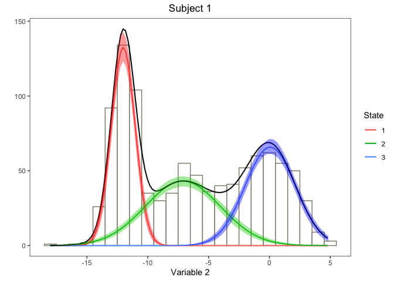

<!-- README.md is generated from README.Rmd. Please edit that file -->

# lizardHMM

<!-- badges: start -->

<!-- badges: end -->

The goal of lizardHMM is to fit lizard movement data with Hidden Markov
Models.

## Installation

You can install the released version of lizardHMM from
[CRAN](https://CRAN.R-project.org) with:

``` r
install.packages("lizardHMM")
```

And the development version from [GitHub](https://github.com/) with:

``` r
# install.packages("devtools")
devtools::install_github("simonecollier/lizardHMM")
```

## Example

Set up a basic HMM with data distributed according to normal state
dependent distributions. This HMM will have 3 states, 2 variables, 1
subject, and 2 covariates (included in the computation of the transition
probability matrix). We also define the design matrix which indicates
the values of the covariates at each point in time. Then we go about
generating data from this HMM.

``` r
library(lizardHMM)

hmm1 <- list(num_states = 3,
             num_variables = 2,
             num_subjects = 1,
             mu = list(matrix(c(12, 18, 22), ncol = 3, nrow = 1, byrow = TRUE), 
                       matrix(c(-12, -7, 0), ncol = 3, nrow = 1, byrow = TRUE)),
             sigma = list(matrix(c(3, 1, 1.5), ncol = 3, nrow = 1, byrow = TRUE), 
                          matrix(c(1, 3, 2), ncol = 3, nrow = 1, byrow = TRUE)),
             beta  = matrix(c(0.01, 0.02, 0.001,
                              0.01, 0.03, 0.004,
                              0.01, 0.01, 0.003,
                              0.01, 0.04, 0.002,
                              0.01, 0.01, 0.004,
                              0.01, 0.03, 0.001), ncol = 3, nrow = 6, byrow = TRUE),
             delta = list(c(0.3, 0.2, 0.5)))

num_sample <- 1000

design           <- list(matrix(0, nrow = 1000, ncol = 3))
design[[1]][, 1] <- 1 # First column is the intercept
design[[1]][, 2] <- sample(c(0, 1), size = 1000, 
                           prob = c(0.3, 0.7), replace = TRUE)
design[[1]][, 3] <- rnorm(1000, mean = 5, sd = 1)

sample <- norm_generate_sample(num_sample, hmm1, design)
x      <- sample$observ
```

We can plot the timeseries of the observations for each subect and
variable along with the corresponding states.

``` r
timeseries_plot(x, sample$state, hmm1$num_subjects, hmm1$num_variables)
#> [[1]]
```


    #> 
    #> [[2]]


The histogram of the data for each subject and variable can be gnerated,
overlayed with the state dependent normal
distributions.

``` r
norm_hist(sample, hmm1$num_states, hmm1$num_variables, hmm1$num_subjects,
          hmm1, width = 1, x_step = 0.2)
#> [[1]]
```


    #> 
    #> [[2]]


Now we can try fitting the data we generated with a basic HMM with
reasonable guesses for the initial parameters.

``` r
num_states = 3
num_variables = 2
num_subjects = 1
num_covariates = 2
mu0 <- list(matrix(c(11, 19, 23), ncol = 3, nrow = 1, byrow = TRUE),
            matrix(c(-10, -5, 1), ncol = 3, nrow = 1, byrow = TRUE))
sigma0 <- list(matrix(c(3, 3, 3), ncol = 3, nrow = 1, byrow = TRUE),
               matrix(c(3, 3, 3), ncol = 3, nrow = 1, byrow = TRUE))
beta0 <- matrix(c(-2, 0, 0,
                  -2, 0, 0,
                  -2, 0, 0,
                  -2, 0, 0,
                  -2, 0, 0,
                  -2, 0, 0), ncol = 3, nrow = 6, byrow = TRUE)
delta0 <- list(c(1/3, 1/3, 1/3))

hmm_fit <- norm_fit_hmm(x, design, num_states, num_variables, num_subjects,
                        num_covariates, mu0, sigma0, beta0, delta0,
                        iterlim = 200, hessian = TRUE)
```

We can find the confidence intervals for our parameter estimates.

``` r
conf_intervals <- norm_ci(hmm_fit, state_dep_dist_pooled = FALSE, 
                          n = 100, level= 0.975) 
conf_intervals
#> $mu
#> $mu$estimate
#> $mu$estimate$`1`
#>          [,1]     [,2]     [,3]
#> [1,] 11.58588 18.01754 22.09549
#> 
#> $mu$estimate$`2`
#>           [,1]      [,2]       [,3]
#> [1,] -12.01727 -7.121748 0.06469706
#> 
#> 
#> $mu$upper
#> $mu$upper$`1`
#>          [,1]     [,2]     [,3]
#> [1,] 11.82979 18.09373 22.28533
#> 
#> $mu$upper$`2`
#>           [,1]      [,2]      [,3]
#> [1,] -11.94133 -6.768608 0.2781436
#> 
#> 
#> $mu$lower
#> $mu$lower$`1`
#>          [,1]     [,2]     [,3]
#> [1,] 11.20647 17.91413 21.94217
#> 
#> $mu$lower$`2`
#>           [,1]      [,2]       [,3]
#> [1,] -12.12254 -7.433414 -0.1706516
#> 
#> 
#> 
#> $sigma
#> $sigma$estimate
#> $sigma$estimate$`1`
#>          [,1]      [,2]     [,3]
#> [1,] 2.676086 0.9136812 1.538067
#> 
#> $sigma$estimate$`2`
#>           [,1]     [,2]     [,3]
#> [1,] 0.9757265 3.101921 2.067543
#> 
#> 
#> $sigma$upper
#> $sigma$upper$`1`
#>         [,1]    [,2]     [,3]
#> [1,] 2.96396 1.00425 1.659892
#> 
#> $sigma$upper$`2`
#>          [,1]     [,2]     [,3]
#> [1,] 1.058371 3.319758 2.244455
#> 
#> 
#> $sigma$lower
#> $sigma$lower$`1`
#>          [,1]      [,2]     [,3]
#> [1,] 2.421643 0.8391876 1.417103
#> 
#> $sigma$lower$`2`
#>           [,1]     [,2]     [,3]
#> [1,] 0.9013176 2.865315 1.910581
#> 
#> 
#> 
#> $beta
#> $beta$estimate
#>              [,1]        [,2]        [,3]
#> [1,]  0.420374334 -0.21621031 -0.05248346
#> [2,]  0.005684073 -0.18367517  0.04230500
#> [3,] -0.244491016 -0.22512241  0.08678225
#> [4,]  0.480478542 -0.83366884  0.03984857
#> [5,]  0.693709952 -0.04331149 -0.12156931
#> [6,]  1.004862618 -0.14665353 -0.15933831
#> 
#> $beta$upper
#>          [,1]       [,2]       [,3]
#> [1,] 1.510681  0.3607881 0.22442700
#> [2,] 1.591337  0.4610303 0.34424303
#> [3,] 1.362749  0.4378531 0.32153004
#> [4,] 1.781039 -0.3043884 0.25735999
#> [5,] 2.143448  0.5635266 0.09755194
#> [6,] 2.201618  0.4339337 0.11784313
#> 
#> $beta$lower
#>            [,1]       [,2]       [,3]
#> [1,] -0.8672615 -0.8341614 -0.3591482
#> [2,] -1.5233597 -0.6792339 -0.1986393
#> [3,] -1.3817692 -0.8574147 -0.1629289
#> [4,] -1.1822415 -1.4199295 -0.2408767
#> [5,] -0.5519370 -0.7521585 -0.3520891
#> [6,] -0.3344039 -0.7681154 -0.4011995
```

Using the viterbi algorithm we can decode the hidden states according to
our fitted HMM and plot the resulting time series.

``` r
viterbi <- norm_viterbi(x, hmm_fit)
timeseries_plot(x, viterbi, num_subjects, num_variables)
#> [[1]]
```


    #> 
    #> [[2]]


We can compute the confidence intervals of the state dependent normal
distributions and compare them to the histogram of
data.

``` r
norm_hist_ci(x, viterbi, num_states, num_subjects, num_variables, hmm_fit, 
             state_dep_dist_pooled = FALSE,
             width = 1, n = 100, level = 0.975, x_step = 0.2)
#> [[1]]
```


    #> 
    #> [[2]]


